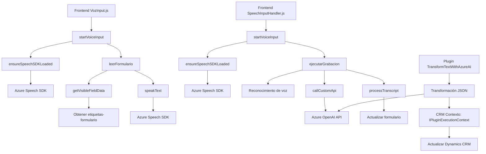

### Breve resumen técnico:
La estructura del repositorio sugiere una solución que integra funcionalidad de entrada y salida de datos por voz, enlace con un CRM (Dynamics 365), y procesamiento mediante inteligencia artificial (Azure OpenAI GPT). Está formada por las siguientes capas:
- **Frontend**: Implementa lógica de interacción con el usuario, concretamente de entrada por voz y conversión de formularios en texto hablado.
- **Plugins y Backend**: Contiene lógica orientada al procesamiento avanzado, invocación de APIs externas, y gestión de datos en Dynamics CRM.

---

### Descripción de arquitectura:
Este sistema tiene características propias de una arquitectura **n-capas** con elementos de **integración de servicios externos** como SDKs y APIs. Aunque distribuye responsabilidades entre capas (Frontend, Plugins, y las llamadas a servicios Azure), mantiene semblanzas a un diseño **monolítico** debido a la directa integración con Dynamics CRM. Las siguientes son características específicas del diseño:
1. **Frontend Modular**: Modularización basada en funciones JavaScript que decouple la lógica (extracción de datos, transformación, síntesis de voz).
2. **Backend Plugin**: Los plugins implementan el patrón típico de Dynamics CRM con servicios externos y validaciones específicas.
3. **Integración de APIs y SDKs**: Uso de *Azure Speech SDK* en frontend para síntesis/reconocimiento de voz; integración de *Azure OpenAI* en plugins para procesamiento avanzado mediante AI.

---

### Tecnologías usadas:
1. **Azure Speech SDK**: Para reconocimiento de entrada de voz y síntesis de texto a voz.
2. **Dynamics CRM plugin SDK**:
   - `Microsoft.Xrm.Sdk`: Para interacciones con entidades y atributos en CRM.
3. **Azure OpenAI**: Usado para procesamiento de texto mediante GPT.
4. **Newtonsoft.Json** / **System.Text.Json**: Manejo de estructuras JSON en el plugin.
5. **JavaScript**: Lógica frontend.
6. **Microsoft Dynamics CRM WebAPI**: Actualización dinámica de atributos del formulario.
7. **Dependency Management**:
   - Carga dinámica de SDK en frontend (`ensureSpeechSDKLoaded`).
   - Uso de servicios externos con `callCustomApi()` para garantizar desacoplamiento.

---

### Diagrama Mermaid válido para GitHub:

---

### Conclusión final:
El repositorio ilustra una solución enfocada a la interacción por voz para CRM, con procesamiento dinámico mediante AI. Se articula mediante dos principales componentes:
1. **Frontend**: Para integración de funcionalidades de voz y actualización de formularios mediante lógica modular en JavaScript y SDK de Azure.
2. **Plugins Backend**: Procesamiento avanzado en CRM usando Azure OpenAI.

**Arquitectura:** Aunque se separan las responsabilidades entre frontend y backend, la solución tiende a ser monolítica en su estructura global, con capas bien definidas y conectadas directamente al contexto Dynamics CRM. Por sus dependencias externas, se acerca a un diseño **n-capas con desacoplamiento funcional**. Ideal para aplicaciones que no requieren un grado extremo de escalabilidad distribuida.