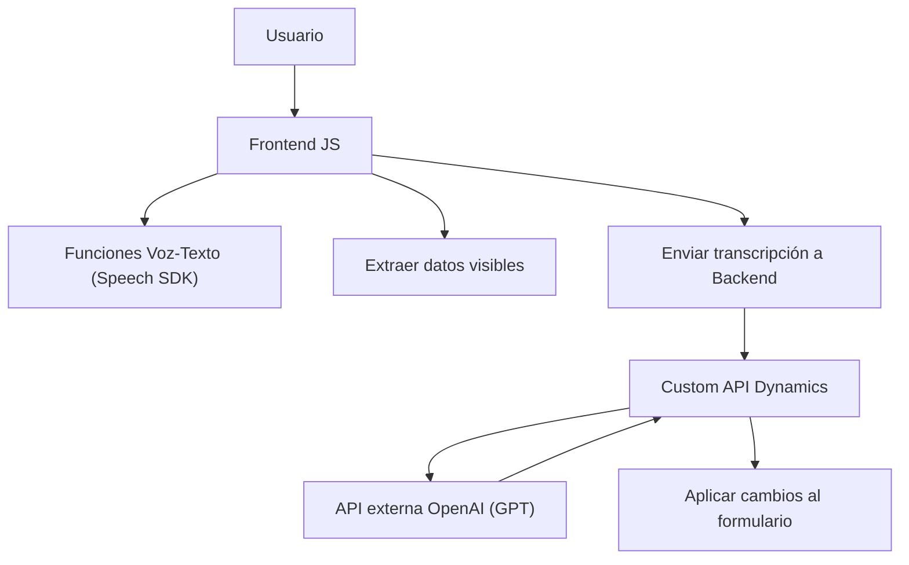

### Breve resumen técnico
El repositorio implementa una solución mixta basada en la integración de diversa tecnología. Está centrado en funcionalidades de accesibilidad y automatización mediante entrada/salida de voz y extrancción de datos en formularios digitales. Utiliza una combinación de frontend en JavaScript, servicios de Azure Speech SDK y plugins en C# para Dynamics CRM con apoyo de inteligencia artificial usando Azure OpenAI.

---

### Descripción de arquitectura
La arquitectura del repositorio combina varios enfoques:
1. **Multi-capa**: Las diferentes capas (Frontend, Backend/Plugins, Integración con API externa) interactúan para proporcionar servicios independientes pero interconectados.
2. **Eventos dinámicos**: El plugin ejecuta acciones bajo un modelo basado en eventos en Dynamics CRM (`IPlugin`), mientras el frontend JavaScript es impulsado por la interacción del usuario con formularios.
3. **Integración de terceros (Speech SDK y OpenAI)**: Se integra servicios externos como Azure Speech SDK para entrada/salida de voz y Azure OpenAI para transformar texto basado en IA.

---

### Tecnologías, frameworks y patrones usados
1. **Frontend (JavaScript)**:
   - Servicios en tiempo real con Azure Speech SDK para síntesis y entrada de voz.
   - Validación y procesamiento de datos de formularios.
   - Patrones:
     - Validación defensiva.
     - Modularidad con funciones específicas.
     - Integración dinámica de SDK vía carga en tiempo de ejecución.

2. **Backend (C#)**:
   - Microsoft Dynamics CRM SDK para desarrollo de plugins basados en eventos (`IPlugin`).
   - Azure OpenAI para transformaciones avanzadas de texto.
   - Uso de bibliotecas como `Newtonsoft.Json.Linq` y `System.Net.Http` para solicitudes a API externa.

3. **Patrones de diseño y arquitectura**:
   - **Plugin-based architecture**: En el backend, con eventos para manejar interacción controlada por CRM.
   - **Integración externa**: En frontend y backend, conectando SDK de Azure y servicios de OpenAI.
   - **Multi-capa**: Separación clara entre frontend para interacción de usuario y backend para procesamiento en Dynamics CRM.

---

### Dependencias o componentes externos
1. **Azure Speech SDK**:
   - Para síntesis de voz, entrada por comando de voz, y reproducción de audio de salida.
2. **Azure OpenAI API**:
   - Para transformaciones de texto usando modelos de lenguaje generativo como GPT.
3. **Dynamics CRM SDK**:
   - Para manejo de eventos, consultas del modelo CRM y manipulación de datos.
4. **Bibliotecas JS y .NET**:
   - `System.Net.Http` y `Newtonsoft.Json.Linq` en backend.
   - Interfaces web estándar en frontend JavaScript para interactuar con SDK.

---

### Diagrama Mermaid válido para GitHub

---

### Conclusión final
Este repositorio implementa una solución de integración avanzada para facilitar accesibilidad y automatización en formularios dinámicos mediante entrada/salida de voz y capacidades de transformación de texto con IA. La arquitectura es adecuada para este tipo de solución, combinando funcionalidad frontend con backend mediante integración de servicios como Azure Speech SDK y OpenAI. Podría ampliarse para soportar más opciones de configuración o idiomas y mejorar la accesibilidad en entornos empresariales.