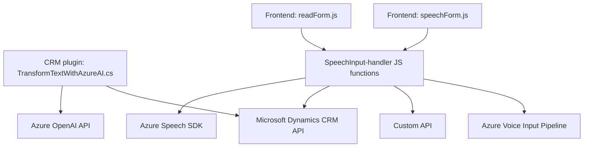
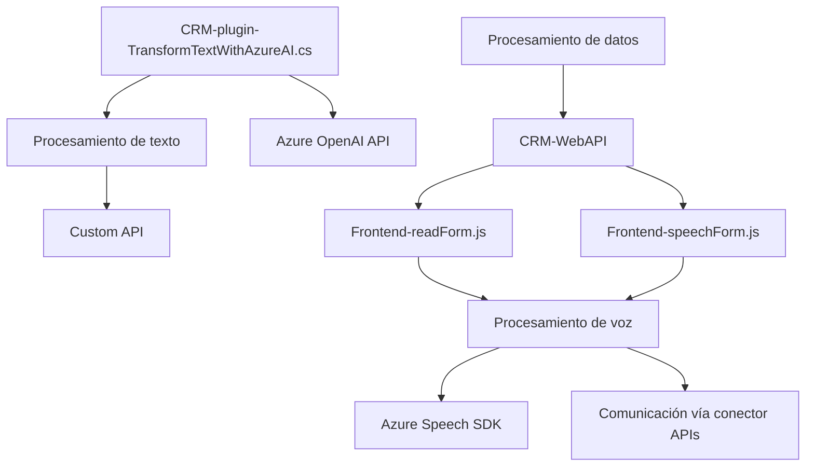

### Breve resumen técnico:
El repositorio gestiona funcionalidades relacionadas con formularios interactivos mediante síntesis de voz, reconocimiento de voz y procesamiento de texto mediante inteligencia artificial. Utiliza tecnologías avanzadas como **Azure Speech SDK**, **Azure OpenAI API** y componentes de **Microsoft Dynamics CRM**. Los scripts en JavaScript están dedicados principalmente a las operaciones del frontend en un entorno CRM, mientras que el archivo C# se utiliza como un plugin para extender la lógica del backend.

---

### Descripción de arquitectura:
La solución sigue una arquitectura híbrida orientada a **microservicios y capas**, donde cada funcionalidad es modularizada y se conecta a servicios externos. La interacción directa de los archivos frontend con Azure Speech SDK y el sistema CRM mediante APIs externas sugiere una arquitectura distribuida.

#### Características clave:
1. **Arquitectura híbrida**:
   - **Capas internas**: Gestión de formulario y lógica CRM organizada en capas (archivo JS implementa parte del enfoque frontend, mientras que el plugin C# realiza las tareas del backend).
   - **Servicio externo**: Conexión con APIs externas como Speech SDK y OpenAI Azure para sintesis y procesamiento de datos.

2. **Integración con servicios en la nube**:
   - Azure Speech SDK para síntesis de voz y procesamiento de texto, con soporte para reconocimiento y generación de voz.
   - Azure OpenAI para procesamiento avanzado de texto y transformación.

3. **Extensiones CRM mediante plugins**:
   - Uso de plugins .NET que permiten la adición de lógica personalizada directa en Microsoft Dynamics 365.

#### Diagrama general de arquitectura:

---

### Tecnologías usadas:
1. **Azure Speech SDK**:
   - Síntesis y reconocimiento de voz.
   - Carga dinámica del SDK.

2. **Azure OpenAI API**:
   - Procesamiento de texto avanzado y generación de contenido basado en IA.

3. **Microsoft Dynamics 365 CRM Web API**:
   - Manipulación de datos en formularios interactivos y uso de funcionalidad CRM como los objetos `executionContext` y `Xrm.WebApi.online`.

4. **JavaScript**:
   - Desarrollo orientado al cliente para el manejo de datos del formulario y comunicación con servicios externos.

5. **C# / .NET Framework**:
   - Desarrollo del plugin para extender la lógica de un sistema CRM y conectarlo con servicios externos.

6. **JSON**:
   - Para el formato y transmisión de datos entre servicios.

7. **HTTP y Webhooks**:
   - Envío de solicitudes HTTP hacia servicios externos como Azure Speech SDK y OpenAI.

8. **Principios de modularidad**:
   - Encapsulación funcional en JavaScript (`speakText`, etc.).
   - Uso de clases y descomposición lógica en el plugin en C#.

---

### Diagrama Mermaid: Integración del sistema

---

### Conclusión final:
Este repositorio describe una solución en la cual se combina un amplio abanico de tecnologías para integrar inteligencias artificiales como **Azure Speech SDK** y **Azure OpenAI API** con sistemas de Microsoft Dynamics CRM. La arquitectura sigue un diseño híbrido entre **microservicios y capas**. La implementación en el frontend es modular y utiliza dependencias externas para mantener la extensibilidad, mientras que el plugin presenta una lógica clara y enfocada en la transformación semántica. El sistema es escalable y permite una adopción eficiente de tecnologías distribuidas, aunque podría mejorarse introduciendo controles de configuración centralizados para incrementar la seguridad.