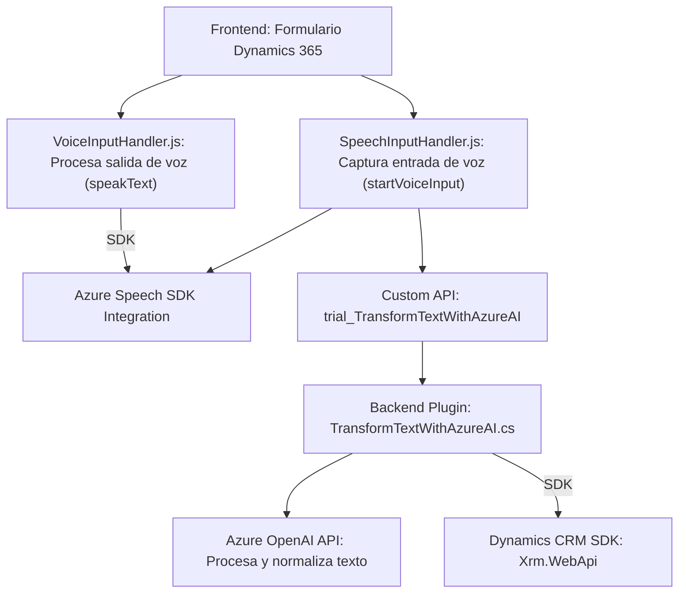

### Breve resumen técnico
El repositorio incluye componentes orientados a la integración y automatización en Dynamics 365 mediante entradas de voz y procesamiento de texto con Azure SDKs, OpenAI, y APIs personalizadas. Es una solución híbrida con frontend (JS) y backend (C#) que interactúa directamente con servicios de Azure.

---

### Descripción de arquitectura
La arquitectura está compuesta por dos principales capas comunicativas:
1. **Frontend (JavaScript)**: Maneja la interacción del usuario con el formulario de Dynamics 365 utilizando Azure Speech SDK para entrada y salida de voz. Opta por la modularidad y carga dinámica de dependencias.
2. **Plugins (C#)**: Procesa textos mediante Azure OpenAI, diseñados como **plugins** para Dynamics CRM implementando clases de tipo `IPlugin`. Esta capa se comunica directamente con servicios de Azure y manipula el contexto CRM.

En su conjunto, la solución implementa un diseño **n capas**, que separa claramente la interfaz (frontend), la lógica de ejecución (plugins) y los servicios externos.

---

### Tecnologías usadas
1. **Frontend**:
   - **Azure Speech SDK**: Servicios de entrada y síntesis de voz.
   - **JavaScript estándar**: Funciones modulares con promesas para integraciones dinámicas.
   - **Dynamics 365 SDK (JavaScript)**: Manipulación de formularios.
   
2. **Backend (Plugins)**:
   - **Microsoft Dynamics CRM SDK**: Para crear plugins.
   - **Azure OpenAI API**: Procesamiento IA en texto.
   - **C#**: Desarrollo de plugins siguiendo patrones estándar.
   - **Dependencias adicionales**: `System.Net.Http`, `System.Text.Json`, y `Newtonsoft.Json`.

3. **Patrones de diseño y arquitectura**:
   - **Modularidad**: Código estructurado en funciones y clases claras.
   - **Carga dinámica**: "Lazy Loading" del SDK de Azure en el frontend.
   - **Plugin-based Architecture**: Extiende Dynamics CRM mediante puntos de extensión.
   - **Integración de servicios externos**: Interacción con Azure OpenAI y Speech SDK.

---

### Diagrama Mermaid

---

### Conclusión final
La solución descrita tiene una arquitectura **n capas**, con enfoque modular y una integración efectiva entre frontend (formularios Dynamics 365) y backend (plugins C#). La dependencia de servicios externos como **Azure Speech SDK** y **Azure OpenAI API** permite agregar inteligencia artificial y automatización a los flujos del negocio en Dynamics 365. Sin embargo, la arquitectura usada puede generar riesgos relacionados con la gestión adecuada de claves API y posibles tiempos de espera en servicios externos. Se recomienda revisar estrategias de seguridad y establecer límites razonables de latencia en los servicios dependientes.