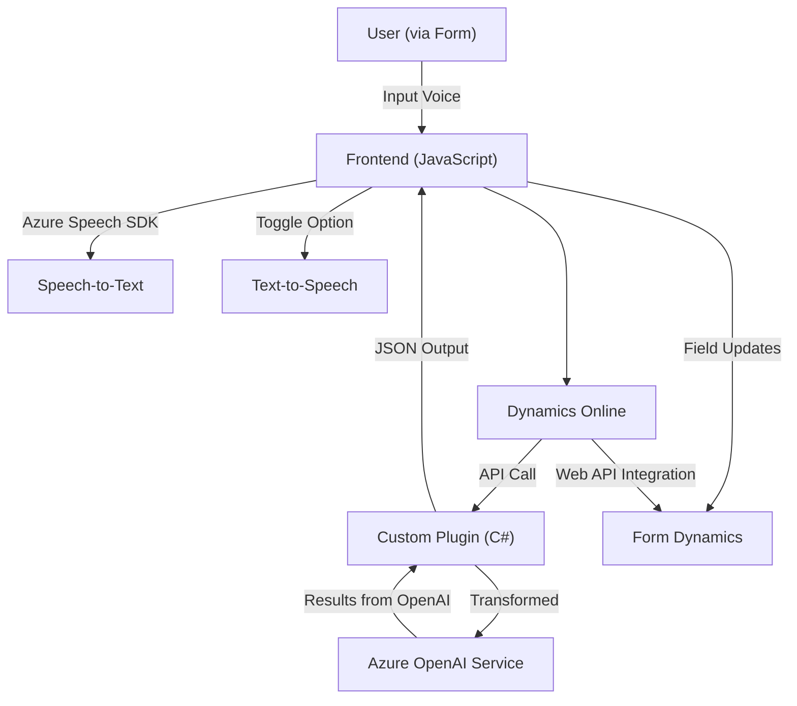

### Breve resumen técnico
El repositorio describe una solución modular que integra Azure Speech SDK y Azure OpenAI con Microsoft Dynamics 365 para proporcionar funcionalidades avanzadas de reconocimiento de voz y síntesis, además de transformación y procesamiento de texto. Los componentes principales incluyen archivos de frontend basados en JavaScript para manejar formularios y entrada por voz, así como un plugin en .NET C# que extiende Dynamics 365 para integración con Azure AI.

### Descripción de arquitectura
La arquitectura sugerida por este repositorio es predominantemente de **n capas** y **modular**. 
- **Frontend:** Compuesto por múltiples scripts de JavaScript que dividen responsabilidades (reconocimiento de voz y síntesis de datos, procesamiento y mapeo de campos, etc.) y que interactúan directamente con APIs externas (Azure Speech SDK y Dynamics Xrm.WebApi).
- **Backend (Plugins):** Extensiones del sistema Dynamics 365 mediante plugins que actúan como lógica personalizada del lado del servidor. Estos interactúan con el servicio Azure OpenAI para realizar transformaciones y devolver datos en un formato útil. 
Por lo tanto, la arquitectura general puede considerarse **n capas**, dividida en las capas de presentación, lógica aplicada en el frontend, y lógica/acceso a datos del backend mediante plugins.

### Tecnologías usadas
1. **Frontend (JavaScript):**
   - Azure Speech SDK: Para reconocimiento y síntesis de voz.
   - Dynamics Web API (`Xrm.WebApi`): Para acceso y manipulación programática de entidades Dynamics.
   - Patrones: Event-Driven, Builder, Adapter, Service Layer.
2. **Backend (Plugins en C#):**
   - `Microsoft.Xrm.Sdk`: Para interactuar con registros en Dynamics 365.
   - Azure OpenAI Service: Procesamiento/transformación de texto según normas definidas.
   - `System.Net.Http`: Para realizar llamadas al servicio Azure OpenAI.
   - `Newtonsoft.Json` y `System.Text.Json`: Serialización y deserialización de datos JSON.
   - Patrones: Plugin Pattern, Dependency Injection, External API Integration.

### Dependencias o componentes externos
1. **Azure Speech SDK**: Utilizado en el frontend para reconocimiento y síntesis de voz.
2. **Azure OpenAI Service**: Transformación avanzada de textos en el backend mediante Plugins.
3. **Microsoft Dynamics 365 Web API**: Conexión backend para la gestión de entidades y campos del CRM.
4. **HTTP Client Libraries (e.g., System.Net.Http)**: Integración con los servicios externos de Azure.
5. **JSON Libraries**: Utilizadas para el manejo de objetos y estructuras JSON.

### Diagrama Mermaid

### Conclusión final
Este repositorio implementa una solución arquitectónica **n capas** con un diseño **modular** y basada en eventos. En el frontend, se utilizan APIs como Azure Speech SDK para facilitar funcionalidades de reconocimiento y síntesis de voz adaptadas a formularios de Dynamics 365. El backend utiliza Plugins en C# para interactuar con entidades del CRM y un servicio externo como Azure OpenAI para realizar transformaciones avanzadas.

La integración de herramientas basadas en inteligencia artificial y la característica de manejo de audio hacen de esta solución un enfoque innovador para mejorar la interacción entre el usuario y los sistemas CRM estándar, manteniendo una clara separación de responsabilidades y escalabilidad para futuras extensiones.