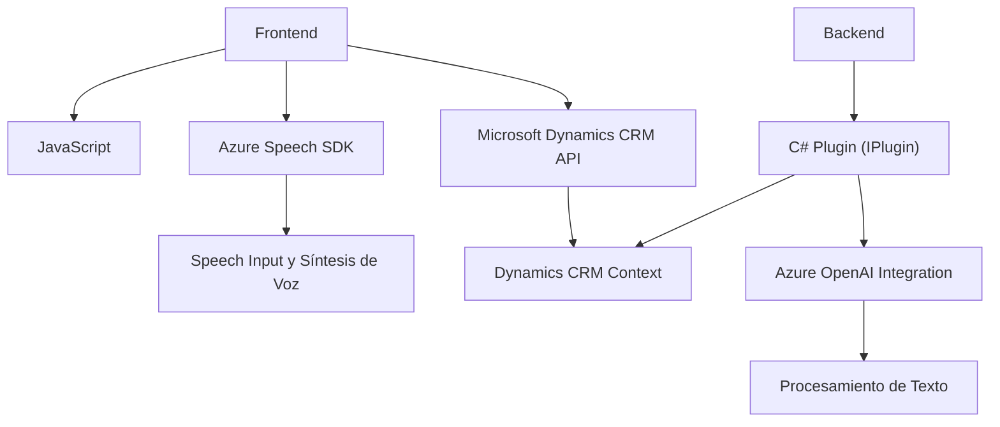

### Breve resumen técnico:
El repositorio contiene tres archivos principales que integran APIs externas (Azure Speech SDK y Azure OpenAI) con Microsoft Dynamics CRM. Cada archivo define funcionalidades específicas: desde formularios dinámicos para captura y síntesis de voz (en JavaScript) hasta procesamiento avanzado de texto con Inteligencia Artificial (en C#). La solución se centra en el uso de procesamiento de voz y texto para enriquecer formularios y flujos en el CRM.

---

### Descripción de arquitectura:
La solución implementada sigue una **arquitectura de n capas** mezclada con principios de integración de servicios externos. Las capas principales son:
1. **Frontend**:
   - Utiliza JavaScript y Azure Speech SDK para capturar y sintetizar voz en formularios CRM.
   - Extenso uso del contexto del formulario y manipulación dinámica de elementos.
2. **Backend**:
   - Define un plugin en C# (`TransformTextWithAzureAI`) que conecta Dynamics CRM con Azure OpenAI para el procesamiento de texto avanzado.
   - Uso de abstracción con interfaces (`IPlugin`) y dependencias para interactuar con el contexto CRM.
3. **Servicios externos**:
   - Integra APIs como Azure Speech SDK y Azure OpenAI directamente como dependencias externas para reconocimiento/síntesis de voz y procesamiento de texto.

La solución no sigue principios estrictos de **arquitectura hexagonal** ni **microservicios**, ya que está diseñada para operar dentro del ecosistema de Dynamics CRM, pero realiza integraciones acopladas con servicios externos.

---

### Tecnologías usadas:
1. **Frontend:**
   - 💻 **JavaScript**: Para manipulación de formularios y lógica de síntesis/reconocimiento de voz.
   - 📦 **Azure Speech SDK**: Para tareas de síntesis y captura de voz.
   - **Microsoft Dynamics Form Context API**: Para interactuar con formularios del CRM.

2. **Backend:**
   - ⚙️ **C#**, .NET Framework: Para construir el plugin que conecta con OpenAI.
   - 🔗 **Azure OpenAI Integration**: Procesamiento natural del lenguaje.
   - 📡 **HTTP Client Framework**: Para solicitudes REST (Azure API).
   - 📚 **Newtonsoft.Json / System.Text.Json**: Serialización/deserialización JSON.

---

### Diagrama Mermaid (GitHub Markdown compatible):

---

### Conclusión final:
Esta solución configura una integración avanzada entre Dynamics CRM y servicios externos de Azure para enriquecer la captura, síntesis y procesamiento de datos mediante texto y voz.  
Con una arquitectura de n capas, patrones de callback asíncronos y servicio externo, aborda las necesidades de plataformas de CRM que buscan incorporar Inteligencia Artificial y servicios de voz en sus formularios dinámicos. Sin embargo, la dependencia directa de APIs externas podría representar un punto único de fallo si los servicios externos no están disponibles.