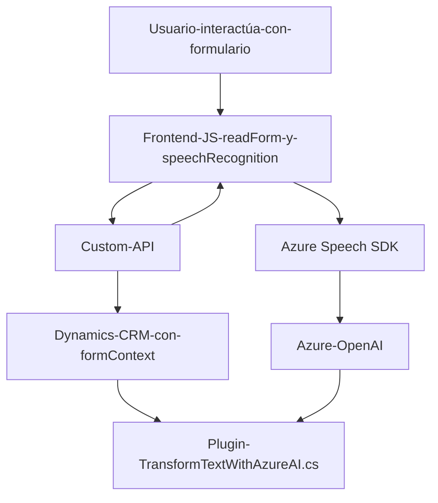

# Resumen Técnico

El repositorio contiene varias soluciones orientadas a formularios inteligentes, con interacción por voz y enriquecimiento basado en inteligencia artificial usando servicios de Azure. Está compuesto por archivos de frontend (JavaScript) y lógica del backend (C#) que interactúan entre sí para ofrecer funcionalidad avanzada en entornos de Dynamics CRM.

# Descripción de Arquitectura

La solución presenta una arquitectura híbrida que combina las siguientes características:
1. **Cliente pesado en el frontend**: Los archivos JavaScript manejan casi toda la lógica de interacción del usuario, integrándose con el API de Dynamics CRM y Azure Speech SDK (y, en algunos casos, servicios Azure OpenAI).
   
2. **Complementos en el backend**: En el lado del servidor, se implementa un plugin como middleware, diseñado para recibir solicitudes, procesarlas utilizando normas específicas, y responder con una salida estructurada en formato JSON.

3. **Servicios externos**: La solución integra múltiples servicios externos, incluidos **Azure Speech SDK** y **Azure OpenAI**, posicionándose como **una arquitectura basada en servicios (Service-Oriented Architecture - SOA)**.

4. **Patrones observados**:
   - **Separación de responsabilidades**: Tanto el frontend como el backend se dividen en funciones/clases especializadas.
   - **Patrón de integración (Facade)**: Las SDK de Azure y las APIs externas están encapsuladas para simplificar su uso.
   - **Patrón de plugin**: Para modularizar el comportamiento en el entorno de Dynamics CRM mediante la interfaz `IPlugin`.

# Tecnologías Usadas

1. **Microsoft Dynamics CRM**: Plataforma utilizada como base para los formularios y su configuración.
2. **Azure Speech SDK**: Realiza síntesis y reconocimiento de voz en tiempo real.
3. **Azure OpenAI**:
   - Para realizar transformaciones basadas en normas específicas en texto.
   - Uso de modelos de IA como GPT para obtener salidas estructuradas.
4. **JavaScript**: Para crear lógica dentro de los formularios (frontend).
5. **C# y .NET Framework**: Backend para definir un plugin que interactúa con Dynamics CRM y Azure OpenAI.
6. **API personalizada**: Extensión que complementa la funcionalidad principal.

# Diagrama Mermaid

A continuación, un diagrama que describe la interacción entre los componentes de la solución:

# Conclusión Final

La solución presentada corresponde a un sistema basado en una **arquitectura de capas** y **orientada a servicios**. Combina un frontend inteligente desarrollado con tecnologías modernas (JavaScript y Azure Speech SDK) para gestionar formularios dinámicos y un backend que depende de **plugins personalizados** que se integran directamente con Dynamics CRM. Adicionalmente, destaca la incorporación de servicios externos como Azure OpenAI para enriquecer y mejorar la experiencia de los usuarios.

Se trata de un ejemplo sólido de cómo las plataformas robustas como Dynamics CRM pueden ampliarse para soportar características avanzadas y específicas. Sin embargo, es importante resaltar la dependencia de los servicios externos, especialmente Azure Speech y OpenAI, que podrían implicar altos costos de operación y generar riesgos en un fallo fuera del control del sistema.