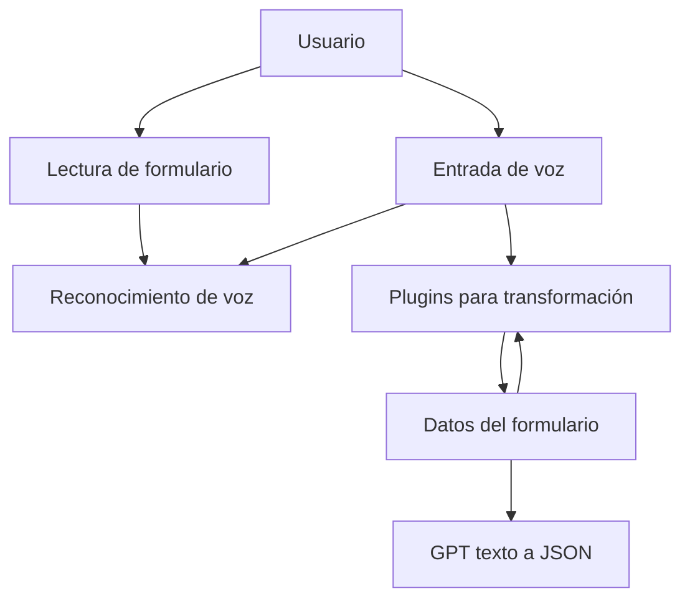

### Breve Resumen Técnico:
El repositorio contiene una solución orientada a la interacción entre usuarios y formularios a través de servicios de voz y texto, utilizando Azure Speech SDK y Microsoft Dynamics API. Incluye módulos frontend en JavaScript para procesar formularios y entrada de voz, y un plugin en C# que conecta con Azure OpenAI para realizar la transformación avanzada de texto.

---

### Descripción de Arquitectura:
La solución combina dos tipos de arquitectura:
1. **Multicapa (N-Capas)**:
   - El frontend en JavaScript interactúa con el usuario y realiza tareas de captura, síntesis y procesamiento de voz. Este actúa como la capa de presentación (Vista/UX).
   - El backend implementado como plugins de Dynamics CRM actúa como lógica empresarial con integración de servicios externos, siguiendo el **Plugin Design Pattern**.
2. **Service-Oriented Architecture (SOA)**:
   - Interfaces de Dynamics (Xrm.WebApi y Microsoft.Xrm.Sdk) son utilizadas para integrar la solución con Dynamics CRM.
   - Dependencia en múltiples servicios de Azure (Speech SDK, OpenAI) para enriquecimiento funcional.

---

### Tecnologías Usadas:
1. **Frontend**:
   - **JavaScript**: Manipulación de formularios y datos visibles.
   - **Azure Speech SDK**: Capacidades de entrada/salida de voz.
   - **Microsoft Dynamics Xrm.WebApi**: Interacción con modelos de datos de Dynamics 365.

2. **Backend/Plugin**:
   - **C#**: Implementación de plugins para procesamiento de texto.
   - **Microsoft.Xrm.Sdk**: Extensibilidad en Dynamics.
   - **Azure OpenAI GPT**: Generación y transformación de texto basado en IA.
   - **Newtonsoft.Json** y **System.Text.Json**: Manejo avanzado de datos estructurados en JSON.

3. **Servicios Externos**:
   - **Azure Speech SDK**: Procesamiento de la voz.
   - **Azure OpenAI GPT**: IA generativa para procesamiento de texto.

---

### Diagrama Mermaid:

---

### Conclusión Final:
Este repositorio define una solución completa enfocada en accesibilidad e inteligencia artificial mediante entrada de voz y dinámica de texto adaptable en formularios de Microsoft Dynamics 365. La combinación de arquitectura multicapa y SOA garantiza tanto modularidad como extensibilidad. La elección de servicios como Azure Speech SDK y OpenAI refleja un enfoque moderno en servicios basados en IA, compatibles con contextos empresariales.