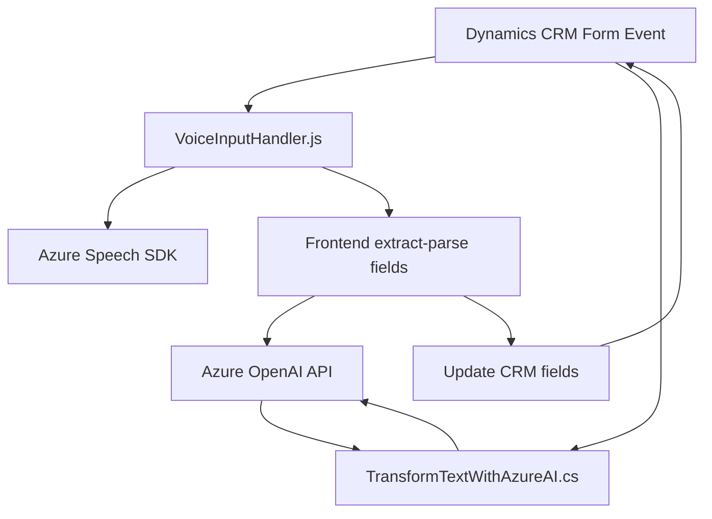

### Breve resumen técnico:
Este repositorio contiene una solución integrada que funciona sobre Dynamics CRM, extendiendo su funcionalidad con reconocimiento de voz, síntesis de voz, e interacción con la API Azure OpenAI. Los archivos están distribuidos entre lógica de frontend en JavaScript, interacción mediante plugins en C#, y comunicación con servicios externos como el Azure Speech SDK y Azure OpenAI.

---

### Descripción de arquitectura:
La solución implementa una arquitectura de capa híbrida:
1. **Frontend (JavaScript)**: Manejo de interacción de usuario en formularios del CRM. Realiza reconocimiento de voz, síntesis de voz y procesamiento de transcripciones utilizando Azure Speech SDK.
2. **Backend (C# Plugin)**: Ejecuta la lógica de negocio personalizada vinculada a eventos del CRM. Comunica datos con Azure OpenAI, transformando texto basado en normas específicas y estructurándolo en JSON.
3. **Servicios externos**:
    - **Azure Speech SDK**: Procesa audio para reconocimiento de voz y síntesis de voz.
    - **Azure OpenAI API**: Realiza procesamiento avanzado de texto con IA.

La arquitectura combina elementos de **plug-in pattern** en Dynamics CRM, **cargadores dinámicos** en el frontend con la incorporación del SDK de Azure Speech, y sigue una aproximación basada en **microservicios** al delegar el procesamiento de texto a la API de Azure OpenAI.

---

### Tecnologías usadas:
- **Frontend**:
  - **JavaScript**: Lenguaje de programación para abordar interacción en el navegador.
  - **Azure Speech SDK**: Procesamiento de voz en tiempo real.
  - **Dynamics CRM SDK**: API de Dynamics para manipular entidades de formularios.
- **Backend**:
  - **C#**: Lenguaje de programación para plugins de Dynamics CRM.
  - **Azure OpenAI (GPT-4o)**: Servicio de IA para procesamiento semántico avanzado.
  - **.NET SDK**: Para integrar la lógica de negocio con la API de Azure y servicios HTTP.
  - **Microsoft.Xrm.Sdk**: Para la integración directa entre el plugin y el CRM.

---

### Diagrama Mermaid:

---

### Conclusión final:
Esta solución está claramente diseñada para integrarse con Dynamics CRM, ampliando su funcionalidad mediante un enfoque interactivo basado en reconocimiento y síntesis de voz. Utiliza herramientas modernas como Azure Speech SDK y Azure OpenAI para realizar tareas cognitivas avanzadas, adoptando una arquitectura híbrida que combina patrones como MVC, microservicio, y eventos. Gracias al diseño modular, esta solución puede ser ampliada fácilmente para integrar funciones adicionales.