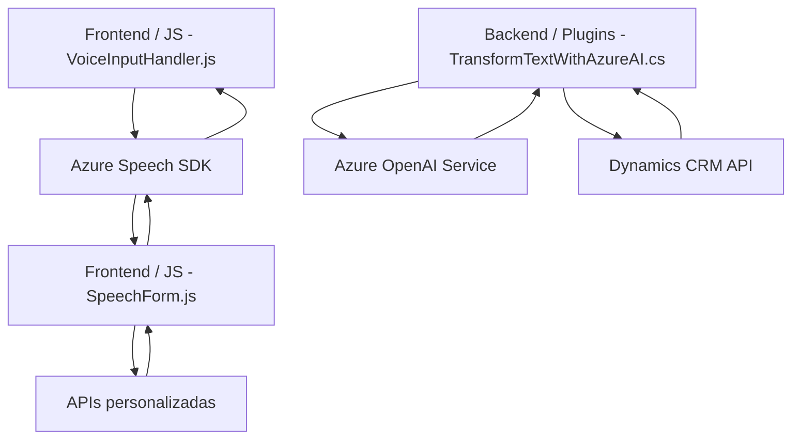

### Breve Resumen Técnico

Se analiza un repositorio que contiene archivos relacionados con el **frontend** y la **integración de plugins** para Microsoft Dynamics CRM. 

- Los archivos del **frontend** están diseñados para interactuar con formularios dinámicos, reconocimiento y síntesis de voz utilizando **Azure Speech SDK**.
- El **plugin TransformTextWithAzureAI.cs** extiende la funcionalidad de Dynamics CRM para transformar datos mediante **Azure OpenAI Service**.

El sistema combina servicios externos de Azure con componentes internos, lo que sugiere una arquitectura basada en **integraciones de servicios distribuida**.

---

### Descripción de Arquitectura

- **Tipo de solución:** Mixta. Contiene un **frontend** que interactúa directamente con el usuario y plugins que extienden las capacidades del backend de Dynamics CRM, creando un ecosistema híbrido.
- **Arquitectura general:**
  - **Frontend:** Arquitectura en capas (captura, procesamiento, síntesis y/o mapeo de datos).
  - **Backend (plugin):** Patrón de **extendibilidad** mediante plugins de Dynamics CRM con integración de servicios externos (APIs de Azure).
- **Patrones observados:**
  - Modularidad funcional: Cada servicio (voz o texto) está encapsulado y tiene responsabilidades claramente definidas.
  - Lazy loading: En el frontend, Azure Speech SDK se carga dinámicamente para optimizar los recursos del navegador.
  - API-first: La interacción con Azure OpenAI Services y APIs personalizadas prioriza la delegación de tareas.

---

### Tecnologías Usadas

1. **Frontend:**
   - Lenguaje: **JavaScript**.
   - Frameworks/Librerías: Azure Speech SDK.
   - Interacciones: Manipulación de formularios, Xrm.WebApi.online.

2. **Plugin (backend):**
   - Lenguaje: **C#**.
   - Frameworks: Dynamics 365 SDK y Azure SDK (OpenAI).
   - Librerías: System.Net.Http, Newtonsoft.Json, System.Text.Json.

3. **Servicios externos**:
   - **Azure Speech Service:** Para reconocimiento y síntesis de voz.
   - **Azure OpenAI Service:** Para generación de texto.

---

### Dependencias y Componentes Externos

- **Azure Speech SDK:** Plataforma para reconocimiento y síntesis de voz.
- **Azure OpenAI Service (GPT-4):** Endpoint de inteligencia artificial para procesamiento semántico.
- **Xrm.WebApi.online:** API de Dynamics 365 para la administración de información en formularios.
- **Newtonsoft.Json y System.Text.Json:** Serialización y procesamiento de JSON.
- **Microsoft Dynamics CRM:** Plataforma de administración de clientes que integra plugins personalizados.

---

### Diagrama Mermaid

---

### Conclusión Final

Este repositorio se enfoca en extender la funcionalidad de **formularios en Dynamics CRM** y mejorar la interacción a través de tecnologías de reconocimiento de voz, síntesis de texto-voz y procesamiento basado en inteligencia artificial. La solución implementa una **arquitectura modular en capas** en el frontend y la integración de plugins en el backend, todo mientras aprovecha servicios distribuidos en la nube (Azure). Es eficiente para aplicaciones empresariales que necesiten integrar tecnologías de reconocimiento de voz y procesamiento de texto avanzado.