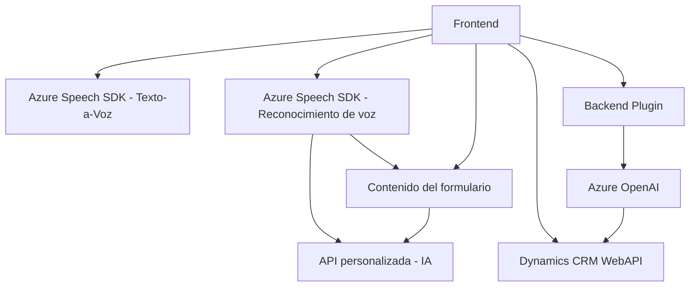

### Breve resumen técnico
El repositorio contiene tres principales archivos relacionados con la interacción entre formularios (en un entorno web y Microsoft Dynamics CRM), el servicio **Azure Speech SDK** y **Azure OpenAI**. En conjunto, forman una solución para captura de datos en formularios mediante reconocimiento de voz, conversión de texto visible en audio, y transformación de texto con inteligencia artificial. La solución parece ser parte de un sistema que combina un frontend para usuarios y un plugin de backend alojado en Dynamics CRM, integrado con tecnologías como Azure AI.

---

### Descripción de arquitectura
La solución tiene una **arquitectura de capas** o **n-capas**, que puede ser desglosada en:
1. **Capa de presentación (Frontend)**: Archivos JavaScript situados en la carpeta `FRONTEND/JS` para procesar formularios, capturar voz, sintetizar audio y realizar reconocimiento por medio del **Azure Speech SDK**.
2. **Capa de lógica de negocio (Backend)**: Implementada mediante el plugin **TransformTextWithAzureAI.cs**, que actúa como intermediario entre Dynamics CRM y **Azure OpenAI** para realizar transformaciones de texto.
3. **Capa de servicios externos (Azure)**:
   - **Azure Speech SDK**: Usado para transformar texto en voz y realizar el reconocimiento de voz.
   - **Azure OpenAI**: Usado para realizar transformaciones avanzadas de texto.

---

### Tecnologías y patrones usados
#### **Tecnologías**
1. **Frontend (JavaScript)**:
   - **Azure Speech SDK** (texto a voz y reconocimiento de voz).
   - **Dynamics CRM WebAPI**: Utilizada para realizar operaciones directamente sobre el formulario.
2. **Backend (.NET/C#)**:
   - **Microsoft Dynamics CRM SDK**: Para integrar plugins en el flujo del sistema.
   - **Azure OpenAI**: API alojada en Azure para realizar transformaciones mediante modelos de GPT.
   - **Json Libraries**: Procesamiento de datos en formato JSON usando `System.Text.Json` y `Newtonsoft.Json.Linq`.
3. **Servicios externos**:
   - **Azure Speech SDK** para reconocimiento de voz y síntesis.
   - **Azure OpenAI** para manipulación y estructuración de texto.

#### **Patrones de diseño**
1. **Facade Pattern**:
   - Los módulos de JavaScript (Frontend) encapsulan la lógica compleja de interacción con Dynamics CRM, Azure Speech SDK y Azure OpenAI.
2. **Adapter Pattern**:
   - Mapeo entre atributos del formulario y los valores extraídos de las transcripciones de voz.
3. **Plugin Architecture**:
   - Implementación del estándar de plugins de Dynamics CRM.
4. **SOA Integration**:
   - La solución utiliza servicios externos (Microsoft Azure) para operaciones específicas de negocio: reconocimiento de voz, síntesis de voz y procesamiento de texto con IA.

---

### Dependencias y componentes externos
1. **Microsoft Azure Speech SDK**: Realiza la transformación y reconocimiento de voz. Tiene puntos finales de conexión web.
2. **Microsoft Azure OpenAI Service**: Usa modelos GPT para manipulación de texto.
3. **Microsoft Dynamics CRM SDK**: Proporciona la funcionalidad para integrar plugins personalizados y operar sobre los datos del CRM.
4. **Dynamics CRM WebAPI**: Permite la interacción con datos del formulario dentro del entorno CRM.
5. **API personalizada basada en IA (referenciada en `callCustomApi`)**: Se integra como un componente externo.

---

### Diagrama **Mermaid**

---

### Conclusión final
La solución presenta una arquitectura **n-capas** dividida entre las capas de presentación (frontend en JavaScript), la lógica de negocio (plugin en .NET/C#) y los servicios externos (Azure Speech SDK y Azure OpenAI). Utiliza varios patrones arquitectónicos, como **Facade**, **Adapter**, y **SOA**. La integración con servicios como Azure API muestra un enfoque moderno y extensible en términos de arquitectura de software. Aunque esta solución no es completamente desacoplada debido a su relación estrecha con Dynamics CRM, es una implementación sólida para el procesamiento avanzado de voz, texto y datos en un contexto de formularios interactivos.