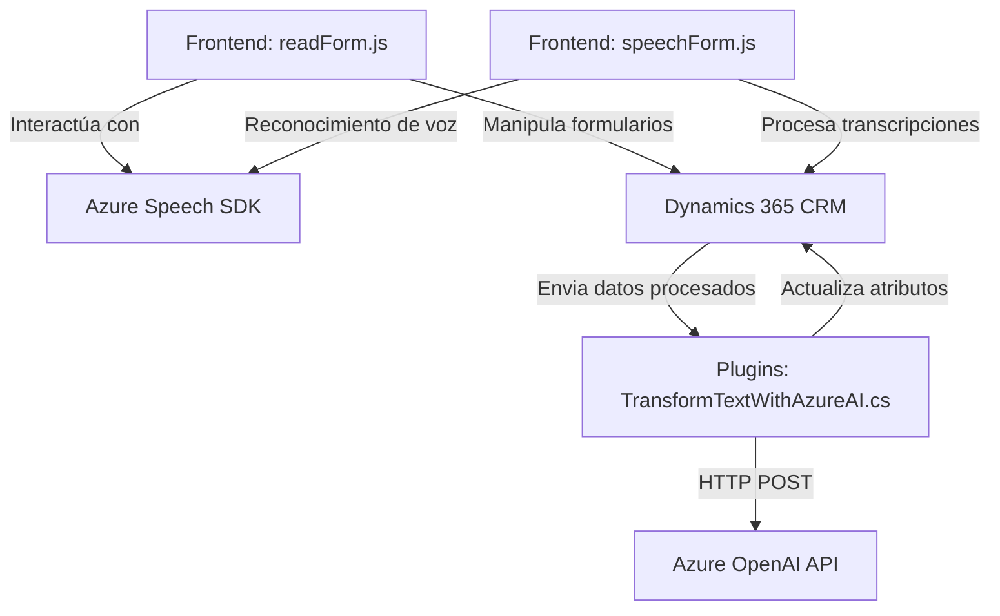

# Análisis técnico del repositorio

## Breve resumen técnico:
El repositorio parece contener la implementación de una solución orientada a API y servicios de voz/IA integrados en un entorno corporativo como Dynamics 365 CRM. Utiliza principalmente JavaScript para el frontend y plugins en C# para extender las capacidades del backend. La funcionalidad principal gira en torno a la entrada de voz, la síntesis de texto a voz, y el procesamiento avanzado de texto utilizando IA (Azure OpenAI).

---

## Descripción de arquitectura:
La arquitectura adoptada es híbrida basada en **componentes n-capas**:
- **Capa de presentación:** Archivos frontend (`readForm.js`, `speechForm.js`) que interactúan con Dynamics 365 y usuarios finales. Estas funciones manejan la entrada de voz y la síntesis, además de complementar con APIs personalizadas y llamadas asíncronas.
- **Capa lógica de negocio:** Archivo `TransformTextWithAzureAI.cs`, que actúa como un plugin para Dynamics CRM y procesa datos integrando reglas de negocio y servicios externos.
- **Capa de datos:** Manipulación directa de datos de formulario en Dynamics 365, con consultas `Xrm.WebApi` y estructura para atributos tipo `lookup`, fechas, valores numéricos, etc.

---

## Tecnologías usadas:
1. **Azure Speech SDK:** Reconocimiento y síntesis de voz mediante integración con APIs de Microsoft Azure.
2. **Azure OpenAI:** Generación de respuesta estructurada basada en GPT-4 para manejo avanzado de texto y datos dinámicos.
3. **Dynamics 365 CRM Web APIs:** Para manipulación de registros de CRM, como la ejecución de APIs personalizadas y mapeo de datos.
4. **JavaScript y DOM:** Para el procesamiento en frontend, incluyendo carga dinámica de bibliotecas (SDK).
5. **C# (.NET):** Backend extensible con plugins (`IPlugin`) para Dynamics 365.
6. **Patrones de diseño:** MVC, adaptador para SDK de Azure, cargador dinámico de dependencias en frontend y estrategia.

---

## Dependencias o componentes externos:
### Identificados:
1. **Azure Speech SDK API** (`https://aka.ms/csspeech/jsbrowserpackageraw`): Usada en los componentes de frontend para la interacción con el reconocimiento y síntesis de voz.
2. **Azure OpenAI API:** Usada en el backend para procesar texto con reglas específicas mediante servicios GPT-4.
3. **Dynamics 365 CRM Web API:** Para llamadas directas a la base de datos del CRM, ejecutar acciones sobre formularios y manipular registros de tipo `lookup`.
4. **APIs HTTP en C#:** Interacción con servicios externos dentro de los plugins como `TransformTextWithAzureAI`.

---

## Diagrama Mermaid:
A continuación, se genera un diagrama simplificado que representa la interacción entre componentes del repositorio:

---

## Conclusión final:
El repositorio implementa una solución integrada para el manejo de entrada y salida de voz, complementada por métodos avanzados para procesar transcripciones y datos en formato estructurado. La arquitectura modular, donde se separa la capa de presentación, la lógica de negocio y los datos, permite escalabilidad y mantenimiento efectivo. Con tecnologías modernas como Azure Speech y OpenAI en combinación con Dynamics 365 CRM, se optimiza la interacción con el usuario y mejora la experiencia mediante accesibilidad por voz e inteligencia artificial.