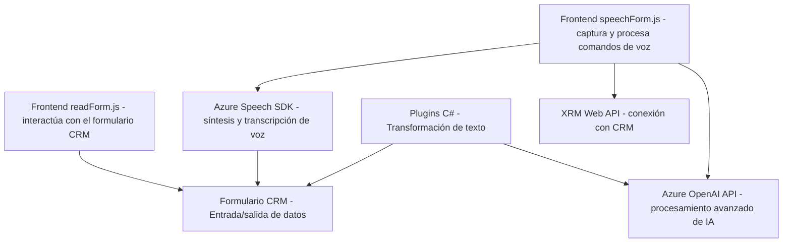

### Breve resumen técnico
El repositorio contiene componentes que implementan una solución híbrida basada en la utilización de capacidades de voz y procesamiento de texto con servicios de Azure. La solución incluye un frontend que interactúa con formularios en aplicaciones CRM mediante reconocimiento y síntesis de voz, así como un plugin para Dynamics CRM que utiliza Azure OpenAI para transformar contenido textual.

---

### Descripción de arquitectura
La arquitectura es híbrida. Combina un paradigma de **Extensibilidad de CRM mediante plugins** en una arquitectura monolítica con **interacciones asincrónicas** vía API y componentes frontend en un modelo cliente-servidor. Varios componentes del software operan en capas:
- **Capa de presentación**: Scripts de tipo frontend (`readForm.js`, etc.) que interactúan con UI de CRM.
- **Capa lógica**: Procesamiento con SDK de Azure Speech y APIs externas.
- **Capa de servicios/externalización**: Uso de Azure Speech SDK y Azure OpenAI API para funciones avanzadas de IA.

Los scripts frontend pueden considerarse componentes desacoplados para enriquecer aplicaciones CRM. Los plugins en C# se comportan como intermediarios entre los datos del CRM y los servicios externos.

---

### Tecnologías usadas
1. **Frontend (JavaScript):**
   - Frameworks: Ninguno mencionado directamente, uso de JavaScript nativo.
   - SDK: Azure Speech SDK para síntesis y transcripción.
   - API de integración: XRM Web API para conexiones con aplicaciones CRM.
   
2. **Backend/Plugins (C#):**
   - Framework: SDK de Microsoft Dynamics (`Microsoft.Xrm.Sdk`).
   - Servicios IA: Azure OpenAI (GPT-4 o similar).
   - Librerías para manejo de JSON: `System.Text.Json`, con alternativa en `Newtonsoft.Json.Linq`.

3. **Patrones aplicados:**
   - **Servicio externo**: Uso dinámico de Azure Speech SDK y OpenAI API para capacidades avanzadas.
   - **Estructura modular**: Código encapsulado con funciones específicas (por ejemplo, separación entre procesamiento manual e impulsado por IA).
   - **Plugin-based Architecture (Dynamics CRM)**: Extiende funcionalidades a través de la interfaz `IPlugin`.
   - **Builder Pattern**: Generación dinámica de payloads JSON para solicitudes API.
   - **Callback Pattern**: Invocación estructurada mediante funciones de devolución para SDK y APIs.

---

### Diagrama Mermaid

---

### Conclusión final
El repositorio corresponde a una solución orientada a aplicaciones CRM, particularmente en el ecosistema de Microsoft Dynamics, con capacidades para interactuar mediante síntesis de voz, reconocimiento de comandos hablados y transformación avanzada de texto usando IA. La arquitectura es modular con capas claras, dando prioridad a la integración con servicios externos como Azure Speech SDK y OpenAI. El enfoque combina **experiencia usuario**, **automatización funcional** y **procesamiento IA** para enriquecer aplicaciones CRM. Sin embargo, es fundamental manejar más robustamente errores en servicios externos y optimizar la gestión de transcripciones complejas que pudieran afectar la experiencia.