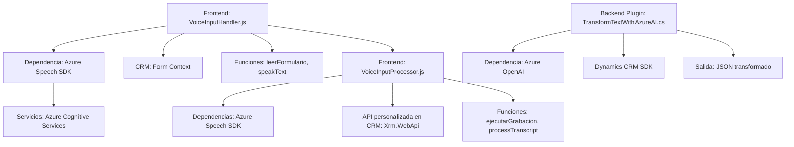

### Breve resumen técnico:
El repositorio presenta una solución multicapa que combina **frontend** (JavaScript) y **backend** (C#). El objetivo central es la integración de funcionalidades de reconocimiento y síntesis de voz (Azure Speech SDK) con la gestión de formularios y procesamiento de texto avanzado utilizando servicios de IA (Azure OpenAI). A su vez, se incluye un plugin para la plataforma Dynamics 365, que extiende sus capacidades mediante el uso de APIs y servicios de IA.

---

### Descripción de arquitectura:
La solución implementa una arquitectura **n-capas** con interacción cliente-servidor. El **frontend**, desarrollado en JavaScript, se encarga de la captura y síntesis de voz en un navegador web contra formularios en línea. El **backend** consiste en un plugin para Microsoft Dynamics 365 escrito en C# que actúa como capa de procesamiento avanzado. También se incluyen patrones de diseño como **client-based modularization** en el frontend y **plugin extensibility** en Dynamics 365.

- **Frontend:** Modular y basado en componentes funcionales, que interactúan directamente con formularios y servicios externos.
- **Backend Dynamics 365:** Plugin que responde a eventos y utiliza servicios externos (Azure OpenAI) para manipular datos.

---

### Tecnologías usadas:
1. **Frontend (JavaScript)**:
   - **Azure Speech SDK**: Para síntesis y reconocimiento de voz.
   - APIs del entorno CRM/Dynamics 365 (`Xrm.WebApi`): Para manipulación de formularios.

2. **Backend (C#)**:
   - **Microsoft Dynamics CRM SDK**: Para integración con Dynamics 365 y ejecución de plugins.
   - **Azure OpenAI Service**: Para la transformación avanzada de texto usando GPT.

3. **Librerías comunes**:
   - `System.Net.Http`: Para realizar conexiones HTTP en el backend a la API de Azure OpenAI.
   - `System.Text.Json` y `Newtonsoft.Json`: Para parseo y serialización de respuestas JSON.

4. **Patrones arquitectónicos**:
   - **Modularización funcional**: En el frontend, cada función realiza un objetivo específico.
   - **Event-driven**: El plugin en backend responde a eventos dentro de Dynamics CRM.
   - **Uso de APIs externas**: Una capa dedicada al manejo de APIs externas (Speech SDK y OpenAI).

---

### Diagrama Mermaid válido para GitHub:

---

### Conclusión final:
La solución presentada combina tecnologías modernas como **Azure Cognitive Services** y **OpenAI** con las capacidades de gestión avanzada de **Dynamics 365**. La estructura modular del código en el frontend y en el backend lo hace particularmente adecuado para entornos empresariales que requieren la interacción entre IA, formularios, y CRM. La arquitectura n-capas favorece la claridad y separación de responsabilidades, mientras explota los servicios externos para potenciar la funcionalidad. Sin embargo, el manejo de credenciales (como las claves API) requeriría mejorar para cumplir con mejores prácticas de seguridad.