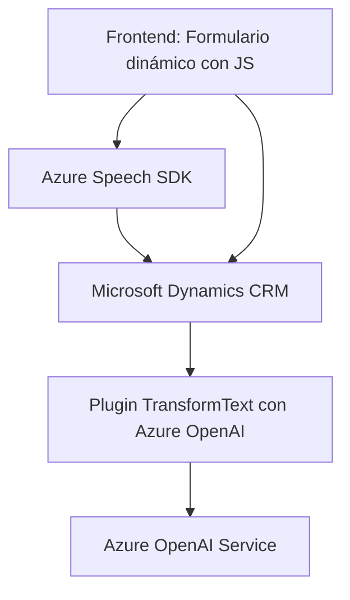

### Breve resumen técnico:
El repositorio describe una solución que integra funcionalidades tanto de frontend como de backend en un entorno Dynamics CRM, usando servicios como **Microsoft Azure Speech SDK** y **Azure AI OpenAI**. La solución incluye:

1. Archivos JavaScript responsables de interactuar con formularios en el frontend, recolectar datos y procesarlos mediante voz/speech recogida o texto sintetizado.
2. Un plugin en **C#** para la integración con Microsoft Dynamics CRM que delega tareas al servicio de Azure OpenAI para transformar texto en formato JSON.

---

### Descripción de arquitectura:
- **Tipo de arquitectura:** La solución sigue un enfoque de arquitectura de **microservicios** en combinación con **orientación a eventos**, debido a que aprovecha componentes y servicios externos como **Azure Speech SDK**, **Azure OpenAI Service**, y APIs personalizadas del CRM.
- **Capas:** También muestra características de arquitectura N-capas:
  - **Frontend:** Implementado con JavaScript, utilizado para interactuar con formularios (captura de datos).
  - **Backend:** Un plugin que opera dentro de Dynamics CRM, interactuando con servicios externos mediante llamadas REST a APIs.

---

### Tecnologías usadas:
1. **Frontend:**
   - Lenguaje: JavaScript (Construya funciones modulares para interacción con formularios).
   - Framework/SDK: Microsoft Azure Speech SDK.
   - API personalizada integrada a través de `Xrm.WebApi` de Dynamics CRM.

2. **Backend:**
   - Lenguaje: C#.
   - Framework: Integrado con **Microsoft Dynamics CRM**.
   - API externa: **Azure OpenAI Service**.
   - Dependencias: `System.Text.Json`, `Newtonsoft.Json.Linq`, `System.Net.Http`.

### Principales patrones:
Algunos patrones observados:
- **Single Responsibility Principle (SRP):** Cada función implementa una tarea específica y clara.
- **Factory Method:** Configuración dinámica del SDK.
- **Abstracción:** Usado tanto en el frontend como en el backend para encapsular funciones específicas.
- **Observer pattern:** Azure Speech SDK utiliza eventos para notificar cambios en el reconocimiento de voz.
- **Dependency Injection:** Uso de `IServiceProvider` en plugins para CRM.

---

### Diagrama Mermaid:

---

### Conclusión final:
La solución presentada es una integración progresiva entre frontend y backend usando una infraestructura de microservicios con componentes externos (Azure Speech y OpenAI). Utiliza un diseño modular enfocado en la interoperabilidad con **Microsoft Dynamics CRM** y garantiza la flexibilidad para actividades de procesamiento de voz y texto en tiempo real. La elección de tecnologías destaca por su capacidad para escalar, integrarse con servicios de nube y ser adaptable a diferentes casos empresariales, como CRM dinámicos.