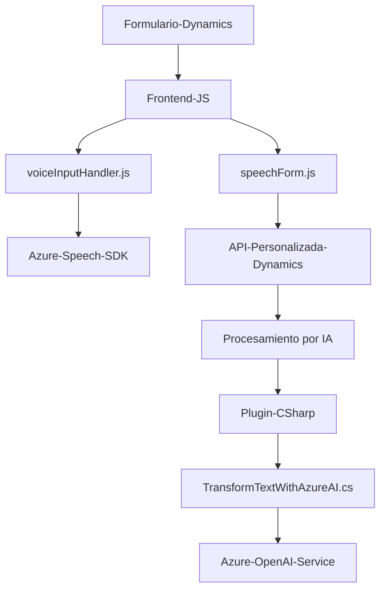

### Breve resumen técnico  
El repositorio combina varios componentes distribuidos entre frontend y plugins personalizados para Dynamics 365 CRM. Su enfoque está dirigido a la interacción mediante voz, facilitando la interacción del usuario con formularios web y servicios externos. En paralelo, un plugin procesa texto con Azure OpenAI para realizar transformaciones inteligentes y estructuradas.

---

### Descripción de arquitectura  
La solución sigue un **modelo n capas** incrementado con arquitectura **cliente-servidor**. Las capas identificadas son:  
1. **Frontend**: Contiene scripts que integran con Dynamics CRM para manejar formularios y servicios externos como Azure Speech SDK.  
2. **Servidor/Plugin**: Desarrollo de lógica personalizada con Dynamics CRM y servicios de Azure OpenAI, que funcionan como parte del backend extensible de Dynamics plugin architecture.  

#### **Elementos clave de arquitectura**:  
- **Frontend** (JavaScript) realiza tareas del lado del cliente, como interacción con formularios y comunicación con servicios de síntesis/reconocimiento de voz.  
- **Plugins** en C# están alojados en Dynamics CRM, procesan texto de entrada, interactúan con Azure OpenAI y transforman datos con lógica robusta.  

---

### Tecnologías usadas  
- **Frontend**:
  - **Tecnologías**: JavaScript, Dynamics 365 Form API, Azure Speech SDK, Web API (`Xrm.WebApi`).  
  - **Patrones**: Modularidad funcional, programación asincrónica, integración con APIs.  
- **Backend**:
  - **Tecnologías**: C# (Microsoft .NET), Microsoft Dynamics CRM SDK, System.Net.Http (para integración REST), Newtonsoft.Json (JSON parsing).  
  - **Servicios externos**: Azure OpenAI, Dynamics Web API.  
- **Arquitectura**: Combina frontend orientado al cliente dinámico junto con extensiones en forma de plugins en la capa backend de Dynamics CRM.  

---

### Dependencias o componentes externos presentes  
1. **Azure Speech SDK**: Reconocimiento y síntesis de voz en la capa frontend.  
2. **Azure OpenAI Service**: Generación de transformaciones de texto en C# plugin.  
3. **Dynamics 365 Form API (Frontend)**: Acceso a entidades de formularios para manipulación en tiempo real.  
4. **Dynamics 365 Plugin Architecture (Backend)**: Extensibilidad nativa de Dynamics CRM con lógica personalizada.  
5. **Librerías esenciales de C#**:  
   - `Microsoft.Xrm.Sdk`: Para manipular entidades y contexto.  
   - `Newtonsoft.Json`: Procesamiento de datos JSON.  
   - `System.Net.Http`: Solicitudes HTTP hacia servicios Azure.  

---

### Diagrama Mermaid válido para GitHub  

---

### Conclusión final  
La solución presentada se orienta a integrar tanto frontend como backend con capacidades avanzadas para mejorar la interacción entre usuarios y formularios de Dynamics CRM mediante entradas basadas en voz e inteligencias artificiales. Se implementan modelos modulares, n capas y cliente-servidor que promueven la escalabilidad y separación de responsabilidades.

**Posibilidades de mejora**:  
- Mejorar la gestión de credenciales (API Keys) para servicios externos utilizando configuraciones más seguras.  
- Convertir la solución en un microservicio desacoplado para una arquitectura más flexible en proyectos de mayor escala.  