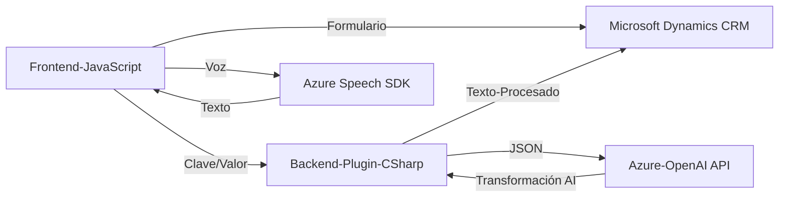

### Análisis técnico, descripción arquitectónica y visualización:

---

#### **Breve resumen técnico:**
El repositorio contiene el desarrollo de una solución que integra funcionalidades avanzadas de interacción por voz con formularios, reconocimiento de voz, y transformación de texto mediante APIs externas. Está orientado a Microsoft Dynamics CRM y se apoya en servicios de Azure como Speech SDK y Azure OpenAI. Además, el código sigue varios patrones de diseño como modularidad, desacoplamiento de dependencias externas, y mapeo de datos entre dominios.

---

### **Descripción de la arquitectura**
1. **Tipo de solución:**  
   - Principalmente se trata de una aplicación orientada al contexto de **Microsoft Dynamics CRM**, extendida mediante:
     - **Frontend:** Interacción con Speech SDK y DOM para enriquecer la experiencia de ingreso y lectura de datos por voz.
     - **Backend:** Plugins y servicios que conectan Dynamics CRM con APIs externas (Azure OpenAI Service).
   
2. **Patrones arquitectónicos:**  
   - **Modularidad:** Cada función define una tarea específica y mantiene un bajo acoplamiento.
   - **SDK Integration:** Los SDK de Azure Speech y OpenAI están integrados dinámicamente sin empaquetarse en el repositorio.
   - **Callback/Workflow Driven:** Uso de callbacks para gestionar la carga asincrónica de SDK y delegación de tareas.
   - **Plugin Pattern:** En el backend (.NET code), se sigue el patrón obligatorio de plugins asociado a Microsoft Dynamics CRM.
   - **Microservicios Externos:** Comunicación directa con servicios Azure OpenAI a través de HTTP para transformación de texto.

3. **Tipo de arquitectura:**  
   La arquitectura general combina:
   - **N-Capas**: El frontend y backend están claramente separados, con comunicación mediante APIs o servicios.
   - **Integración de servicios externos:** Dependencias de Azure Speech SDK y Azure OpenAI sugieren que el sistema se apoya en una arquitectura expandida por microservicios externos (aunque de forma indirecta).

---

### **Tecnologías usadas:**
1. **Frontend:**  
   - **Lenguaje:** JavaScript.
   - **Bibliotecas externas:**  
     - **Azure Speech SDK:** Para reconocimiento y síntesis de voz.  
     - DOM API y Browser APIs: Para la manipulación de formularios.
   - **Patrones de diseño:** Modularidad, callback.

2. **Backend:**  
   - **Lenguaje:** C#.  
   - **Frameworks:**  
     - Microsoft Dynamics SDK (principalmente interfaces como `IPlugin`).  
   - **APIs Externas:**  
     - Azure OpenAI Services para procesamiento de texto avanzado.  
     - Dynamics Web API para acceso a datos de entidades CRM.

---

### **Dependencias externas:**
1. **Azure Speech SDK:** Para reconocer comandos de voz, conversión de texto-voz, e interacción de usuario.
2. **Azure OpenAI API Service:** Para transformar texto reglamentado usando modelos de lenguaje como GPT.
3. **Dynamics Web API:** A través de `Xrm.WebApi` y `IOrganizationService` para manipulación directa de datos en CRM.
4. **HTTP Client Libraries:** En backend C#, para invocar servicios REST externos como Azure OpenAI.
5. **JSON Parsers:** `Newtonsoft.Json` y `System.Text.Json` para manejo de datos estructurados.

---

### **Diagrama Mermaid para GitHub Markdown:**

---

### Conclusión final:
La solución analizada es una implementación modular y escalable que habilita capacidades de reconocimiento de voz, interacción mediante comandos hablados, y transformación avanzada de texto utilizando Azure OpenAI, todo en el contexto de Microsoft Dynamics CRM. La arquitectura se encuentra bien segmentada entre el frontend (lectura/voz) y el backend (procesamiento/transformaciones), con una fuerte dependencia de APIs externas. Es un ejemplo de integración de servicios en la nube para extender funcionalidades empresariales.