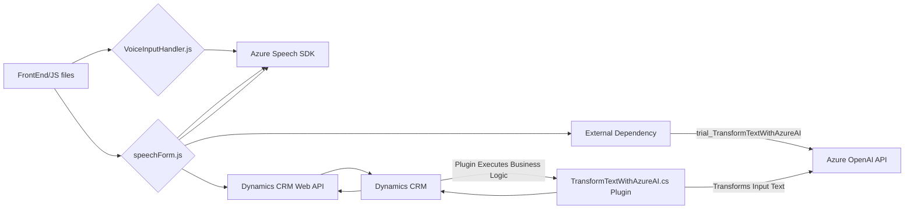

## Breve resumen técnico:
El repositorio contiene componentes de software utilizados para interactuar con formularios de Microsoft Dynamics CRM mediante la integración de dos servicios de Azure: Azure Speech SDK y Azure OpenAI. Los componentes principales son:
1. **Frontend (JavaScript)**:
   - `readForm.js`: Diseñado para extraer valores de un formulario, convertirlos en texto legible y sintetizarlos en voz mediante Azure Speech SDK. Mejora la accesibilidad del sistema.
   - `speechForm.js`: Implementa reconocimiento de voz y transcripción con Azure Speech SDK, realiza procesamiento del texto hablado, llama a una API personalizada (transformación mediante Azure AI), y aplica resultados al formulario de Dynamics 365.
2. **Plugin (C#)**:
   - `TransformTextWithAzureAI.cs`: Implementación de un plugin para Dynamics CRM encargado de transformar texto utilizando Azure OpenAI y devolverlo como estructura JSON estandarizada.

---

## Descripción de arquitectura:
### Modelo:
La arquitectura del sistema parece ser híbrida:
1. **Multicapa (n-capas)**:
   - **Presentación**: Los archivos JavaScript manejan vistas e interacción con formularios del usuario en el cliente (JavaScript dinámico).
   - **Lógica de negocio**: Parte del procesamiento está en el cliente (`speechForm.js` y `readForm.js`), mientras que otros aspectos como la transformación de texto por Azure AI están en el servidor, configurados en el plugin de Dynamics CRM.
   - **Datos**: Manipulación directa de atributos dentro del contexto extendido de Dynamics 365 (mediante APIs y el plugin).

### Patrón:
El uso de eventos para manejar voz y transcripción, junto con la integración de APIs externas, sugiere un diseño basado en **Event-Driven Architecture**. La interacción con formularios en Dynamics y la delegación de tareas específicas a Azure OpenAI sigue el **Patrón de Cliente-Servidor**.

---

## Tecnologías usadas:
1. **Frontend:**
   - **JavaScript**: Lenguaje base para las operaciones del cliente.
   - **Azure Speech SDK** (versión para navegador): Para la síntesis y reconocimiento de voz, y transcripciones.
   - **Dynamics 365 Web API**: Integración directa con formularios y datos de Dynamics CRM (usando `Xrm.WebApi`).

2. **Backend (Plugin):**
   - **C#/.NET**: Desarrollo de plugins para Microsoft Dynamics CRM.
   - **Azure OpenAI**: Procesamiento avanzado de texto mediante inteligencia artificial.
   - **JSON APIs**: Para estructurar y consumir datos.

3. **Frameworks y dependencias**:
   - **System Libraries (.NET):** Para manejar datos, texto y comunicaciones HTTP.
   - **Newtonsoft.Json.Linq**: Manipulación y creación de objetos JSON (en C#).
   - Event-driven approach: manejo de datos mediante triggers y funciones reutilizables en ambos niveles.

---

## Diagrama Mermaid 100 % Compatible con GitHub Markdown:

---

## Conclusión final:
El repositorio presenta una solución para integrar capacidades avanzadas de accesibilidad (síntesis y reconocimiento de voz) y procesamiento de lenguaje natural ofrecido por Azure AI dentro de un sistema CRM, como Dynamics 365. Se usa una arquitectura de **n-capas** combinada con sistemas cliente-servidor y eventos para gestionar la interacción entre cliente (Frontend) y servidor (Backend + plugins). La implementación explora modularidad y adaptabilidad mediante patrones como Bridge y Event-Driven Architecture, ofreciendo una solución escalable y sofisticada que maximiza el rendimiento y la accesibilidad.