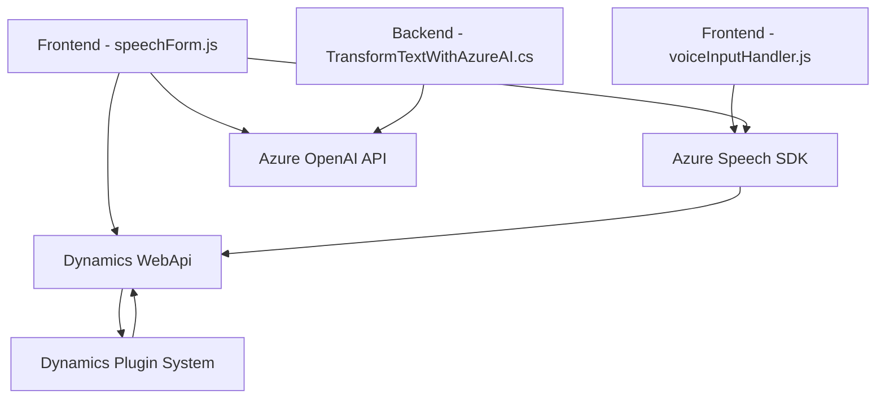

### Breve resumen técnico
El repositorio contiene elementos que integran tecnologías de Microsoft y Azure para enriquecer la funcionalidad de un entorno Dynamics CRM. Incluye dos scripts de frontend relacionados con Azure Speech SDK y un archivo backend para procesamiento de texto con Azure OpenAI. Los scripts de frontend manejan síntesis y reconocimiento de voz para interactuar con formularios, mientras que el backend utiliza inteligencia artificial para transformar textos en Dynamics CRM.

---

### Descripción de arquitectura
La solución sigue una arquitectura `n capas`, dividiendo responsabilidades entre el frontend y el backend. 
1. **Frontend**: Implementa lógica basada en eventos y procesamiento dinámico desde la entrada del usuario (voz y formulario). Utiliza un patrón modular con mapeo de datos y contiene una integración directa con Azure Speech SDK.
2. **Backend**: Arquitectura basada en microservicios y plugins específicos. Emplea la arquitectura plugin de Dynamics CRM, proporcionando extensibilidad mediante integración con la API de Azure OpenAI.
3. **Integraciones**: Se observa un fuerte enfoque en la integración con servicios externos (Azure Speech SDK y Azure OpenAI).

---

### Tecnologías usadas
- **Frontend**:
  - `Azure Speech SDK`: Para síntesis y reconocimiento de voz.
  - `Dynamics 365 WebApi`: Para interactuar con formularios y atributos en Dynamics CRM.
  - JavaScript ECMAScript 2015+.

- **Backend**:
  - `Dynamics CRM Plugins (IPlugin)`: Extensión implementada con la API de plugins.
  - `.NET Framework/C#`: Se utiliza para desarrollar el plugin.
  - `Azure OpenAI REST API`: Para procesamiento de texto con modelos GPT-4 alojados en Azure.
  - `Newtonsoft.Json` y `System.Text.Json`: Para trabajar con JSON.

---

### Dependencias y componentes externos presentes
1. **Azure Cloud Services**:
   - **Azure Speech SDK**: Manipulación de entrada y salida de voz.
   - **Azure OpenAI API**: Uso de IA para transformar textos.
2. **Dynamics CRM**:
   - Extensiones de formularios: Mapeo de datos del formulario en el frontend.
   - Plugin architecture: Backend integrado con Dynamics CRM utilizando `IPlugin`.
3. **Frameworks/Librerías**:
   - `System.Net.Http`: Para manejo de llamadas HTTP en el backend.
   - `Newtonsoft.Json` y `System.Text.Json`: Para trabajar con JSON internamente en los plugins.

---

### Diagrama **Mermaid** válido para GitHub Markdown

---

### Conclusión final
Esta solución muestra una integración avanzada entre el ecosistema de Microsoft Dynamics 365 y varios servicios de Azure, como Speech SDK y OpenAI. La arquitectura divide con eficacia las responsabilidades entre frontend y backend, destacando patrones `n capas`. El diseño modular en el frontend y la extensibilidad a través del backend garantizan escalabilidad y adaptabilidad. Es altamente compatible con entornos empresariales, ampliando las capacidades de los usuarios mediante interfaces naturales y una integración robusta con servicios de IA.