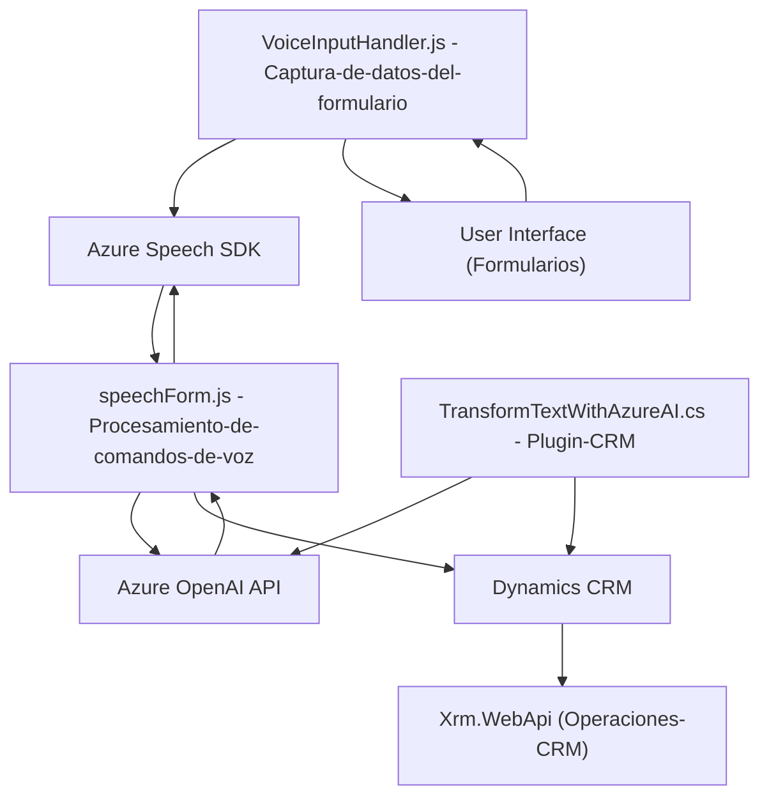

### Breve resumen técnico

El repositorio integra especificaciones de voz y procesamiento de texto mediante Azure Speech SDK y Azure OpenAI API. Está dividido en tres bloques principales: una solución frontend para manejar interacciones con formularios (`readForm.js` y `speechForm.js`) y un plugin backend para integrar Azure OpenAI dentro de Dynamics CRM (`TransformTextWithAzureAI.cs`). La solución busca convertir texto en voz, escuchar comandos de voz y aplicar estos datos procesados dinámicamente en formularios de Dynamics CRM.

---

### Descripción de arquitectura

La solución tiene una arquitectura de **cliente-servidor** centrada en la interacción con formularios y su procesamiento en tiempo real utilizando inteligencia artificial integrada con servicios en la nube. A nivel de detalle:
1. **Frontend**:
   - Componente de presentación en JavaScript para la gestión de formularios (navegador o cliente local).
   - Integración dinámica con SDK de Azure Speech para síntesis de voz y reconocimiento de comandos hablados.
2. **Backend**:
   - Plugin basado en Dynamics CRM que utiliza Azure OpenAI para realizar transformaciones avanzadas del texto recibido.
   - Conecta el servidor principal CRM con el servicio RESTful de OpenAI mediante solicitudes HTTP.

La arquitectura general puede categorizarse como una solución **n capas**, combinando lógica de cliente (frontend), un backend centralizado (CRM Plugin), y servicios distribuidos (Speech SDK y Azure OpenAI).

---

### Tecnologías usadas
1. **Frontend**:
   - **JavaScript** y su ecosistema.
   - **Azure Speech SDK** para síntesis y reconocimiento de voz.
   - **Xrm.WebApi** para operaciones sobre Dynamics CRM desde el cliente.
2. **Backend**:
   - **C# (System.Net.Http, Newtonsoft.Json)** para procesamiento HTTP y manejo de JSON.
   - **Dynamics CRM SDK** (Microsoft.Xrm.Sdk) para extensiones de CRM.
   - **Azure OpenAI API** como servicio externo para transformar texto.
3. **Azure Cloud Services**:
   - Speech SDK y OpenAI.
4. **Patterns and Practices**:
   - Modularidad funcional en el frontend (encapsulación de funciones).
   - Plugin-based extension para Dynamics CRM.
   - Service-oriented integration (RESTful APIs).

---

### Diagrama Mermaid válido para GitHub

---

### Conclusión final

Este repositorio presenta una solución n-capas que combina frontend y backend con servicios distribuidos (Azure Cloud). Su objetivo es potenciar aplicaciones basadas en formularios con reconocimiento de voz, síntesis de texto a voz, y procesamiento de comandos dinámicos utilizando inteligencia artificial. El uso de estándares como SDK de Azure, Dynamics CRM Plugins, y la integración con servicios RESTful externos, garantizan que el producto sea escalable y conforme a prácticas modernas. Sin embargo, para mayor robustez sería recomendable validar entradas por parte de usuarios y manejar de manera más exhaustiva los posibles errores de conexión a los servicios externos, especialmente cuando se utilizan APIs críticas como las de Azure.