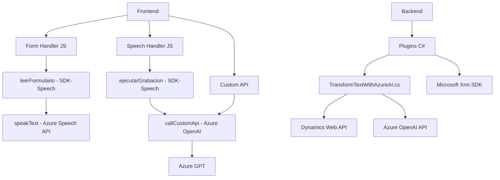

### Breve resumen técnico
El repositorio contiene múltiples archivos clasificados bajo diferentes carpetas que interactúan entre sí para implementar funcionalidades en un entorno predominantemente de front-end (JavaScript) y back-end (C# plugins). Las funcionalidades incluyen reconocimiento y síntesis de voz con Azure Speech SDK, transformación de texto utilizando Azure OpenAI API, y generación dinámica de valores en formularios. El sistema parece centrado en integrar un front-end dinámico con un back-end vinculado a Microsoft Dynamics CRM mediante plugins.

---

### Descripción de arquitectura
La arquitectura del sistema está basada en una integración cliente-servidor:
1. **Front-end**: Utiliza JavaScript para la síntesis de voz, reconocimiento de voz, y mapeo dinámico de formularios (representa una arquitectura modular basada en eventos). Este componente interactúa con APIs externas como Azure Speech SDK o APIs personalizadas.
2. **Back-end**: Implementa extensiones mediante plugins (.NET) de Microsoft Dynamics CRM, siguiendo un modelo de arquitectura de extensibilidad basado en el patrón `Plugin`. Esta capa es responsable de consumir servicios como Azure OpenAI API para procesar texto.
3. **SOA (Arquitectura Orientada a Servicios)**: Los diferentes módulos consumen servicios externos, como Azure Speech SDK y Azure OpenAI API, integrándose en una arquitectura orientada a servicios para facilitar procesamiento inteligente y manejo de eventos.

---

### Tecnologías usadas
1. **Front-end**:
   - **JavaScript (ES6)**: Lenguaje principal para las funcionalidades en el navegador.
   - **Azure Speech SDK**: Para reconocimiento y síntesis de voz.
   - **Dynamics Web API (Xrm.WebApi)**: Para interacción con entidades de Microsoft Dynamics CRM.
   - **Custom API**: Integración con API personalizada para transformación de texto mediante IA.

2. **Back-end**:
   - **C# (.NET Framework)**: Para implementar el plugin en Dynamics CRM.
   - **Microsoft.Xrm.Sdk**: Extendiendo funcionalidades de Dynamics CRM.
   - **Azure OpenAI API**: Generación de respuesta inteligente con modelos GPT.
   - **System.Net.Http y Newtonsoft.Json**: Para llamadas y manipulación de APIs y procesamiento JSON.

3. **Patrones**:
   - **Modularidad** en front-end para el aislamiento de funciones.
   - **Cliente-Servidor**, integrando el cliente (JavaScript) y el servidor back-end (Azure y Dynamics CRM).
   - **Eventos dinámicos**, como `callbacks` y carga asincrónica de recursos.
   - **Extensibilidad mediante Plugins**, para manipular datos en Dynamics CRM y procesarlos con servicios externos (Azure OpenAI).

---

### Diagrama Mermaid válido para GitHub

---

### Conclusión final
El repositorio presenta un sistema diseñado para habilitar funcionalidades avanzadas impulsadas por IA y servicios en la nube. El **front-end** utiliza integraciones con Azure Speech SDK para reconocimiento y síntesis de voz, complementándolo con una API personalizada que transforma texto con Azure OpenAI. En el **back-end**, se extiende Dynamics CRM mediante Plugins que consumen estos servicios externos. La arquitectura puede clasificarse como **cliente-servidor con orientación a servicios**, manteniendo una estructura modular y adaptada para escenarios dinámicos en el contexto CRM.