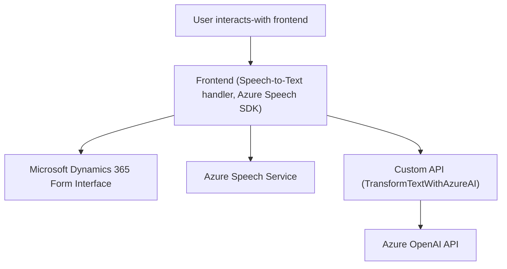

### Breve resumen técnico

El repositorio contiene un sistema que extiende la funcionalidad de formularios en Dynamics 365 con entrada de voz y síntesis de texto a voz. Se apoya en servicios de Azure Speech SDK y Azure OpenAI, además de integración directa con la API de Dynamics CRM. Está orientado a mejorar la accesibilidad y experiencia de usuario, habilitando tanto entrada por voz como transformación dinámica de texto mediante inteligencia artificial para modificar y actualizar datos en tiempo real.

---

### Descripción de arquitectura:
El sistema tiene características de una **arquitectura de servicios integrados (integrated services architecture)**, con comunicación entre distintas capas y servicios. Incluye una combinación de patrones:

1. **Arquitectura basada en microservicios**: Usando APIs de Azure Speech, OpenAI en Azure y Dynamics 365 como servicios individuales.
2. **N capas (Frontend + Backend)**: Con un frontend que gestiona la interfaz de interacción para capturar datos y una capa posterior (plugin) que aplica la lógica de negocio en Dynamics 365.
3. **Integración de servicios y API Gateway**: Se utiliza un patrón API Gateway para interactuar con servicios externos (Azure).

Además, la estructura modular del código con funciones específicas y clases autónomas indica un enfoque orientado a mantener la claridad y escalabilidad.

---

### Tecnologías usadas

1. **Frontend**:
   - **JavaScript**:
     - Operaciones de DOM (por ej., creación y manipulación de elementos HTML).
     - Lógica modular, separación por funciones específicas.
   - **Azure Speech SDK**:
     - `window.SpeechSDK`: Para entrada de voz (speech-to-text) y síntesis de texto a voz.
     - Dinámica de carga del SDK usando `document.createElement` y `document.head.appendChild`.
   - **Web APIs / Browser APIs**:
     - Para la manipulación de elementos dinámicamente y renderización.

2. **Backend**:
   - **C#** utilizando la API de Dynamics CRM:
     - Plugin implementado en base a la interfaz `IPlugin`.
   - Azure OpenAI API:
     - Conecta al modelo de lenguaje GPT para la transformación de textos en formato JSON.
   - **HTTP Client**:
     - Realiza una conexión HTTP segura con la API remota.

3. **Frameworks y APIs de Terceros**:
   - Microsoft Dynamics Web API: Interacción con datos del formulario.
   - Azure OpenAI para procesamiento de texto inteligente.
   - Azure Speech SDK para entrada por voz y síntesis de voz.

---

### Dependencias o componentes externos

1. **Azure Speech SDK**: Para la funcionalidad de entrada de voz y síntesis de voz.
2. **Azure OpenAI API**: Para transformar dinámicamente los datos textuales en JSON estructurado.
3. **Microsoft Dynamics 365 Web APIs**:
   - Interacción con formularios.
   - Búsqueda dinámica de datos.
   - Ejecución de plugins personalizados.
4. **Custom API** (`trial_TransformTextWithAzureAI`): Un punto de integración para transformación de texto usando Azure AI.
5. **JSON libraries**:
   - `Newtonsoft.Json` o cualquier otra librería compatible con C# para la manipulación de JSON.
6. **Dependency Injection Framework**:
   - `IServiceProvider` para manejar la inyección en Dynamics CRM.

---

### Diagrama **Mermaid**

---

### Conclusión Final

El análisis sugiere que este repositorio forma parte de una solución para mejorar la accesibilidad en aplicaciones basadas en formularios, especialmente en entornos como Dynamics 365. La arquitectura muestra una integración eficiente de servicios externos con patrones como modularidad y event-driven programming. Aunque el diseño tiene una orientación plug-and-play para Dynamics (gracias a los plugins), destaca el uso de Azure AI y Azure Speech como microservicios.

El sistema puede ser optimizado en términos de seguridad, delegando el manejo de claves sensibles y mejorando el tratamiento de excepciones en API externas. Su diseño modular permite escalabilidad, y es adecuado para entornos corporativos que busquen procesamiento automatizado y accesibilidad basada en voz.