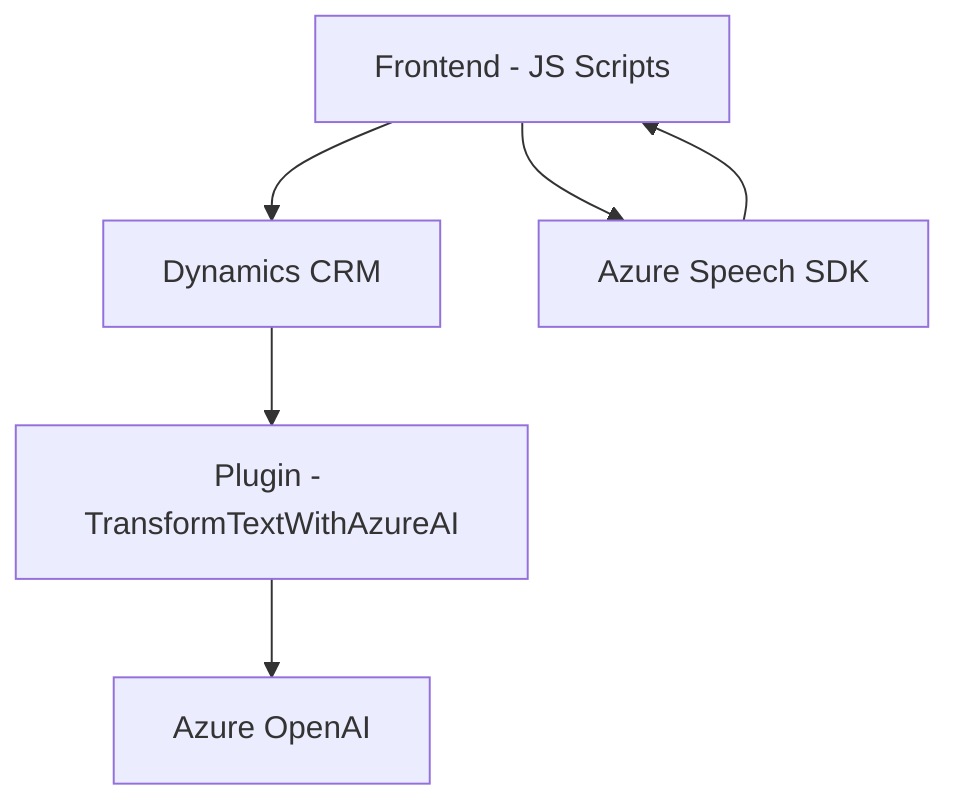

### Breve resumen técnico

El repositorio implementa una solución híbrida centrada en la captura, procesamiento y síntesis de voz en formularios de Dynamics 365, junto con un plugin que usa Azure OpenAI para procesamiento avanzado de texto estructurado. Los archivos analizados sugieren que se trata de una combinación de **frontend especializado** para formularios interactivos (JavaScript) y un **plugin para backend** que opera como extensiones personalizadas dentro de Dynamics CRM.

---

### Descripción de arquitectura

La arquitectura es de estilo **integración modular con servicios externos**, más específicamente dentro de un **sistema empresarial basado en Dynamics 365**. 
1. **Frontend:** Scripts de JavaScript usados para la interacción directa con formularios de usuario.
2. **Backend Plugin:** Integrado en el entorno de Dynamics CRM mediante la implementación de `IPlugin`, con funciones que recurren a APIs externas y a los servicios de Dynamics 365 Web API para mayor funcionalidad.
3. **Servicios externos:** Uso de SDKs y APIs como Azure Speech y Azure OpenAI, que amplían las capacidades del sistema central sin modificarlo directamente.

Aunque no se implementa una arquitectura avanzada como hexagonal o por microservicios, se observa la separación entre la capa de presentación (Frontend/JavaScript) y lógica del negocio (Plugin para backend y llamadas a servicios externos). Esto lo clasificaría como una **arquitectura de n capas**.

---

### Tecnologías y frameworks usados

1. **Frontend (JavaScript):**
   - **Azure Speech SDK:** Para la síntesis y reconocimiento de voz.
   - **Dynamics Web API:** Acceso y manipulación de datos de formularios en Dynamics 365.
   - **Modularidad:** Funciones utilitarias para procesar campos visibles/formateo de datos del formulario.

2. **Backend Plugin (.NET C#):**
   - **Microsoft.Xrm.Sdk:** Extensión para integrar funcionalidades en Dynamics CRM.
   - **Azure OpenAI GPT API:** Procesamiento avanzado de texto.
   - **JSON Libraries:** Nueva integración con librerías `Newtonsoft.Json.Linq` y `System.Text.Json` para acceso y manipulación de datos estructurados.
   - **System.Net.Http:** Para realizar solicitudes HTTP POST.

3. **Patrones y principios:**
   - **Separación de responsabilidades:** Cada archivo tiene funciones y clases especializadas en tareas concretas.
   - **SDK integration:** Aprovechamiento de APIs y SDKs externos para incorporar funcionalidades sin reescribirse.
   - **Capa de plugins:** Manejo en backend mediante clases que implementan el `IPlugin`.

---

### Diagrama `Mermaid`

Un diagrama simplificado del flujo de la solución:

### Explicación del diagrama:
1. **A["Frontend - JS Scripts"]**: Los scripts del frontend interactúan directamente con el SDK de Azure Speech para síntesis de voz, y con Dynamics CRM para manejar formularios dinámicos.
2. **C["Azure Speech SDK"]**: Provee las capacidades de procesamiento de voz (reconocimiento y síntesis), en comunicación constante con el frontend.
3. **B["Dynamics CRM"]**: Funciona como el núcleo del sistema. Recibe eventos del frontend y delega tareas al plugin para el procesamiento avanzado.
4. **E["Plugin - TransformTextWithAzureAI"]**: Extensión en backend que llama a servicios de Azure OpenAI para transformar texto.
5. **D["Azure OpenAI"]**: Proporciona funcionalidades avanzadas de procesamiento de texto estructurado que el plugin usa.

---

### Conclusión final

La solución combina un **frontend especializado con comunicación directa con SDKs** para la manipulación de formularios y un **plugin backend** que extiende la funcionalidad de Dynamics CRM mediante integración con Azure OpenAI. Esto apunta hacia una arquitectura **n capas**, con separación entre presentación, lógica y servicios externos. Las tecnologías utilizadas refuerzan la modularidad, permitiendo escalar la solución o incorporarla fácilmente en otros entornos basados en Azure y Dynamics.

Sin embargo, los siguientes puntos podrían ser revisados para optimizar:
1. **Desempeño:** Evaluar la latencia en la conexión con servicios API externas.
2. **Seguridad:** Garantizar el manejo adecuado de claves de acceso a Azure (evitando exposición).
3. **Mantenimiento:** Modularizar aún más las funcionalidades de frontend y backend, facilitando su adaptación a otros entornos empresariales.