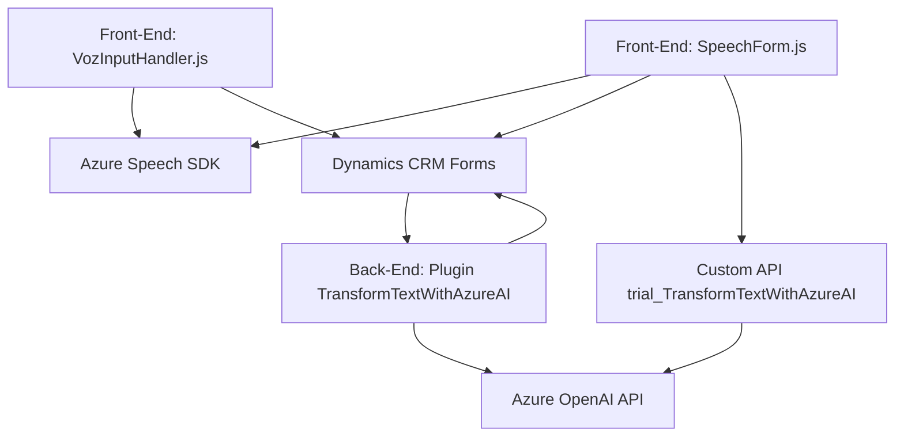

### Breve resumen técnico
El repositorio tiene una clara división funcional entre un frontend basado en JavaScript para capturar y procesar datos de entrada y salida de voz, y un componente backend (plugin) que interactúa con Azure OpenAI API para manejar transformaciones en el contexto de Dynamics CRM. Los archivos JS operan dentro de la estructura de Microsoft Dynamics, utilizando el contexto de los formularios y los atributos, mientras que el plugin backend implementa procesos específicos para el procesamiento de datos.

### Descripción de la arquitectura
La arquitectura muestra una combinación de **n capas** y uso de **servicios externos**:
1. **Frontend (Presentation Layer)**:
   - Maneja la interacción con el usuario y datos a través de los formularios de Dynamics CRM.
   - Implementa funcionalidades asíncronas con llamadas al SDK de Microsoft Azure Speech.
   - Gestión de transcripciones con posibilidades de manipulación avanzada mediante APIs personalizadas y procesamiento dinámico de datos.
   
2. **Backend (Business Logic Layer)**:
   - Implementación de un plugin (`TransformTextWithAzureAI`) que sigue el **Plugin Pattern** de Dynamics CRM, procesando datos de entrada mediante Azure OpenAI API.

En conjunto, esto sigue una **arquitectura de n capas** basada en la separación de responsabilidades (presentación, negocio y gestión de datos) integrada con microservicios de Microsoft Azure.

### Tecnologías usadas
1. **Frontend**:
   - **JavaScript**: Implementación de lógica asíncrona y modular.
   - **Dynamics CRM customizations**: Utilización del contexto `formContext` para trabajar sobre campos del formulario.
   - **Azure Speech SDK**: Procesamiento dinámico para texto a voz y transcripciones de voz activa.

2. **Backend**:
   - **Azure OpenAI API (GPT)**: Para transformar texto con normas personalizadas.
   - **Microsoft.Dynamics CRM SDK**: Interfaz del plugin y servicios de Dynamics CRM.
   - **System.Net.Http**: Para peticiones al servicio de Azure OpenAI.
   - **JSON APIs**: Procesamiento de datos mediante serialización/deserialización entre Dynamics y el servicio Azure OpenAI.

### Dependencias o componentes externos
1. **Microsoft Dynamics CRM**:
   - Gestión de entidades, atributos y formularios.
   - Uso de Dynamics Web API para comunicación.
   - Estructura interna de plugins, ejecución bajo la plataforma CRM.

2. **Azure Speech SDK**:
   - Carga dinámica del SDK para sintetizar voz y realizar transcripción de habla.

3. **Azure OpenAI API**:
   - Uso de inteligencia artificial para procesamiento y transformación de datos textuales.
   
4. Posibles componentes:
   - CDN para carga de scripts críticos como `csspeech/jsbrowserpackageraw`.
   - API personalizada en Dynamics CRM para procesamiento adicional de datos mediante AI.

---

### Diagrama Mermaid

---

### Conclusión final
El repositorio representa un sistema híbrido, donde un frontend en JavaScript actúa como intermediario para el tratamiento y síntesis de voz, mientras integra con Dynamics CRM. Por otro lado, el backend utiliza un plugin que aprovecha la inteligencia artificial de Azure OpenAI para manejar transformaciones avanzadas de texto. Este diseño es adecuado para aplicaciones empresariales que requieran interacción dinámica con formularios y funcionalidades impulsadas por IA sobre la plataforma Dynamics CRM. Te recomiendo asegurar un robusto manejo de errores especialmente en los integradores de Azure OpenAI y sus dependencias SDK para reducir posibles puntos de falla.