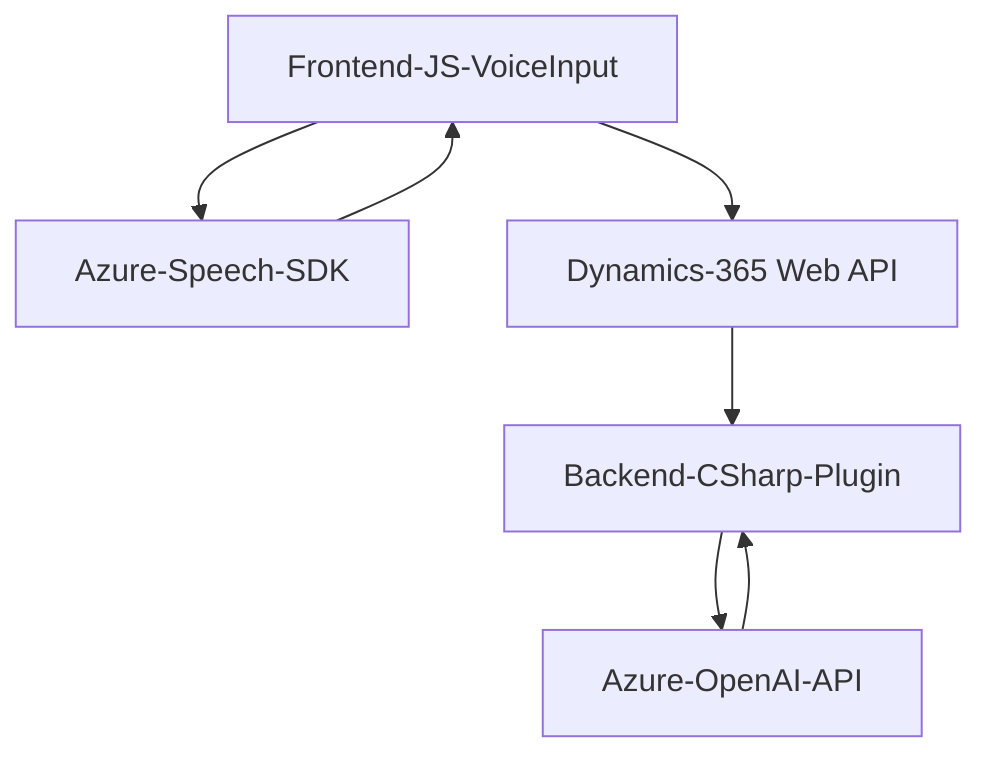

### Breve resumen técnico
Los archivos corresponden a las distintas capas de una solución híbrida basada en Microsoft Dynamics CRM, que integra un **frontend web** implementado en JavaScript y un **backend con plugins en .NET**, además de servicios externos como **Azure Speech SDK** y **Azure OpenAI API**. La solución incluye procesamiento de voz, manipulación de formularios dinámicos, y un plugin para transformación de texto mediante inteligencia artificial alojada en la nube.

---

### Descripción de arquitectura
La arquitectura sigue un enfoque **n-capas con integración de servicios externos**:
1. **Frontend**: 
   - Implementado en JavaScript. Realiza operaciones de síntesis de voz y reconocimiento de voz en formularios de Dynamics CRM. 
   - Interactúa con servicios de Azure (Speech SDK) para reconocimiento y síntesis de texto hablado.
   - Se integra con Dynamics 365 mediante APIs y SDK relacionados.
   
2. **Backend**:
   - Un plugin construido en C# que realiza transformación de texto utilizando servicios de Azure OpenAI API.
   - Encapsulación clara de las llamadas a APIs externas y del flujo de datos en Dynamics CRM.

3. **Externo**: Servicios de Azure (Speech SDK y OpenAI) utilizados para procesamiento cognitivo (voz e inteligencia artificial).

---

### Tecnologías usadas
**Frontend:**
- **Tecnologías**: JavaScript.
- **Frameworks/SDK**: Azure Speech SDK.
- **Integraciones**: Microsoft Dynamics Web API.
- **Patrones**:
  - Modularización y separación de preocupaciones: Funciones aisladas con responsabilidades específicas.
  - Callback pattern: Uso de funciones de retorno para flujo asincrónico (carga dinámica de SDK).
  - Dependency Injection simulada: El SDK de Azure Speech se carga dinámicamente.

**Backend:**
- **Tecnologías**: C# (.NET Framework).
- **Frameworks/SDK**: Microsoft Dynamics SDK.
- **Integraciones**: Azure OpenAI API.
- **Patrones**:
  - Plugin architecture: Desarrollo como un módulo funcional que interactúa con el CRM.
  - Separation of Concerns (SoC): Métodos están segmentados por objetivo y responsabilidad.
  - API integration: Llamadas HTTP a Azure OpenAI.

---

### Diagrama Mermaid válido para GitHub

---

### Conclusión Final
Esta solución integra herramientas modernas para la automatización y mejora de procesos que dependen de voz e inteligencia artificial. Con un frontend que facilita la interacción directa con usuarios mediante reconocimiento y síntesis de voz, y un backend que utiliza un plugin para la transformación avanzada de texto por inteligencia artificial, se logra una estructura claramente separada por capas, promoviendo escalabilidad y mantenibilidad.