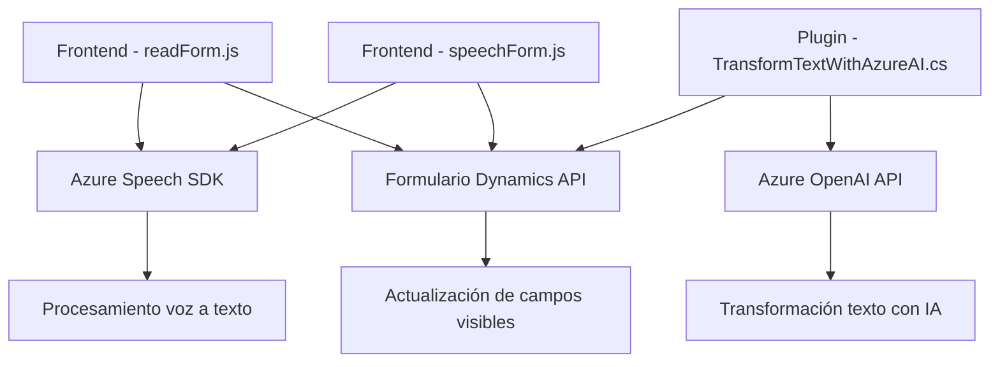

### Breve Resumen Técnico

El repositorio parece ser parte de una solución híbrida que integra **frontend** (usando JavaScript para funcionalidad del lado del cliente) con **Microsoft Dynamics CRM Plugins**, junto con servicios externos como **Azure Speech SDK** y **Azure OpenAI API**. Los archivos `readForm.js` y `speechForm.js` están orientados a la interacción del cliente mediante reconocimiento de voz y síntesis de texto, mientras que el plugin en `.cs` se encarga de integrar la lógica avanzada de transformación de datos mediante Azure OpenAI en el servidor.

---

### Descripción de Arquitectura

El diseño del sistema combina tres grandes piezas arquitectónicas:
1. **Frontend con JavaScript**:
   - Módulos para interacción con formularios (captura de datos y síntesis de voz).
   - Uso de Azure Speech SDK para procesamiento de audio y generación de respuesta en formato voz.

2. **Dynamics CRM Plugins**:
   - Extensiones server-side para Dynamics CRM, usando arquitectura basada en plugins.
   - A través de patrones de **Microsoft Dynamics SDK**, realiza transformaciones con Azure OpenAI API.

3. **Servicios externos**:
   - **Azure Speech SDK**: Procesa datos de voz a texto y viceversa. El código implementa integración directa con los servicios de Azure Speech.
   - **Azure OpenAI API**: Análisis y transformación de texto basados en inteligencia artificial.

La solución sigue una **arquitectura en capas**, donde diferentes componentes desempeñan roles específicos:
- **Capa de presentación**: Manejo de formularios y entrada de datos con voz (JavaScript en cliente).
- **Capa lógica de negocio**: Plugins en Dynamics CRM procesan y transforman datos.
- **Capa de servicios externos**: SDK de Azure Speech y APIs de Azure OpenAI para procesamiento avanzado.

---

### Tecnologías Usadas

1. **Frontend**:
   - **JavaScript**: Funciones modulares para captura de datos y voz.
   - **Azure Speech SDK**: Manejo de transcripción y síntesis de voz.

2. **Backend en Dynamics CRM**:
   - **Microsoft Dynamics SDK (IPlugin)**: Extensiones de la lógica en CRM.
   - **ASP.NET/C#**: Desarrollo del plugin.

3. **Servicios externos**:
   - **Azure Speech Service**: Procesamiento de voz a texto y síntesis.
   - **Azure OpenAI API**: Transformación de lenguaje natural.
   - **API Dynamics 365**: Actualización y manejo de formularios.

4. Dependencias Heredadas:
   - Integraciones REST con HTTP (`System.Net.Http`).
   - Manipulación de JSON con `System.Text.Json` y `Newtonsoft.Json`.

---

### Diagrama Mermaid Válido para GitHub

1. **Frontend Modules** (`readForm.js` and `speechForm.js`) use `Azure Speech SDK` for voice input and synthesis, interacting with **Dynamics API** for form data.
2. **Plugin (`TransformTextWithAzureAI.cs`)** connects to **Azure OpenAI API** for transforming textual information and programmatically updates **forms** in Dynamics 365.

---

### Conclusión Final

La solución es altamente especializada para automatizar la gestión e interacción de formularios dentro de Dynamics CRM mediante entrada de datos por voz y transformación de texto con inteligencia artificial. El diseño combina una **arquitectura en tres capas**:
1. Presentación (JavaScript frontend).
2. Lógica empresarial (C# plugin en Dynamics CRM).
3. Servicios externos (Azure Speech SDK y Azure OpenAI API).

#### Fortalezas:
- Modularidad: Separación funcional por archivo, siguiendo principios del diseño limpio.
- Utilización de servicios cloud: Uso de Azure Speech SDK y Azure OpenAI mejora escalabilidad y reduce carga local.
- Manejo eficaz de interacción de voz: Proceso completo desde entrada de voz hasta síntesis y actualización de formularios.

#### Áreas de mejora:
- Configuraciones hardcoded (API keys y endpoints) que podrían externalizarse para facilitar el mantenimiento.
- Oportunidades para aumentar abstracción: separar lógica de procesamiento de datos y comunicación con APIs.

Este diseño es ideal para aplicaciones empresariales donde la interacción natural y la automatización de tareas sean prioridades, como Dynamics CRM para la gestión de relaciones con clientes.