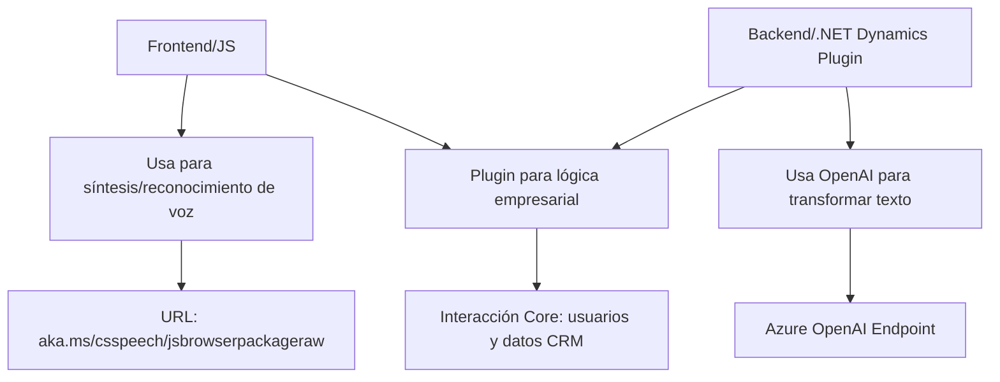

### Breve Resumen Técnico
Los archivos en el repositorio se centran en la integración de servicios externos para mejorar la funcionalidad de aplicaciones empresariales basadas en formularios y CRM. Específicamente:
1. **Frontend**: Maneja síntesis de voz (con Azure Speech SDK) y entrada de voz para formularios interactivos.
2. **Backend (Plugin)**: Utiliza Azure OpenAI para transformar texto bajo reglas específicas y aplica lógica en un contexto de Dynamics CRM.

---

### Descripción de Arquitectura
La solución tiene dos componentes principales:
1. **Frontend**: Modular y orientado a eventos. Utiliza una arquitectura basada en capas:
   - **Presentación y lógica de negocio**: Separada por funciones que encapsulan funcionalidades (ej. `speakText`, `processTranscript`).
   - **Integración externa**: Dinámicamente conecta con Azure Speech SDK.
   - **Desacoplamiento**: Cada funcionalidad está restringida a su propósito específico.
   
2. **Backend (Plugin)**: SOA (Service-Oriented Architecture) usando un servicio externo (Azure OpenAI) para complementar las capacidades de Dynamics CRM, implementado como un **Plugin Architecture**.

La solución general es híbrida, utilizando principios de arquitectura de capas y desacoplamiento funcional.

---

### Tecnologías Usadas
1. **Frontend**:
   - **Azure Speech SDK**: Para técnicas de síntesis y procesamiento de voz.
   - **JavaScript**: Base para funciones manejadoras (orientación modular y asincrónica). 
   - **Promesas (Promises)**: Para integración eficiente con APIs externas y asincronía.
   - **Event-driven design**: Callbacks para funciones asíncronas.
   - **HTTP Requests**: Para interactuar con external APIs.

2. **Backend**:
   - **Dynamics CRM SDK**: Framework especializado para desarrollo de plugins y lógica empresarial.
   - **C#**: Lenguaje base para implementar lógica de negocios con plugin personalizado.
   - **Azure OpenAI**: API para transformación de texto estructurada.
   - **Newtonsoft.Json & System.Text.Json**: JSON serialization/deserialization para operar con APIs.

---

### Dependencias y Componentes Externos
1. **Azure Speech SDK**: Generación y reconocimiento de voz (URL: `https://aka.ms/csspeech/jsbrowserpackageraw`).
2. **Azure OpenAI**: Procesamiento de texto según normas estructuradas (API Key requerida en backend).
3. **Dynamics CRM (Microsoft)**: Plugin personalizado en el contexto de CRM para reglas de negocio.
4. **HTTP & JSON Serialization Libraries**: Para manejar datos y conectar APIs.

---

### Diagrama Mermaid

---

### Conclusión Final
La solución proporciona una integración avanzada para entornos empresariales, mejorando accesibilidad y automatización en la interacción con formularios mediante voz y procesamiento de datos. Combina un diseño modular en el frontend con una arquitectura orientada a servicios en el backend, enfatizando desacoplamiento y escalabilidad.