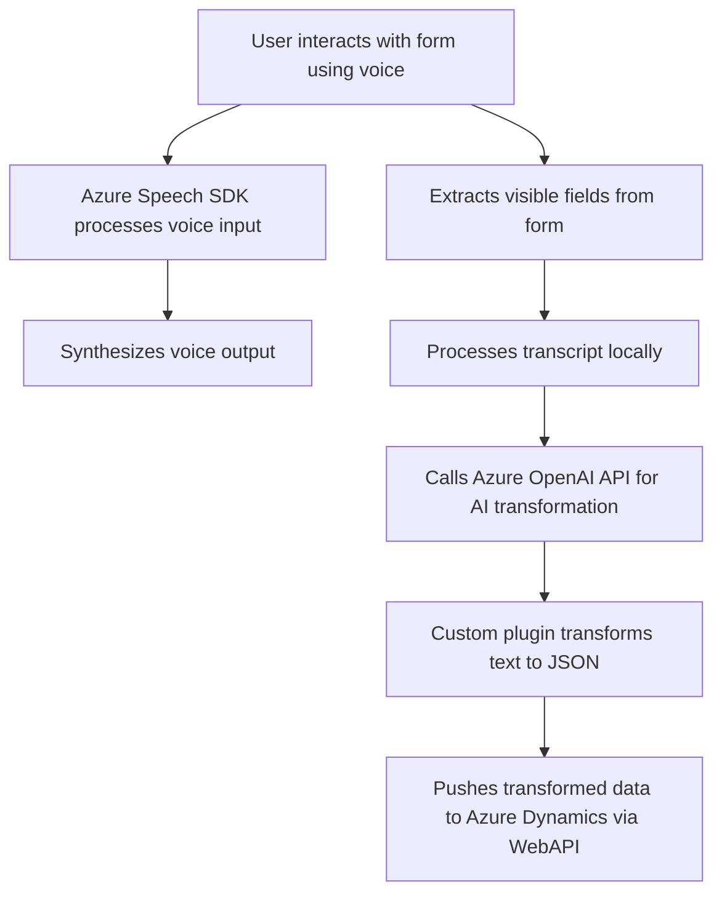

# Análisis Técnico del Repositorio

## Breve Resumen Técnico
El repositorio contiene tres archivos principales cuya funcionalidad gira alrededor de la integración con **Microsoft Azure Speech SDK** para reconocimiento de voz y síntesis de texto, junto con un plugin para transformar texto en objetos JSON estructurados empleando **Azure OpenAI**. Los archivos `readForm.js` y `speechForm.js` están orientados al frontend de una aplicación que probablemente interactúa con Microsoft Dynamics 365, mientras que el archivo `TransformTextWithAzureAI.cs` implementa un backend plugin para Dynamics 365.

---

## Descripción de Arquitectura
### Tipo de Arquitectura
La solución tiene una estructura **n capas** con integración a microservicios externos mediante tecnologías como **Azure Speech SDK** y **Azure OpenAI API**, combinado con la integración de un plugin basado en la arquitectura del ecosistema Dynamics 365.

### Detalles Generales
1. **Frontend:**
   - Implementado en **JavaScript**.
   - Utiliza el **Azure Speech SDK** en el navegador, con una funcionalidad orientada al reconocimiento y síntesis de voz en tiempo real.
   - Integrado con otros servicios para acceder al contexto del formulario de Dynamics 365 y realizar mapeos de datos visibles en los formularios.
   - Arquitectura modular basada en funciones con responsabilidades definidas.

2. **Backend (Plugin en `TransformTextWithAzureAI.cs`):**
   - Implementa **Microsoft Dynamics 365 Plugin Architecture** mediante la interfaz `IPlugin`.
   - El plugin utiliza la **Azure OpenAI API** para convertir texto en objetos JSON estructurados usando Normas predefinidas (Prompt Engineering).
   - Se integra directamente dentro del sistema de Dynamics 365.

---

## Tecnologías Usadas
1. **Front-end:**
   - **JavaScript** como lenguaje de programación.
   - **Azure Speech SDK** para reconocimiento y síntesis de voz.
   - **Microsoft Dynamics WebAPI** para consumo de entidades de la plataforma CRM.

2. **Backend:**
   - **C#** como lenguaje de programación.
   - **Microsoft Dynamics SDK (Xrm SDK)** para conectar con las entidades de la plataforma.
   - **Azure OpenAI API** para la conversión avanzada de texto y creación de objetos JSON.
   - **System.Text.Json** para serialización/deserialización de texto.
   - **System.Net.Http** para realizar solicitudes a servicios externos REST.
   - **Newtonsoft.Json.Linq** para manipular estructuras JSON.

3. **Patrones Implementados:**
   - **Modular Design**: Separación clara de responsabilidades mediante funciones y clases organizadas.
   - **Service-Oriented Architecture (SOA)**: Integración de servicios externos (Azure Speech SDK, Azure OpenAI API).
   - **Adapter Pattern**: Comunicación y transformación de datos entre Dynamics y servicios externos.
   - **Callback Pattern**: Manejo de la carga asíncrona del SDK y callbacks para ejecutar acciones subsiguientes.
   - **Factory Pattern**: Creación de objetos dentro del Azure Speech SDK.

---

## Diagrama Mermaid (GitHub Markdown Compatible)

---

## Conclusión Final
Este repositorio implementa una solución para voz y generación de contenidos estructurados en forma de JSON mediante interacción con formularios y servicios en la nube. En términos generales:
1. Es un sistema basado en una arquitectura **n capas**, donde el frontend se comunica con servicios externos (Azure Speech SDK y Dynamics WebAPI).
2. La funcionalidad backend es implementada como un **Plugin** que actúa como adaptador entre Dynamics 365 y la API de Azure OpenAI.
3. Aunque funcional, el diseño podría beneficiarse de mejoras en:
   - **Seguridad**: Externalizar credenciales sensibles y funciones redundantes con propiedades compartidas.
   - **Manejo de errores**: Añadir soporte para reintentos y control de errores en los métodos que interactúan con APIs externas.
4. Un enfoque con mayor separación e implementación de la arquitectura **hexagonal** podría permitir trabajar más independientemente de los servicios externos y mejorar la manejabilidad del código.

En general, la solución es adecuada para la tarea que se busca realizar, pero con espacio para optimización arquitectónica y refactorización.