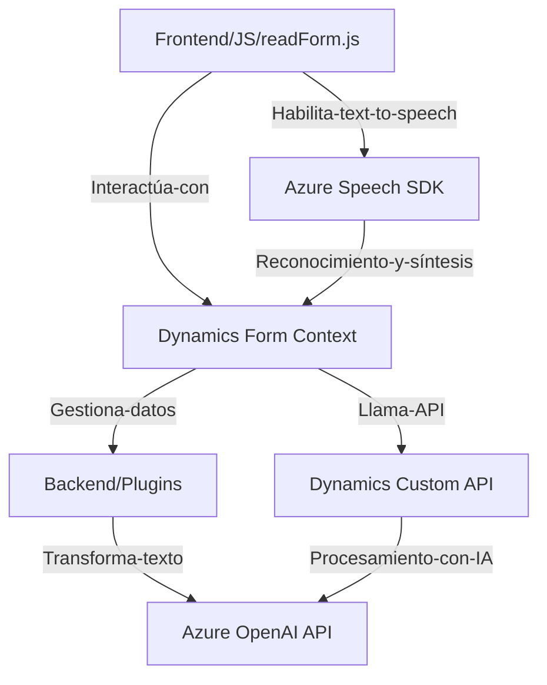

### Breve resumen técnico

El repositorio descrito da soporte a una solución basada en Dynamics 365 que permite enriquecer la interacción con formularios usando tecnologías de reconocimiento y síntesis de voz (speech-to-text/text-to-speech) y procesamiento avanzado basado en inteligencia artificial (Azure OpenAI). Los scripts en JavaScript son utilizados para construir la interfaz frontend que interactúa con form contexts en Dynamics 365, mientras que el archivo en C# define un plugin para integrar lógica de transformación avanzada mediante la API Azure OpenAI en el backend de Dynamics CRM.

---

### Descripción de arquitectura

La arquitectura es de **n capas** con una estructura típica de integración entre un **frontend dinámico** (que interactúa con el usuario y el contexto del formulario) y un **backend (Dynamics CRM)** interoperando con servicios externos como **Azure Speech SDK** para reconocimiento/síntesis de voz y **Azure OpenAI API** para el procesamiento de texto.

1. **Frontend (UI/Interaction Layer):**
   - Interacciones con el usuario (entrada y salida).
   - Manejo de reconocimiento y síntesis de voz.
   - Integración directa con los contextos de formularios de Dynamics 365.
   - Uso de APIs externas para procesamiento avanzado.

2. **Backend (Business Logic Application Layer):**
   - Plugins que actúan como extensiones del CRM.
   - Realizan tareas de lógica avanzada, como transformación de texto en formatos estructurados con IA.

3. **Servicios externos (Third-party integration):**
   - Comunicación con Azure Speech SDK para reconocimiento/síntesis de voz.
   - Azure OpenAI API para procesamiento avanzado de texto.

---

### Tecnologías usadas

1. **Frontend:**
   - **JavaScript**: Lenguaje principal para definir las funcionalidades del frontend.
   - **Azure Speech SDK**: Usado para traer capacidades de texto a voz y reconocimiento de voz.
   - **Dynamics CRM (Frontend context)**: Integración nativa.
   - **APIs personalizadas (Dynamics)**: Para manejo extendido de inteligencia artificial.

2. **Backend:**
   - **C#:** Principal lenguaje para la creación del plugin del CRM.
   - **Azure OpenAI API:** Utilizado en el plugin para transformar texto.
   - **Microsoft Dynamics SDK:** Framework para interactuar con el modelo de datos y ejecución de eventos del CRM.
   - **HTTP/JSON Libraries (System.Net.Http, Newtonsoft.Json)**: Para integrar servicios externos.

---

### Diagrama Mermaid

---

### Conclusión final

La solución descrita corresponde a un sistema **multicapa** orientado a dinamizar la interacción del usuario con formularios en entornos de Dynamics 365 mediante tecnologías de voz e inteligencia artificial. La arquitectura implementa una fuerte integración de servicios (Azure Speech, Azure OpenAI) para ofrecer capacidades mejoradas, combinando lógica frontend dinámica, backend extensible mediante plugins, y procesamiento avanzado. Esto respalda un diseño flexible adaptable a necesidades empresariales.