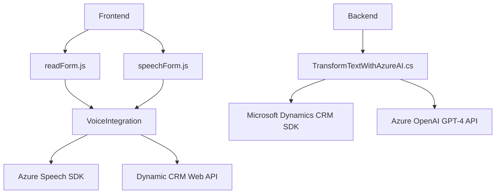

### Breve resumen técnico

El análisis abarca tres archivos con funcionalidades diversas:
- **Frontend/JS/readForm.js y speechForm.js**: Scripts que manejan la voz como entrada y salida en formularios dinámicos basados en un sistema CRM. Utilizan el SDK de Azure Speech para la conversión de texto a voz y el reconocimiento de voz.
- **Plugins/TransformTextWithAzureAI.cs**: Plugin de Dynamics CRM que transforma texto utilizando Azure OpenAI (GPT-4), estructurándolo en JSON según reglas específicas.

La solución parece ser parte de un sistema orientado a mejorar la accesibilidad y la interacción inteligente de usuarios con formularios, usando servicios de IA y voz.

---

### Descripción de arquitectura

#### General:
1. **Tipo de solución**: Aparece ser una solución híbrida para una plataforma CRM, donde:
   - **Frontend**: Interfaces interactivas para manejar datos.
   - **Plugin**: Procesos personalizados en Dynamics CRM para extender funcionalidades, como la integración con Azure OpenAI.

#### Arquitectura:
2. **Arquitectura observada**:
   - **Frontend**: Modular con interacción directa hacia un Service Layer que conecta al SDK de Azure Speech y APIs internas.
   - **Backend**: Plugin basado en **n capas**, con lógica de negocio y capa de integración que usa servicios externos como Azure OpenAI.
   - **Patrones observados**:
     - **Service Integration**: Uso de SDKs y APIs externas como Azure Speech y Azure OpenAI, promoviendo la separación de responsabilidades.
     - **Facade Pattern**: Simplificación de tareas complejas en funciones de acceso rápido.
     - **Plug-in Pattern**: Extensión de funcionalidades en Dynamics CRM mediante el plugin.

---

### Tecnologías usadas

1. **Frontend**:
   - **JavaScript**: Lenguaje principal para el manejo de voz y formularios.
   - **Azure Speech SDK**: Para transcribir voz y sintetizar texto en audio.
   - **Dynamic CRM Web API**: Manipula formularios dinámicos del CRM.

2. **Backend**:
   - **C#:** Lenguaje usado en Dynamics CRM plugins.
   - **Microsoft Dynamics CRM SDK**: Para personalización e integración de funcionalidades.
   - **Azure OpenAI (GPT-4)**: Motor para procesamiento de texto avanzado.

3. **Dependencias adicionales**:
   - **HTTP Client y JSON libraries (Newtonsoft.Json):** Manejadores clave en la integración del plugin con Azure OpenAI.

---

### Diagrama **Mermaid** válido para GitHub Markdown

---

### Conclusión final

Esta solución representa una integración híbrida de un **frontend interactivo** y un **plugin backend** dentro de un sistema CRM, con el objetivo de mejorar la eficiencia y accesibilidad de los datos procesados. Utiliza patrones y tecnologías modernas como reconocimiento de voz y procesamiento de texto mediante IA. La arquitectura apuesta por escalabilidad y modularidad, lo que permite su fácil extensión para otras aplicaciones.