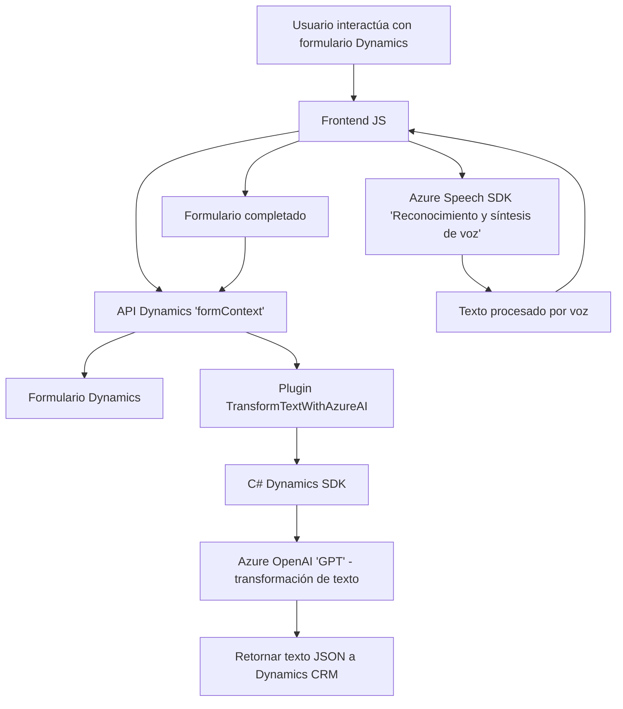

### Breve resumen técnico
El repositorio en cuestión parece corresponder a una solución integrada para Microsoft Dynamics CRM que permite interactuar con formularios mediante dos enfoques principales: entradas de voz (reconocimiento de voz y síntesis) y procesamiento de texto con capacidades de inteligencia artificial (Azure OpenAI). Combina componentes frontend con una aplicación de backend en forma de plugin para Dynamics CRM.

---

### Descripción de arquitectura
La arquitectura general es una **n capas** con integración de **servicios cloud externos**. El componente de frontend interactúa directamente con formularios de Dynamics CRM y el SDK para reconocimiento y síntesis de voz. El backend, implementado como plugin, extiende las capacidades de Dynamics CRM mediante la integración con el servicio Azure OpenAI. La arquitectura sugiere un diseño modular con componentes que se ejecutan independientemente y se comunican mediante APIs de terceros y métodos distribuidos.

- **Principales capas:**
  - **Presentación (Frontend JS):** Interacción directa con el usuario a través de formularios y procesamiento de voz.
  - **Lógica de negocio (Plugin Backend):** Transformación avanzada de texto, procesada y gestionada en Dynamics CRM.
  - **Acceso y consumo de servicios externos:** Por medio de Azure Speech SDK y Azure OpenAI.

---

### Tecnologías, frameworks y patrones usados
1. **Tecnologías:**
   - **Frontend:** JavaScript, Azure Speech SDK, Dynamics 365 API.
   - **Backend:** C# (.NET), Microsoft Dynamics CRM SDK, Azure OpenAI, HTTP Client.

2. **Patrones:**
   - **Integración con servicios externos:** Uso de SDKs y endpoints de Azure para reconocimiento de voz y procesamiento de texto.
   - **Patrón de plugin:** Standard implementado en Dynamics CRM para extensibilidad.
   - **Uso de API dinámica:** La carga condicional del Azure Speech SDK optimiza la ejecución según las necesidades.
   - **Modularidad:** Separación de lógica de procesamiento de texto, asignación en formularios y la ejecución general.

---

### Dependencias o componentes externos
1. **Azure Speech SDK:** Reconocimiento y síntesis de voz.
2. **Azure OpenAI:** Procesamiento avanzado de texto usando modelos GPT.
3. **Dynamics 365 API:** Interacción directa con formularios y entidades CRM mediante métodos como `Xrm.WebApi.online.execute`.
4. **Librerías de programación:** 
   - En el plugin se usa `Newtonsoft.Json` y `System.Net.Http` para manejo de JSON y peticiones HTTP.
   - Dynamics SDK para implementación del patrón de plugin.

---

### Diagrama **Mermaid** válido para GitHub Markdown

---

### Conclusión final
El análisis muestra una solución orientada a mejorar la interacción con formularios de Dynamics CRM, combinando tecnologías de vanguardia como reconocimiento de voz y procesamiento de lenguaje natural con servicios de Azure. La arquitectura basa su funcionalidad en una integración estrecha entre los componentes frontend (interacción de usuario y procesamiento de voz) y backend (transformación avanzada de texto mediante OpenAI en plugins). Esta solución es escalable, modular y utiliza servicios cloud para potenciar capacidades de automatización y personalización.

