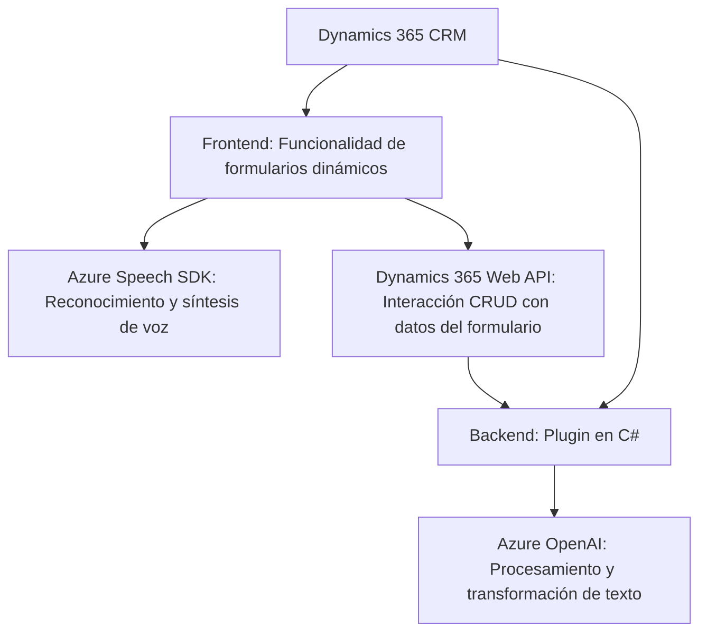

## Breve Resumen Técnico y Descripción de la Arquitectura

### Tipo de solución
La solución parece ser un sistema de integración que combina la funcionalidad de una **API** junto con un **frontend** para formularios dinámicos dentro de un entorno **CRM**, específicamente Microsoft Dynamics 365. Parte de su lógica se encuentra en archivos JavaScript (para el manejo del formulario, reconocimiento de voz, y síntesis de texto) y un plugin en C# para extender las capacidades de procesamiento del CRM.

---

### Arquitectura del sistema
La arquitectura del sistema es **n-capas** porque separa las responsabilidades de presentación (frontend), lógica de negocio (plugins y procesamiento mediante OpenAI), y servicios externos (Azure Speech SDK y Dynamics 365 Web API):

1. **Capa de presentación (Frontend):** Manejo de formularios dinámicos en Dynamics CRM usando JavaScript con funciones específicas para integrar capacidades de voz.
2. **Capa de integración y procesamiento:** Plugins en C# que extienden la funcionalidad del CRM y usan servicios externos (Azure OpenAI) para procesamiento avanzado de texto.
3. **Servicios externos:** Uso del Azure Speech SDK (para reconocimiento y síntesis de voz), Azure OpenAI, y Dynamics 365 Web API.

Este modelo no es monolítico porque se apoya en múltiples componentes distribuidos, aunque también carece de una independencia total entre servicios para considerarse **microservicios**.

---

### Tecnologías y patrones usados
- **Frontend (JavaScript):**  
  - **Libraries/SDK:** 
    - Azure Speech SDK.
    - Dynamics 365 Web API (`Xrm.WebApi.online.execute`).
  - **Patrones:** Modularización, asincronía (`async/await`), gestión mediante callbacks.
  - **Operaciones con formularios:** Manipulación de datos dinámicos en formularios del CRM (lectura y escritura).

- **Backend (C#):**  
  - **Frameworks:** Dynamics 365 SDK, .NET Framework.  
  - **Servicios externos:** Azure OpenAI.  
  - **Patrones:**  
    - Plugin Architecture para extender el comportamiento del CRM.
    - Service Locator para inyección de dependencias.
    - Integración API REST con Azure OpenAI para procesamiento de datos.
    - Decoradores (`Attributes`) para configuración dinámica del comportamiento del plugin.

---

### Dependencias y componentes externos
1. **Microsoft Azure Speech SDK:** Para síntesis y reconocimiento de voz.
2. **Microsoft Dynamics 365 SDK:** Integración con CRM y manipulación de datos del formulario dinámico.
3. **Azure OpenAI:** Procesamiento avanzado de texto mediante modelos de inteligencia artificial.
4. **Librerías .NET:** `Newtonsoft.Json`, `System.Net.Http`, `System.Text.Json`.

---

### Diagrama Mermaid válido para GitHub

---

### Conclusión Final
Esta solución ofrece capacidades avanzadas para un entorno CRM como Dynamics 365. En particular, facilita la integración de funcionalidades orientadas a la usabilidad y automatización, como el manejo de formularios con voz (reconocimiento y conversión a texto) y procesamiento dinámico con Azure OpenAI. La arquitectura basada en n-capas y dependencias distribuidas con servicios de Microsoft Azure representa una opción escalable y flexible.

Pros:
- Modularidad bien definida.
- Uso de servicios basados en cloud (Azure Speech, OpenAI).
- Integración directa con Dynamics 365.

Contras:
- Alta dependencia de servicios de Microsoft.
- Complejidad en mantenimiento debido a la extensión del modelo a múltiples configuraciones y responsabilidades.