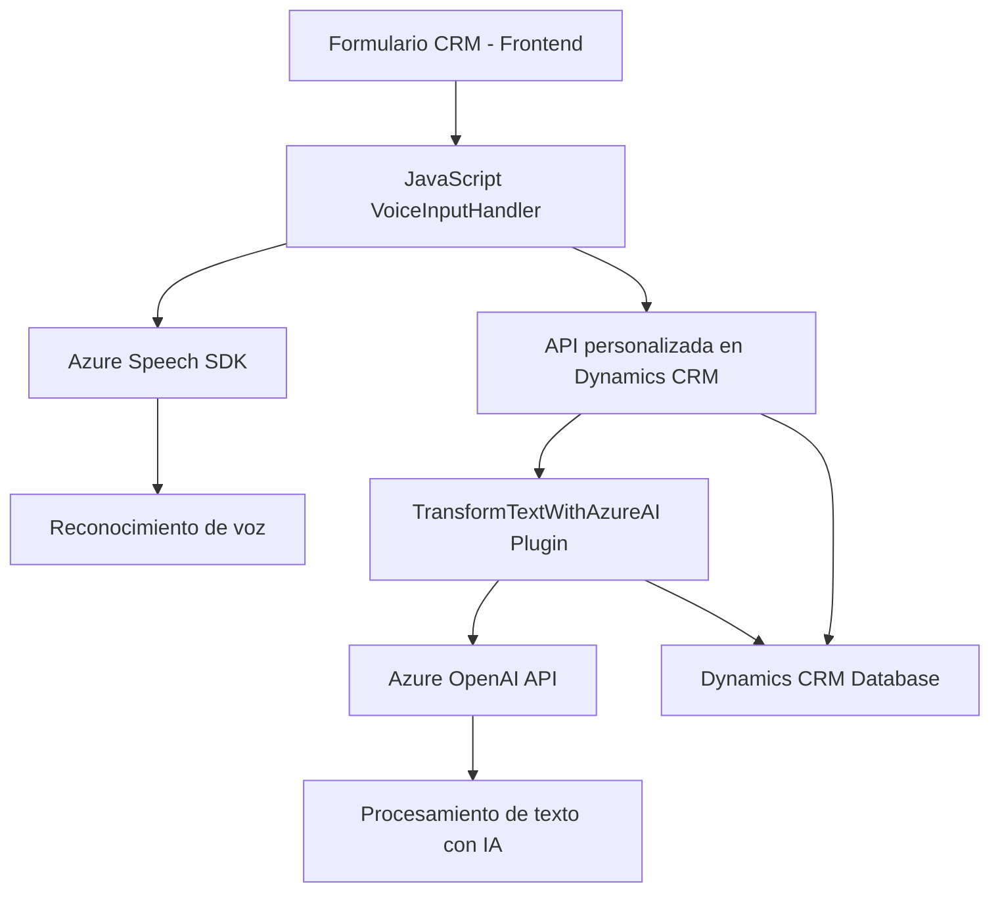

### **Análisis de la solución**

#### 1. Breve resumen técnico
El repositorio contiene una solución basada en módulos que interactúan con Microsoft Dynamics CRM y Azure AI. La lógica principal integra la **API de Azure Speech SDK** para síntesis y reconocimiento de voz, y usa **Azure OpenAI API** para transformar y estructurar texto. Está compuesto de:

- **Frontend**: Código JavaScript utilizado para interactuar con formularios CRM y procesar datos mediante integración con el SDK de Azure Speech y APIs externas.
- **Plugins**: Una clase C# orientada a transformar texto con reglas predefinidas utilizando inteligencia artificial (Azure OpenAI).

La arquitectura está diseñada para procesamiento de datos en tiempo real y está altamente integrada con servicios externos, como Dynamics CRM y Azure AI.

---

#### 2. **Descripción de arquitectura**
La solución tiene componentes distribuidos, que se dividen en **frontend en JavaScript** y **backend en C# para Dynamics CRM**. Puede clasificarse como una arquitectura híbrida:

- **Arquitectura orientada a eventos**: Los componentes del frontend y el backend reaccionan ante eventos específicos (como clics en formularios o ejecución de plugins en Dynamics).
- **Integración con servicios externos**: Uso de SDKs y APIs externalizadas (Azure Speech SDK y Azure OpenAI).
- **Arquitectura modular para frontend**: Cada parte funcional está separada en funciones específicas según su responsabilidad (ejemplo: `leerFormulario`, `speakText`).
- **Plugin Architecture** para el backend: Extiende la funcionalidad de Dynamics CRM mediante una clase registrada como plugin.

---

#### 3. **Tecnologías usadas**
- **Frontend**:
  - **Lenguaje**: JavaScript.
  - **Framework**: Dynamics CRM (formContext, executionContext APIs).
  - **Servicios externos**:
    - Azure Speech SDK (SDK de IA para voz y texto).
    - Custom APIs en Dynamics CRM (Xrm.WebApi).
- **Backend**:
  - **Lenguaje**: C#.
  - **Framework**:
    - Dynamics CRM SDK (Microsoft.Xrm.Sdk).
    - Integración de plugins (`IPlugin`).
  - **Servicios externos**:
    - Azure OpenAI API (procesamiento de texto con IA).
- **Dependencias comunes**:
  - `Newtonsoft.Json`: Herramienta para manipulación de JSON en backend.
  - `System.Net.Http`: Para solicitudes HTTP hacia APIs externas.
  - CDN dinámico (Azure Speech SDK).

---

#### 4. **Dependencias y componentes externos**
- **Azure Speech SDK**: Para síntesis de voz y reconocimiento de voz.
- **Azure OpenAI API**: IA avanzada para transformar texto en backend.
- **Dynamics CRM SDK**:
  - Para manipulación del contexto del formulario (`executionContext`, `formContext`, etc.).
  - APIs para interacción con datos y entidades CRM, como consultas a tipo `lookup`.
- API personalizada: Extendiendo la lógica de CRM para transformar datos y realizar acciones específicas tras reconocimiento de voz.

---

#### 5. **Diagrama Mermaid**
El siguiente diagrama describe los componentes principales y su interacción:

---

### **Conclusión Final**
Este repositorio representa una solución modular y distribuida que integra tecnologías en la nube (Azure SDK y OpenAI con APIs), interactuando con Dynamics CRM mediante una arquitectura basada en eventos. Su capacidad para manejar datos contextuales desde un formulario y procesarlos con inteligencia artificial lo hace adecuado para automatizar tareas complejas en entornos de gestión empresarial. La combinación de frontend y plugins crea un sistema adaptable y escalable que se ajusta a las necesidades de su aplicación.