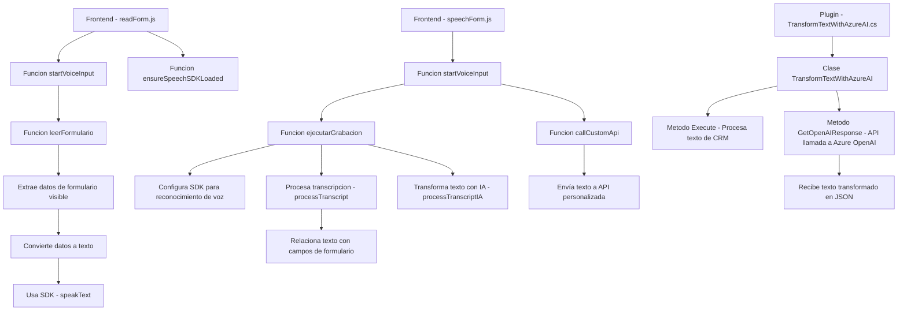

### Breve Resumen Técnico
Esta solución tiene tres componentes principales que permiten la interacción vocal con formularios, el procesamiento de datos con un SDK externo (Azure Speech SDK), y la transformación de texto basada en inteligencia artificial usando Azure OpenAI. Los archivos están diseñados para integrarse con un entorno Dynamics CRM.

---

### Descripción de Arquitectura
La arquitectura general está orientada al **modelo de n capas** debido al enfoque modular y la interacción directa con sistemas externos (Azure Speech y Dynamics CRM). Los patrones destacados incluyen:
1. **Capa de presentación**: Implementada en los archivos de JavaScript, que se enfocan en la captura y síntesis de voz en el navegador, además de manejar la interacción del usuario.
2. **Capa lógica de negocio**: Representada por el plugin de Dynamics CRM (`TransformTextWithAzureAI.cs`), que implementa reglas específicas como el procesamiento de texto con OpenAI.
3. **Capa de integración/API**: Utiliza servicios externos: Azure Speech SDK para síntesis/reconocimiento de voz y Azure OpenAI para transformación semántica de datos.

La solución integra servicios externos de manera descentralizada (un estilo cercano a **microservicios** en cuanto a sus componentes, aunque la arquitectura general no es completamente microservicios).

---

### Tecnologías Usadas
1. **Lenguajes**:
   - **JavaScript**: Para la lógica interactiva del frontend y manejo del SDK de Azure Speech.
   - **C#**: Plugin para Dynamics CRM para transformación de datos y procesamiento con OpenAI.
2. **Frameworks**:
   - Azure Speech SDK: Interacción en tiempo real para síntesis y reconocimiento de voz.
   - Dynamics CRM SDK: Gestión de datos y lógica del CRM.
3. **Librerías**:
   - Newtonsoft.Json: Procesamiento JSON en el plugin.
   - `System.Net.Http` y REST API: Comunicación con el servicio OpenAI.
4. **Patrones Arquitectónicos**:
   - Callback pattern: En los scripts de JavaScript para cargar dinámicamente el SDK.
   - Integración de servicios (con Azure Speech y OpenAI).
   - SRP (Single Responsibility Principle): Métodos enfocados en tareas específicas.

---

### Diagrama Mermaid válido para GitHub Markdown

---

### Conclusión Final
Este conjunto de archivos es un **sistema integrado** que combina procesamiento de voz, captura de datos en formularios interactivos y transformación avanzada de texto con inteligencia artificial. Aunque se utiliza intensivamente el concepto de servicios externos como microservicios (Azure Speech SDK y Azure OpenAI), la arquitectura se organiza principalmente como una solución **n capas** dentro del contexto de Dynamics CRM.

En términos de seguridad y buenas prácticas, sería aconsejable:
1. Evitar claves API en el código y utilizar sistemas de gestión de secretos.
2. Integrar pruebas unitarias tanto en el frontend como en el plugin backend.
3. Migrar hacia configuraciones más explícitas de endpoints y dependencias externas usando herramientas como Azure Key Vault o Managed Identity para proteger identificadores sensibles.

Este repositorio representa una solución escalable y modular, con configuraciones claras para formularios y flujos corporativos basados en interacción vocal y procesamiento inteligente.