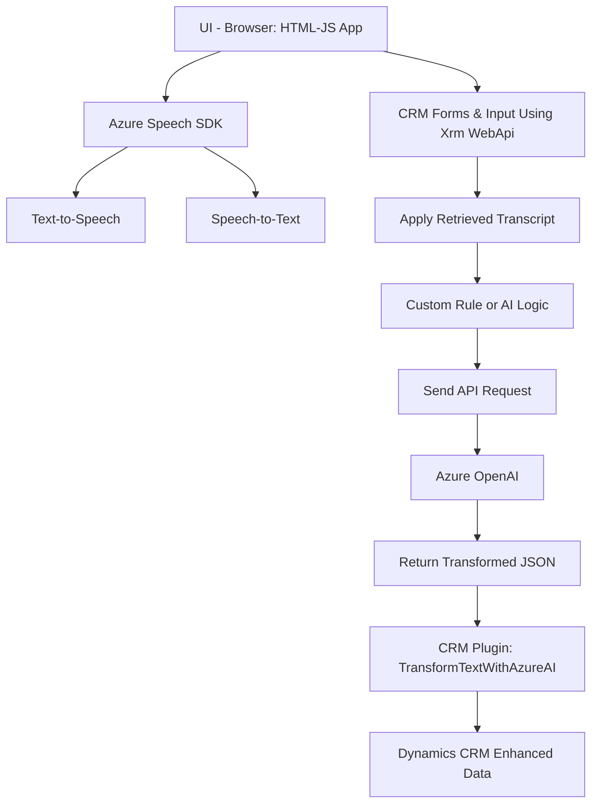

**Breve resumen técnico:**

El repositorio contiene dos archivos y un plugin, diseñados para transformar y manejar datos mediante tecnologías de reconocimiento de voz e inteligencia artificial (AI). Los scripts de frontend permiten la interacción a través de entradas por voz y lectura de formularios, mientras que el plugin en el backend utiliza Azure OpenAI para transformar y analizar datos.

---

**Descripción de arquitectura:**

1. **Tipo de solución:** La solución representa un sistema compuesto por:
   - **Frontend:** Aplicación de cliente web para formularios interactivos con entrada y salida de voz.
   - **Backend:** Plugin (EJB-like behavior) integrado como un proceso en Dynamics CRM para transformación de texto.

2. **Patrones y Arquitectura**:
   - **Event-driven programming**: En el frontend, varias de las funcionalidades dependen de eventos como la carga de un SDK o la activación de entrada por voz.
   - **Hexagonal Architecture**: El plugin usa una separación clara entre el sistema central de CRM y una dependencia externa (Azure OpenAI) para procesamiento del negocio.
   - **Service Integration Layer**: Define la integración entre Azure Speech SDK, APIs personalizadas y el modelo CRM en el frontend.
   - **Plugin Design Pattern**: Usado por el backend para desarrollar extensiones en Dynamics CRM con problemas específicos.

3. **Flujo general**:
   - El **frontend** interactúa directamente con el usuario en el navegador: utiliza el Azure Speech SDK para convertir texto en voz, grabar audio, y procesar transcripciones mediante inteligencia artificial o reglas predefinidas, aplicándolas a formularios dinámicos de tipo CRM.
   - El **plugin** gestiona la lógica empresarial avanzada como la transformación de texto entrante mediante Azure OpenAI y retorna objetos JSON que estructuran la información según reglas especificadas.

---

**Tecnologías usadas:**
1. **Frontend**:
   - JavaScript para lógica en el cliente.
   - **Azure Speech SDK**: Reconocimiento de voz y síntesis de texto en voz.
   - APIs del navegador: Para manipulación de DOM y servicios web.

2. **Backend**:
   - **Microsoft Dynamics CRM SDK**: Para interacción y manipulación de objetos CRM.
   - **Azure OpenAI API**: Uso de modelos GPT-4 para transformar textos.
   - **Newtonsoft.Json**: Procesamiento de datos JSON.
   - **Microsoft ecosystems**: Para soporte de arquitectura basada en plugins y servicios CRM.

---

**Dependencias externas y componentes asociados:**

1. **Externos**:
   - **Azure Speech SDK**: Para funcionalidad de síntesis y procesamiento de voz en frontend.
   - **Azure OpenAI API**: Para procesamiento de texto inteligente a través de la integración REST.
   - **Servicios Dynamics CRM**: Interacciones con WebAPIs del CRM para asignación de valores y manipulación de formularios.

2. **Internos**:
   - API personalizada: `trial_TransformTextWithAzureAI`, posiblemente alojada en una infraestructura propia o en Azure.
   - Extensiones en CRM: Definición de workflows a través de plugins basados en `IPlugin`.

---

**Diagrama Mermaid que describe el sistema:**

---

### **Conclusión final:**

La solución es un conjunto modular compuesto de un cliente web desarrollado en JavaScript que facilita interacción por voz habilitada por el **Azure Speech SDK**, sincronizado con datos extraídos y procesados a través de **Microsoft Dynamics CRM WebAPI**. Por su parte, el plugin en el backend aplica transformaciones avanzadas al texto reconocido mediante reglas definidas o modelos de inteligencia artificial que utilizan el **Azure OpenAI API**.

La arquitectura de la solución refleja adecuadamente patrones como **service integration**, **plugin pattern** para Dynamics CRM, y puede clasificarse como un enfoque híbrido que aplica principios de **Hexagonal Architecture**, dado que las interacciones con servicios externos están bien separadas, así como el acoplamiento con el cliente.

Este diseño favorece la escalabilidad para soportar futuras integraciones, por ejemplo, con otros modelos de AI o SDK de voz de otras plataformas. Sin embargo, el uso de APIs dinámicas y dependencias dado por frameworks específicos como Dynamics y Azure compromete ciertas características de portabilidad, ya que se orienta únicamente a estos proveedores.