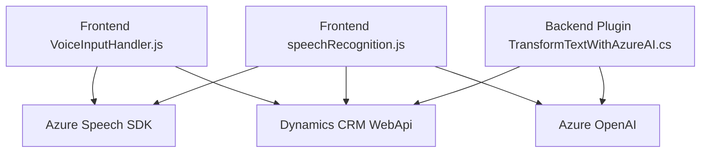

### Breve resumen técnico
El repositorio es una solución que se integra con Microsoft Dynamics 365 y utiliza Microsoft Azure Speech SDK y Azure OpenAI para ofrecer funcionalidad avanzada de entrada y salida de datos mediante voz. Incluye tanto módulos frontend, de reconocimiento y síntesis de voz, como un plugin backend para la transformación de datos. Todo está diseñado para manipular datos del formulario de Dynamics 365 con alta modularidad y escalabilidad.

---

### Descripción de arquitectura
La arquitectura tiene características de **n capas** con integración de servicios en la nube (Azure Speech SDK y OpenAI). Los módulos frontend procesan datos en el cliente y los interactúan con el backend o CRM mediante APIs. El backend incluye un plugin basado en Dynamics 365 que ejecuta transformaciones más avanzadas utilizando servicios externos, lo que también denota un enfoque orientado a servicios.

1. **N Capas**: 
   - Frontend que ejecuta reconocimiento y síntesis de voz (cliente, navegador).
   - Comunicación con APIs externas (Azure).
   - Backend con plugin en Dynamics 365 que extiende la funcionalidad mediante el servicio OpenAI.

2. **Patrones usados**: 
   - **Plugin Design Pattern**: La lógica del plugin en `TransformTextWithAzureAI.cs` está muy alineada con el patrón de extensión que soporta Dynamics.
   - **Factory Method**: Utilizado para configurar objetos especializados como `SpeechConfig`, `AudioConfig`, y otros en el SDK.
   - **Delegación**: La lógica comparte tareas entre el cliente y Azure para máximo rendimiento y flexibilidad.
   - **Facade Pattern**: Centralización de integración con OpenAI en el método `GetOpenAIResponse`.

---

### Tecnologías usadas
1. **Frontend**:
   - Lenguaje: `JavaScript`.
   - SDK: `Microsoft Azure Speech SDK` (síntesis y reconocimiento de voz).
   - API Dynamics CRM: `executionContext`, manipulación de formularios.

2. **Backend**:
   - Lenguaje: `C#`.
   - Dependencias:
     - `System.Net.Http`, `System.Text.Json` y `Newtonsoft.Json` (HTTP requests y JSON parsing).
     - Azure OpenAI API y modelo GPT para procesamiento de texto.
     - Microsoft Dynamics CRM SDK.

3. **Servicios externos**:
   - Azure Speech SDK (voz a texto y texto a voz).
   - Azure OpenAI GPT para transformaciones avanzadas.

---

### Diagrama Mermaid

---

### Conclusión final
Este repositorio combina tecnologías de Microsoft (Dynamics CRM, Speech SDK) y Azure (OpenAI GPT) para facilitar la entrada y transformación de datos mediante voz, enfocándose en mejorar la interacción con formularios de un sistema CRM. Tiene una arquitectura n capas con el frontend manejando interacciones y el backend realizando transformaciones avanzadas. La implementación es modular, aprovecha patrones arquitectónicos modernos y utiliza APIs externas con enfoque orientado a servicios.