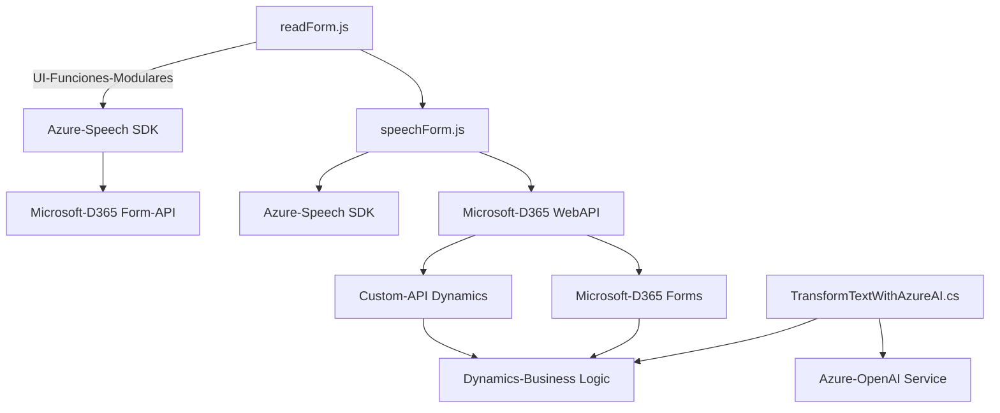

### Breve resumen técnico
El repositorio contiene tres archivos relacionados con la implementación de funcionalidades basadas en voz e IA en aplicaciones Microsoft Dynamics 365. Los archivos **`readForm.js`** y **`speechForm.js`** están orientados al frontend y manejan procesos para la entrada y salida por voz usando **Azure Speech SDK** y una API de Microsoft Dynamics. El archivo **`TransformTextWithAzureAI.cs`** define un backend plugin para procesar texto con el modelo GPT-4 de **Azure OpenAI**.

---

### Descripción de arquitectura
Se puede inferir que la solución sigue un **modelo híbrido de arquitectura SOA (Service-Oriented Architecture)** junto con una **arquitectura distribuida basada en microservicios**:
- **Frontend**: Implementación de funcionalidades para interacción con formularios gestionados por Dynamics 365, extendiendo el enfoque modular mediante scripts que integran servicios como Azure Speech SDK y APIs de Dynamics 365. Las funciones están altamente desacopladas para cumplir con principios de responsabilidad única (SRP).
- **Backend**: Plugin que actúa como punto de integración en Dynamics CRM siguiendo el patrón Plugin y Strategy, consumiendo servicios de Azure OpenAI.
La solución está diseñada para interactuar con servicios externos (Azure AI, Speech SDK y Dynamics APIs) en un entorno corporativo gestionado.

---

### Tecnologías utilizadas
1. **Frontend:**
   - **JavaScript ES6** (Modularidad y programación asíncrona con `Promise` y callbacks).
   - **Azure Speech SDK** (Reconocimiento y síntesis de voz).
   - **Microsoft Dynamics Form API** (Para acceso y modificación a datos en el formulario).

2. **Backend:**
   - **C# (.NET)** con implementaciones como:
     - Dependencias de Dynamics CRM: `Microsoft.Xrm.Sdk` y servicios asociados.
     - Libros estándar: `System.Net.Http` y `System.Text.Json`.
   - **Azure OpenAI Service** (IA para transformar texto usando GPT).

3. **Infraestructura**:
   - API personalizada (Custom API de Microsoft Dynamics 365).
   - **RESTful HTTP** para comunicación entre sistemas de Azure y Dynamics.
   - Manejo dinámico de scripts para cargar SDK según necesidad.

---

### Diagrama Mermaid válido para GitHub

---

### Conclusión final
La solución descrita es un **híbrido de aplicaciones basadas en servicios** que extiende las capacidades de Microsoft Dynamics CRM, enfocándose en la integración con servicios inteligentes basados en IA y tecnologías de voz (Azure Speech y Azure OpenAI). Su diseño modular, el uso de programación asíncrona y su enfoque en la arquitectura orientada a eventos lo hacen eficiente para manejar casos de automatización en formularios web y expandir funcionalidades basadas en inteligencia artificial y reconocimiento de voz. Sin embargo, se recomienda mejorar la gestión de credenciales y revisar la seguridad de conexiones externas, especialmente aquellas relacionadas con Azure OpenAI y Dynamics APIs.