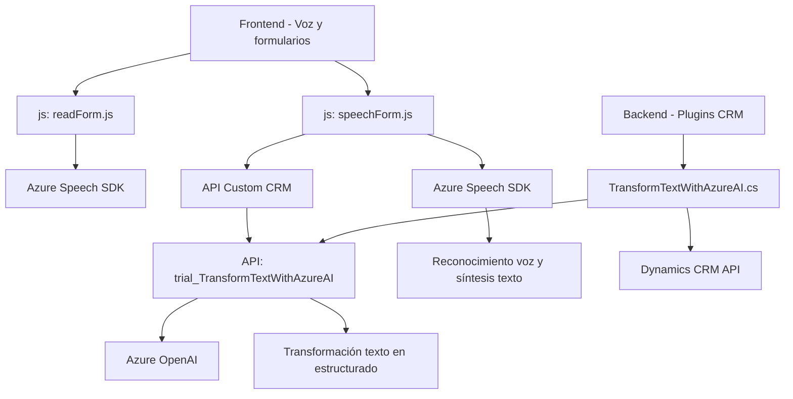

### Breve resumen técnico:
Los archivos analizados pertenecen a una solución que incluye un sistema de gestión CRM extendido con funcionalidades avanzadas de accesibilidad y procesamiento de texto/voz. La solución integra tecnologías de reconocimiento de voz, síntesis de texto y transformación mediante inteligencia artificial proporcionadas por servicios de **Azure Speech SDK** y **Azure OpenAI**.

### Descripción de arquitectura:
1. **Tipo de solución:** 
   - La solución se compone de:
     - Una capa **frontend** extendida que interactúa con los formularios del CRM, aplicando procesamiento dinámico de datos y entradas de voz.
     - Plugins backend que ejecutan transformaciones de texto a través de REST APIs.
   - Es una arquitectura híbrida que se apoya en extensibilidad del CRM para lógica y conexión con APIs externas.

2. **Arquitectura general:** 
   - Basada en **n capas**, con separación de responsabilidades (frontend para manejo de entrada voz/formularios y backend con tareas computacionales avanzadas en plugins).
   - Uso de **microservicios externos** para procesamiento (Azure OpenAI y Azure Speech).
   - Los componentes están organizados modularmente, respetando principios como la dependencia inversa.

### Tecnologías usadas:
1. **Frontend (JavaScript):**
   - **SDK de Azure Speech:** Para reconocimiento y síntesis de voz.
   - Librerías estándar de JavaScript para manipulación de DOM y procesamiento de datos.
   - Integración con APIs del CRM (`Xrm.WebApi`).

2. **Backend (Plugins, C#):**
   - **Microsoft CRM SDK (Dynamics):** Manejo de eventos y servicios organizativos.
   - **Azure OpenAI (REST API):** Transformación de texto mediante modelos IA.
   - Serialización de datos con **Newtonsoft.Json** y **System.Text.Json**.
   - Uso de `HttpClient` para interacción con servicios externos.

### Patrones utilizados:
1. **Modularización:** Separación funcional clara entre frontend y backend, y dentro de cada capa.
2. **Fachada:** Funciones principales que encapsulan operaciones del SDK de Azure.
3. **Procesamiento condicional:** Ruta de flujo adaptable según modalidad (IA o no IA).
4. **Plugin-based architecture:** Usada en el backend para event-driven extensibilidad del CRM.

### Dependencias externas:
1. **Azure Speech SDK:** Reconocimiento y síntesis de voz.
2. **Azure OpenAI (API):** Procesamiento avanzado de texto.
3. **Dynamics CRM Web API:** Interacción directa con datos del CRM.
4. **Newtonsoft.Json:** Manejo de JSON estructurado.
5. **HTTP Protocol:** Para consumir APIs externas.

### Diagrama Mermaid:

### Conclusión final:
La solución representa un ecosistema integrado que combina capacidades frontend y backend para procesar datos y voz en formularios CRM con extensiones que hacen uso de IA mediante servicios externos de Azure. La arquitectura sigue principios de separación de responsabilidades con un diseño basado en n capas, soporte para eventos del CRM y patrones modernos de integración con APIs externas. Es escalable y puede adaptarse fácilmente a contextos de accesibilidad o automatización de gestión de datos.