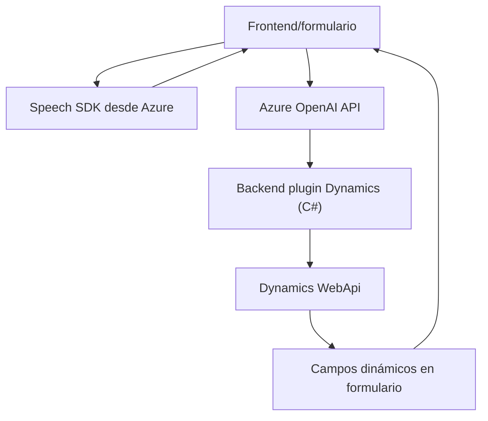

### Breve resumen técnico

El repositorio contiene funcionalidades que integran reconocimiento de voz y procesamiento de texto mediante Azure Speech SDK y Azure OpenAI, enfocados en la interacción con formularios (parte de frontend) y en la generación de contenido estructurado compatible con Microsoft Dynamics 365 (plugin en backend). 

---

### Descripción de arquitectura

#### Tipo de solución
La solución combina:
1. **Frontend** basado en JavaScript para capturar voz, procesar entrada y actualizar formularios dinámicos.
2. **Backend plugin** diseñado para Microsoft Dynamics 365 en C#, que interactúa con datos y servicios de AI.

#### Arquitectura general
1. **Frontend (N-capas)**:
   - Procesamiento de datos directamente en el cliente, con funcionalidades separadas en módulos.
   - Carga dinámica de dependencias externas (Azure Speech SDK).

2. **Backend (integración con Dynamics 365)**:
   - **Plugin-Based Architecture** acoplada a Dynamics 365, extendiendo funcionalidades mediante el patrón de plugins y servicios externos.

3. **Patrón de integración**:
   - Uso de servicios REST para conectar con Azure Speech SDK y OpenAI.
   - Dependencia explícita y directa de APIs externas como Dynamics, OpenAI y Speech SDK.

En conjunto, la arquitectura es híbrida con elementos de capas en frontend y plugins en backend.

---

### Tecnologías usadas

#### En frontend:
- **Lenguaje:** JavaScript.
- **Dependencias externas:**
  - **Azure Speech SDK** para entrada y salida de voz.
- **Frameworks/clientes:** Dynamics 365 (integración implícita en el contexto de los formularios).

#### En backend:
- **Lenguaje:** C#.
- **Dependencias externas:**
  - **Azure OpenAI Services** para procesamiento de texto.
  - **Dynamics SDK (`Microsoft.Xrm.Sdk`)** para operaciones internas.
  - **Newtonsoft.Json** y **System.Text.Json** para manejo y serialización de JSON.
  - **System.Net.Http** para llamadas HTTP.

#### Patrones observados:
1. **Modularización:** Uso de funciones específicas separadas por responsabilidades (en frontend y backend).
2. **Carga dinámica:** `ensureSpeechSDKLoaded` en frontend para verificar y cargar dependencias críticas.
3. **Plugin-Based:** Capacidades extendidas en Dynamics usando plugins (backend).
4. **MVC implícito:** Separación entre manipulación de datos del formulario y presentación en frontend.

---

### Diagrama mermaid válido para GitHub

---

### Conclusión final

La solución es una integración avanzada entre frontend basado en JavaScript para captura de voz y manejo de formularios, y backend orientado a Dynamics 365 utilizando servicios como Azure OpenAI. Está diseñada como una arquitectura híbrida que aprovecha tecnologías modernas como SDKs de Azure y servicios de IA. Aunque la modularidad y separación lógica son puntos fuertes, hay riesgos potenciales como la exposición directa de claves API en el código del plugin, lo que debería ser mejorado para una solución segura y escalable.