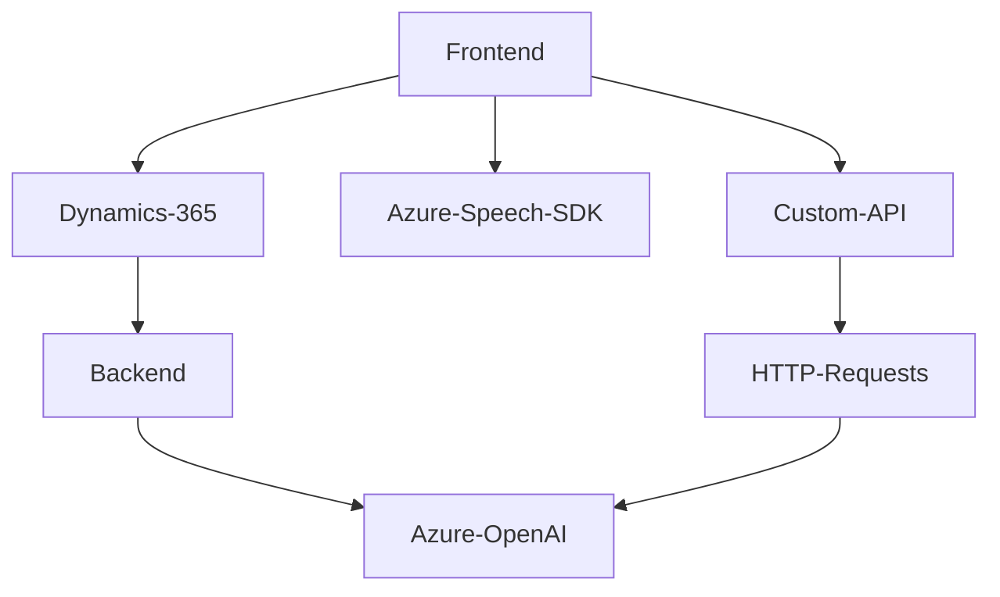

# Análisis Técnico del Repositorio

## Breve Resumen Técnico
El repositorio contiene una solución híbrida con integración de JavaScript en Dynamics 365 y un plugin para procesar texto mediante servicios de inteligencia artificial de Azure (Azure OpenAI). Los archivos analizados apuntan a tres áreas principales:
1. Manipulación de formularios y síntesis de texto a voz mediante el SDK de Azure Speech.
2. Reconocimiento de voz y actualización dinámica de formularios en Dynamics 365.
3. Procesamiento avanzado de texto basado en un plugin C# que interactúa con Azure OpenAI.

---

## Descripción de Arquitectura
La solución adopta una **arquitectura modular**, distribuida entre:
- **Frontend**: Archivos JavaScript que interactúan directamente con el DOM de formularios en Dynamics 365, utilizando el SDK de Azure Speech para manipular entrada/salida de voz.
- **Backend**: Plugin C# que actúa como una interfaz para procesar texto utilizando Azure OpenAI y devolver resultados estructurados en formato JSON.

### Características de Arquitectura
1. **Arquitectura Tipo Integración**: Centralizada en la plataforma Dynamics 365, pero extendida con servicios externos como Azure Speech y Azure OpenAI para funciones avanzadas.
2. **Multicapa**:
   - **Frontend (Presentación)**: Manipulación del DOM y SDK, control de eventos en formularios.
   - **Backend (Lógica de negocio)**: Plugin basado en reglas que utiliza Azure para inteligencia artificial.
   - **Capas de Datos**: Interacción con APIs de Dynamics para obtener y escribir datos en formularios.
3. **Estilo Modular**: Código dividido en funciones autónomas, para facilitar el mantenimiento y escalabilidad.

---

## Tecnologías Usadas
1. **Frontend**:
   - Azure Speech SDK: Para síntesis y reconocimiento de voz.
   - JavaScript ES6+: Manipulación del DOM y control de eventos.
   - Dynamics 365 API: Para interacción con formularios y mapeo de datos.
2. **Backend**:
   - C#: Desarrollo del plugin conforme al estándar Dynamics 365 (`IPlugin`).
   - Azure OpenAI: Servicios de inteligencia artificial para transformación de texto.
   - HTTP Client (`System.Net.Http`) para solicitudes externas.
   - Integración con Dynamics SDK (`Microsoft.Xrm.Sdk`).
3. **Otros Servicios**:
   - `Newtonsoft.Json` y `System.Text.Json`: Para manipulación JSON.
   - `"trial_TransformTextWithAzureAI"`: API personalizada en Dynamics 365.

---

## Diagramas Mermaid

### Explicación del Diagrama
1. El **Frontend** interactúa directamente con los formularios de Dynamics 365 para manipulación de datos y entrada/salida de voz (Azure Speech SDK).
2. El backend (Plugin C#) también se conecta a Dynamics 365 para procesar texto ingresado por el frontend, delegando tareas avanzadas de inteligencia artificial al servicio Azure OpenAI.
3. La **Custom API** opera como puente entre el frontend y procesamiento avanzado de texto, utilizando llamadas HTTP a servicios externos.
4. Servicios **externos** (Azure Speech SDK y Azure OpenAI) son componentes clave.

---

## Conclusión Final
La solución, diseñada como una integración profunda con Dynamics 365, combina distintas tecnologías para optimizar los procesos de reconocimiento de voz, manipulación de formularios y transformación de texto. Los archivos cumplen funciones muy específicas y están organizados modularmente, facilitando la escalabilidad y el mantenimiento. Este enfoque permite aprovechar servicios innovadores de Azure, mientras se mantiene una estructura clara y funcional dentro de Dynamics 365.