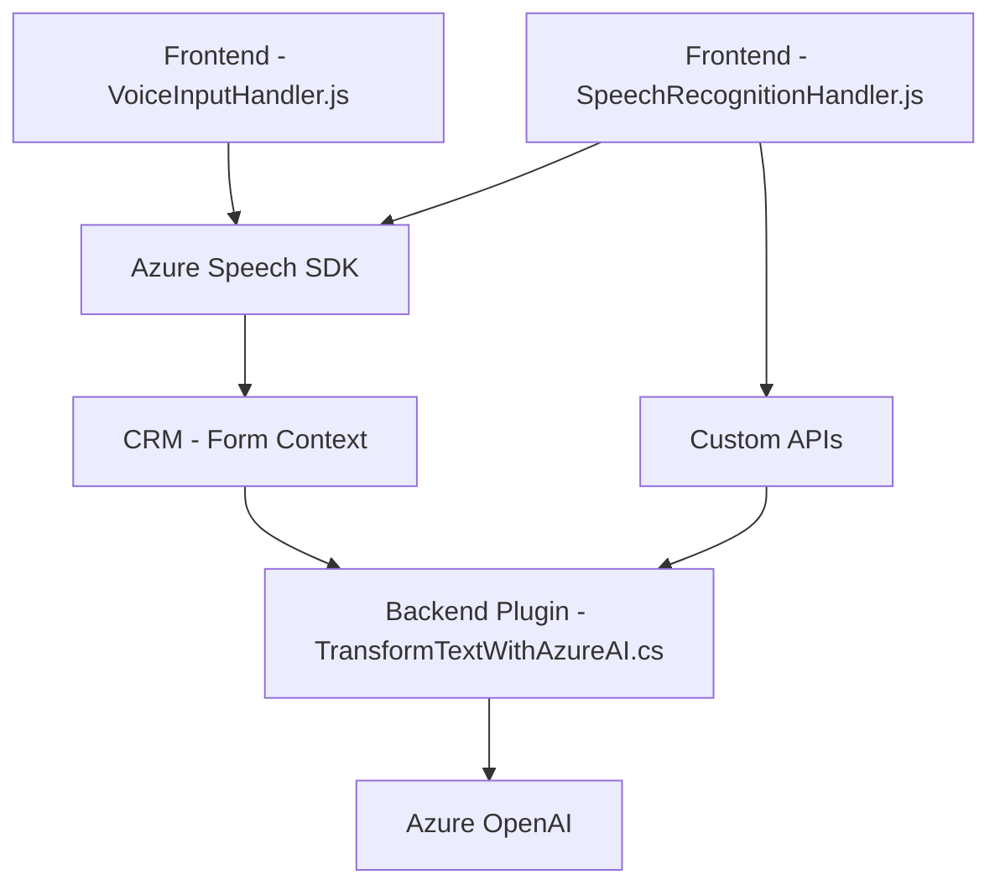

### Breve Resumen Técnico
Este repositorio combina una solución **frontend** y **backend** orientada a la automatización y gestión de datos mediante reconocimiento de voz, síntesis de voz, procesamiento basado en inteligencia artificial (Azure OpenAI), e integración directa con un entorno CRM (Dynamics 365). La solución incluye varias piezas:
1. **Frontend**: Archivos JavaScript (`VoiceInputHandler.js` y `SpeechRecognitionHandler.js`) se encargan de interactuar dinámicamente con el usuario mediante Azure Speech SDK.
2. **Backend**: Un plugin en C# (`TransformTextWithAzureAI.cs`) implementa procesamiento de datos con OpenAI para el CRM.

---

### Descripción de Arquitectura
La solución utiliza una arquitectura de **n capas horizontal** con separación de responsabilidades entre el frontend, backend, y servicios externos. Cada capa maneja aspectos específicos:
- **Frontend**: Realiza entradas/salidas de voz y captura/lectura de formularios dinámicos desde la interfaz de usuario.
- **Backend**: Procesa datos mediante plugins orientados al CRM y servicios externos como Azure OpenAI.
- **Servicios externos**: Integración con APIs de Azure Speech SDK y OpenAI para automatización con inteligencia artificial.

---

### Tecnologías y Frameworks Usados
#### **Tecnologías**
1. **Azure Speech SDK** para servicios de Text-to-Speech y Speech Recognition.
2. **Microsoft Dynamics 365 SDK** para plugins y manipulación de datos relacionados al CRM.
3. **Azure OpenAI** para procesamiento inteligente de texto.
4. **JavaScript** para lógica del cliente.
5. **C# .NET** para plugins backend.

#### **Frameworks y Librerías**
1. **System.Net.Http** y **Newtonsoft.Json** para solicitudes API y procesamiento de respuestas en el backend.
2. **Language-specific APIs**:
   - `window.SpeechSDK` en frontend.
   - `Microsoft.Xrm.Sdk` en backend.

#### **Patrones Arquitectónicos**
1. **Modularización**: Separación de funcionalidades en pequeñas funciones para facilitar mantenimiento.
2. **Asynchronous Programming**: Uso de async/await y callbacks para dinámico manejo de APIs de Azure.
3. **Plugin Pattern**: Plugins para ejecutar lógica específica dentro del ciclo de vida del CRM (Dynamics 365).
4. **Adapter/Mapping Pattern**: Mapping dinámico de información entre formularios y atributos CRM.
5. **Client-Server Communication**: Interacciones del frontend y backend con APIs externas (Azure Speech, Azure OpenAI).

---

### Dependencias y Componentes Externos
1. **Azure Speech SDK**: Se carga dinámicamente desde la CDN `https://aka.ms/csspeech/jsbrowserpackageraw`.
2. **Azure OpenAI**: Integración en el backend mediante C# para transformar texto en JSON estructurado.
3. **Microsoft Dynamics 365 CRM**: El backend se ejecuta como un plugin integrado en el CRM para manipular datos y completar tareas de procesamiento.
4. **HTTP Libraries**: En C# (`System.Net.Http`) para las conexiones con los APIs externos.
5. **JSON Libraries**: Para serialización y deserialización de JSON (`System.Text.Json`, `Newtonsoft.Json.Linq`).

---

### Diagrama **Mermaid** 100% Compatible con GitHub Markdown

---

### Conclusión Final
El repositorio es una solución híbrida con:
- **Frontend**: Implementado en JavaScript con integración directa a servicios de Microsoft Azure (Speech SDK) para interacción por voz.
- **Backend**: Construido para Microsoft Dynamics 365 como un plugin que emplea el procesamiento de datos con Azure OpenAI.
- **Arquitectura de n capas**, que incluye separación modular entre UI, CRM backend, y servicios externos.
- Uso de servicios avanzados de IA y reconocimiento de voz, lo que la posiciona para aplicaciones empresariales en automatización y productividad con interacción natural del usuario.

Esta solución es técnicamente sólida pero puede necesitar refinamientos en areas de seguridad (mala práctica de credenciales expuesta en código). Es recomendada para entornos empresariales que requieren integración dinámica con CRM y herramientas de IA.