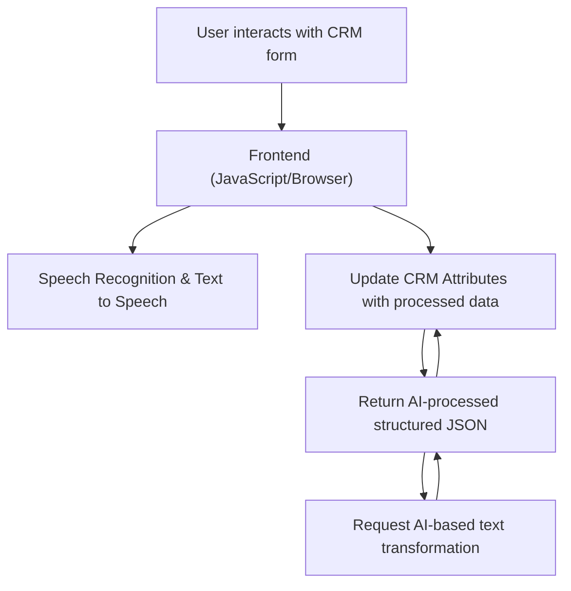

# Breve resumen técnico

El repositorio presentado incluye archivos relacionados con un sistema que integra funcionalidades de voz, inteligencia artificial y procesamiento de datos en formularios, vinculado principalmente a Microsoft Dynamics CRM. Combina un frontend en JavaScript y un backend basado en Plugins de Dynamics CRM. También hace uso intensivo de servicios externos como Azure Speech SDK y Azure OpenAI GPT para reconocimiento de voz y procesamiento con IA.

---

# Descripción de arquitectura

La arquitectura del sistema parece estar basada en un **modelo de capas/n-capas** con una integración **híbrida** de componentes en el frontend, implementando lógica de negocio tanto en el lado del cliente (JavaScript con Azure Speech) como en el backend (plugin C# en Dynamics CRM). Algunos patrones internos específicos incluyen:

1. **Multicapa orientada a servicios:**
   - El frontend se compone de módulos JavaScript que manejan directivas de GUI y lógica de procesamiento ligera.
   - El backend, en C#, implementa plugins de Dynamics CRM configurados para manejar acciones específicas dentro de los procesos del CRM.
2. **Integración API & SDKs:** Tanto el cliente (frontend) como el servidor (plugins backend) se conectan a servicios externos. En el frontend, se utiliza **Azure Speech SDK**, mientras que en el servidor, se conecta con **Azure OpenAI Service**.
3. **Event-Driven Architecture** (principalmente en el frontend): Uso explícito de eventos y contextos (como el `executionContext` y `formContext`) para interactuar con formularios dinámicos.

---

# Tecnologías usadas

1. **Frontend**:
   - **JavaScript**: Desarrollo de lógica funcional y manipulación del DOM.
   - **Azure Speech SDK**:
     - Reconocimiento de voz.
     - Conversión de texto a voz.
     - Carga dinámica del SDK en el navegador.
   - **Dynamics 365 Web API**:
     - Comunicación con Dynamics para actualizar los formularios.

2. **Backend**:
   - **C# (Microsoft .NET Framework)**:
     - Desarrollo del plugin dentro de Dynamics CRM.
   - **Azure OpenAI Service (Azure GPT-4)**:
     - Procesamiento avanzado de lenguaje natural (NLP) y transformación de texto en estructuras JSON.
   - **Microsoft Dynamics CRM SDK**:
     - Interfaces como `IPluginExecutionContext` y `IOrganizationService` para extender las capacidades del CRM.
     - Manipulación directa del contexto de ejecución y formas del CRM.
   - **System.Net.Http**: Para realizar peticiones HTTP al servicio de Azure OpenAI.

---

# Diagrama Mermaid

---

# Conclusión final

Este sistema está diseñado como una solución en **n-capas** basada en Microsoft Dynamics CRM para facilitar la interacción de los usuarios con los formularios utilizando tecnologías de **integración de inteligencia artificial y procesamiento de voz**. 

El frontend actúa como el punto inicial para iniciar el flujo de voz y transmitir las interacciones del usuario al backend. El backend, mediante plugins en C#, se conecta con servicios avanzados como **Azure GPT** para procesar y transformar el texto transcrito en una estructura comprensible y útil para operaciones del CRM. La arquitectura demuestra una integración sólida de servicios cloud externos (Azure Speech y OpenAI), junto con un diseño modular y extensible.