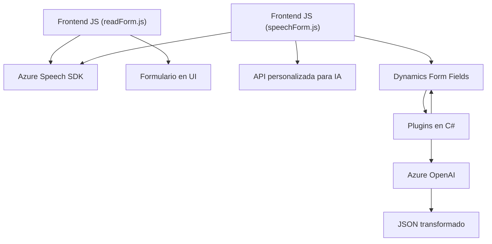

### Breve resumen técnico
El repositorio contiene módulos y plugins orientados a la interacción de formularios empresariales mediante voz, texto y transformación semántica, integrando APIs de **Azure Speech SDK** y **Azure OpenAI**, con uso específico en entornos como **Dynamics CRM**. Las funcionalidades principales abarcan la síntesis de voz, reconocimiento de audio, traducción de audio a texto y normalización semántica del texto. También incluye plugins desarrollados en **C#** para interacción directa con CRM y procesamientos avanzados mediante servicios de Azure AI.

---

### Descripción de arquitectura
La arquitectura utilizada combina **Service-Oriented Architecture (SOA)** con componentes distribuidos que delegan tareas específicas a microservicios y SDK externos proporcionados por Azure. Los archivos de JavaScript están diseñados para manejar interacción cliente, asincronismo, y modularización. Los plugins en C# siguen una arquitectura de plugins específica de **Dynamics CRM**, actuando como puntos de conexión para extender la capacidad del sistema CRM e integrarlo con servicios externos de Azure.

---

### Tecnologías, frameworks y patrones usados
1. **Lenguajes y frameworks:**
   - **JavaScript**: Procesamiento de formularios, síntesis y reconocimiento de audio.
   - **C# (.NET Framework)**: Implementación de plugins y manejo en el lado del servidor para Dynamics CRM.
   - **Azure Speech SDK** y **Azure OpenAI SDK**: Para funcionalidades de voz y transformación semántica.
   - **Microsoft Dynamics SDK**: Integración API para entidades CRM.

2. **Patrones arquitectónicos utilizados:**
   - Integración con **microservicios externos (Azure)** mediante SDK y APIs REST.
   - Modularización: Cada función y clase tiene roles específicos para facilitar mantenimiento.
   - Asincronismo y manejadores de eventos: Usados en funciones de JavaScript que dependen de APIs de terceros o llamadas dinámicas.
   - Plugin architecture: Extendiendo la funcionalidad de sistemas CRM mediante clases de implementación definida (como la interfaz `IPlugin`).
   - Dependency Injection en C# mediante `IServiceProvider`, permitiendo una separación clara entre lógica del entorno CRM y la lógica personalizada.

---

### Diagrama Mermaid

El siguiente diagrama muestra la interacción entre los componentes de la solución y las tecnologías externas:

---

### Conclusión final
Esta solución se centra en la integración de servicios de Azure con un sistema CRM empresarial, extendiendo su funcionalidad mediante un conjunto modular de archivos JavaScript y plugins en C#. La arquitectura mantiene una separación clara entre la lógica de cliente (procesamiento de audio y texto en el navegador) y la lógica de servidor (transformación de texto y comunicación directa con Azure AI). Esto garantiza una alta flexibilidad, escalabilidad y adaptabilidad en entornos dinámicos.