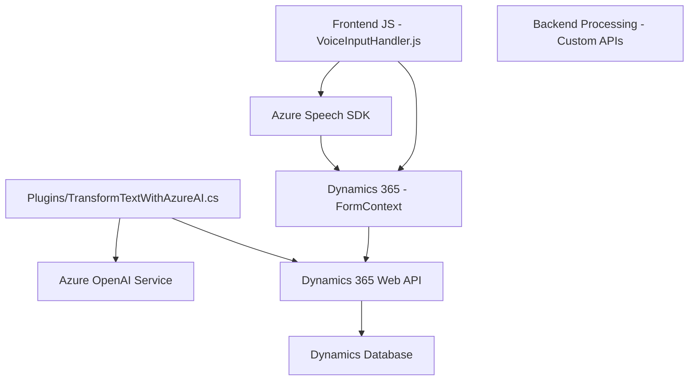

## Breve Resumen Técnico

El repositorio parece ser una solución completa que integra varias tecnologías para implementar funcionalidades de entrada de voz, síntesis de voz, y procesos de transformación de texto en aplicaciones de Dynamics CRM. Utiliza servicios de Azure como Speech SDK y OpenAI junto con APIs personalizadas para manipular formularios y datos en Dynamics CRM.

---

## Descripción de Arquitectura

La arquitectura sigue un modelo híbrido que combina varios elementos:

1. **Frontend**:
   - Capa de interacción directa con el usuario.
   - Implementaciones basadas en funciones en JavaScript que interactúan con Azure Speech para captura y síntesis de voz.

2. **Plugins Backend**:
   - Usa el patrón de plugins de Dynamics CRM (`IPlugin`) para manejar la lógica de negocio cuando se requieren transformaciones avanzadas de texto. 

3. **Integración con Servicios Externos**:
   - Usa Azure Speech SDK y Azure OpenAI Service como componentes clave externos que habilitan funcionalidades avanzadas como reconocimiento de voz, síntesis de voz, y transformación de texto.

4. **Patrones de Arquitectura**:
   - **Responsabilidad única** en cada archivo: Cada archivo tiene funciones o clases claramente segmentadas para cumplir con propósitos específicos.
   - **Modularidad**: Código dividido para gestionar funciones específicas como reconocimiento de voz, actualización de formularios, manejo de APIs, y transformación de texto.
   - **Event-driven Architecture**: Las interacciones con el usuario, como entradas de voz y eventos de formulario, son manejadas de forma reactiva en el código.

---

## Tecnologías Usadas

1. **Frontend**:
   - *JavaScript* para captura, procesamiento de voz y manipulación de DOM/formularios.
   - *Azure Speech SDK* para reconocimiento y síntesis de voz.
   - *Dynamics 365 API* (Xrm.WebApi) para integración con CRM.

2. **Backend Plugins**:
   - C# con capacidades .NET Framework para desarrollar plugins que se ejecutan en Dynamics CRM.
   - *Azure OpenAI Service* para transformar texto con inteligencia artificial.
   - *HttpClient* y *Json Serializers* (System.Text.Json y Newtonsoft.Json) para consumir APIs externas y manejar estructuras de datos.

---

## Diagrama Mermaid

---

## Conclusión Final

La solución es una arquitectura híbrida orientada a event-driven, principalmente diseñada para enriquecer un sistema CRM (Dynamics) con capacidades avanzadas como entrada y síntesis de voz, además de procesamiento de texto con IA. Implementa capas para interacción con el usuario (Frontend), lógica de negocio (Dynamics Plugins), y soporte externo (Azure Services).

Aunque la modularidad y separación de responsabilidades están bien implementadas, algunas configuraciones críticas (como claves de servicios) están harcodeadas en el código, lo que puede comprometer la seguridad y mantenimiento de la solución. Optimizar estas configuraciones y externalizar las normas de transformación puede mejorar la escalabilidad del sistema.