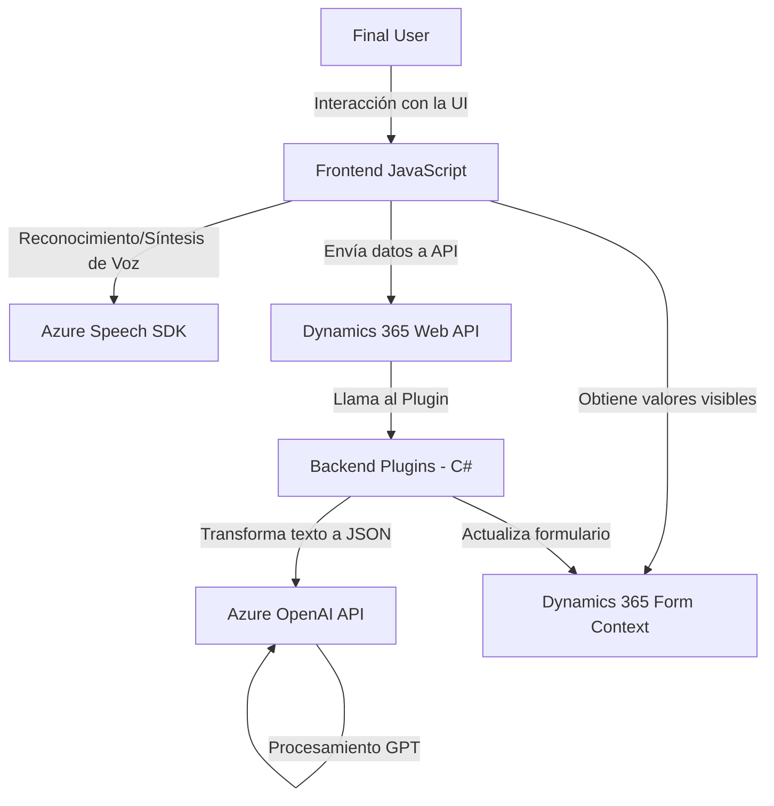

### Breve Resumen Técnico
El repositorio parece ser una solución integrada que utiliza funcionalidad de frontend y backend sobre Dynamics 365, con servicios avanzados de Azure (Azure Speech SDK y Azure OpenAI). La finalidad principal es manipular formularios, usando reconocimiento de voz, síntesis de voz y generación de texto estructurado con inteligencia artificial.

---

### Descripción de Arquitectura
La arquitectura implementada es **"n-capas con servicios integrados"**:
1. **Frontend:** Contiene lógica de procesamiento de datos del formulario y síntesis/reconocimiento de voz (JavaScript). Interactúa con APIs externas y con el contexto del formulario en Dynamics 365.
2. **Backend:** Plugins desarrollados en C# que procesan datos mediante la API de Azure OpenAI y exponen resultados JSON estructurados, que se integran a Dynamics CRM.
3. **Servicios externos:** Azure Speech SDK y Azure OpenAI se vinculan como dependencias externas para las capacidades avanzadas de interacción con el usuario. Dynamics CRM funciona como la capa de gestión de datos y lógica empresarial.

---

### Tecnologías Usadas
1. **Azure Speech SDK:** Para manejo de síntesis y reconocimiento de voz.
2. **Dynamics 365 CRM SDK:** Para integraciones con formularios y APIs internas de Dynamics.
3. **Azure OpenAI API:** Procesamiento avanzado de lenguaje y generación de JSON.
4. **Frontend:** JavaScript (orientación modular con funciones específicas).
5. **Backend:** C#, con uso de librerías .NET estándar y Newtonsoft.Json para manipulación de datos.
6. **Patrones:** Dynamically Loaded Dependency, Plugin Pattern, External API Integration.

---

### Dependencias o Componentes Externos
1. **Speech SDK (Azure):** URL: `https://aka.ms/csspeech/jsbrowserpackageraw`.
2. **Azure OpenAI:** Procesamiento de texto mediante modelos GPT.
3. **Dynamics 365 API:** (`Xrm.WebApi.online.execute`) para datos relativos al entorno de Dynamics 365.
4. **Newtonsoft.Json:** Serialización/deserialización avanzada en el backend.

---

### Diagrama Mermaid (100% Compatible con GitHub Markdown)

---

### Conclusión Final
El repositorio implementa una solución orientada a mejorar la interacción de usuarios con datos de un CRM mediante la integración de tecnologías avanzadas como Azure Speech y OpenAI. La arquitectura es clara, eficiente y modular, combinando un diseño **n-capas** tradicional bien adaptado con integración de servicios avanzados de IA. Este enfoque permite un manejo estructurado y dinámico de interacción entre usuarios y los datos del sistema.