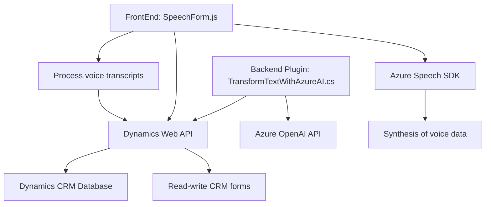

### **Breve resumen técnico**
El repositorio contiene código que interactúa con formularios web y sistemas Dynamics 365 utilizando reconocimiento de voz y síntesis de voz (Azure Speech SDK). Además, emplea un plugin de Dynamics CRM desarrollado en .NET para convertir texto en datos estructurados mediante Azure OpenAI. Esto implica una implementación modular que combina procesamiento frontal con lógica de negocio en el backend, apoyada en servicios de terceros.

---

### **Descripción de arquitectura**
1. **Tipo de solución**: Combina API, plugins backend y frontend dinámico. Una interfaz web procesa formularios y entradas de voz. En paralelo, un plugin de Dynamics CRM extiende la funcionalidad con OpenAI.
2. **Patrón de arquitectura**:
   - En el frontend: Aplicación modular con interacción cliente-servidor y comunicación con APIs externas.
   - Backend: Arquitectura basada en eventos (Plugins de Dynamics CRM) y servicios individuales encapsulados que procesan datos integrados con el sistema CRM y APIs externas.

---

### **Tecnologías usadas**
1. **Frontend**:
   - JavaScript: Para lógica relacionada con formularios y entrada/salida de voz.
   - Azure Speech SDK: Reconocimiento y síntesis de voz.
   - Dynamics 365 Web API: Llamadas hacia manipulación de datos del sistema.
2. **Backend**:
   - C#: Creación de plugins personalizados para Dynamics CRM.
   - Azure OpenAI API: Procesamiento avanzado de texto y generación de datos estructurados.
   - HTTP Requests (via `System.Net.Http`): Conexión a APIs externas.
3. **Patrones observados**:
   - Modularidad, integración de servicios externos, lógica basada en eventos (Dynamics CRM plugins).

---

### **Diagrama Mermaid**

---

### **Conclusión final**
1. La solución integra un frontend dinámico con procesamiento de voz y un backend extendido mediante `Plugins` de Dynamics CRM.
2. El diseño refleja un enfoque **modular y desacoplado**, con lógica específica para cada responsabilidad: reconocimiento de voz, escritura en formularios, y transformación avanzada de texto. 
3. La arquitectura emplea una combinación de **N-capas** (Frontend-WebAPI/Plugins-DynamicsDB), con dependencias en servicios como Azure Speech y Azure OpenAI. Esto permite una solución basada en eventos y servicios externos alineada con principios modernos de desarrollo de software.