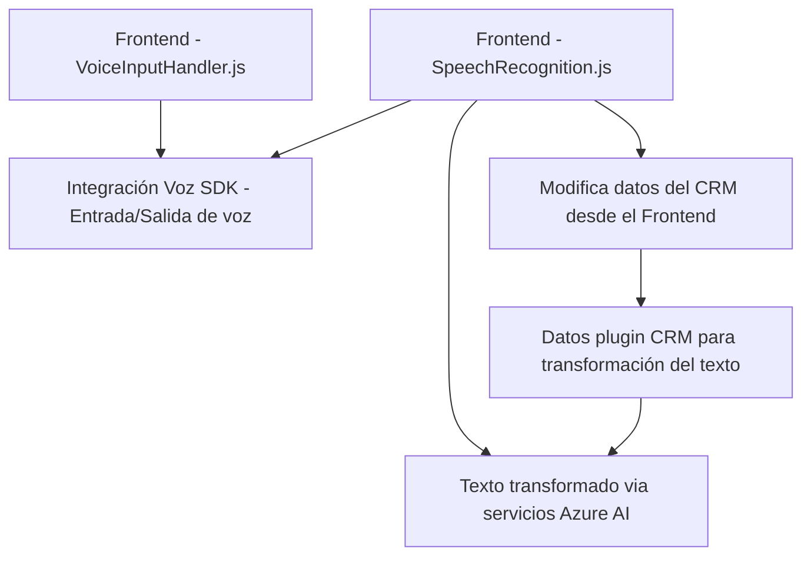

### Análisis técnico:

#### **Resumen técnico**
El repositorio contiene principalmente tres componentes:
1. **Frontend JS:** Utilizado para manejo de entradas y salidas de voz en un contexto de formularios, integrado con Azure Speech SDK.
2. **Plugins en .NET:** Usados para interactuar con Dynamics 365 y realizar transformaciones de texto utilizando servicios de Azure OpenAI.
3. **Backend en Dynamics CRM:** Interacción directa con formularios y datos dentro de Dynamics 365, integrándose con soluciones externas como Azure Speech SDK y OpenAI.

#### **1. Qué tipo de solución es**
La solución corresponde a **interfaz frontend y backend** que incluye:
- **Frontend JS:** Permite habilitar entrada/salida de voz en formularios usando Azure Speech SDK.
- **Backend Plugins (.NET)**: Lógica de negocio en Dynamics 365 CRM para transformar datos o integrar APIs de terceros (Azure OpenAI).

#### **2. Tecnologías, frameworks y patrones usados**
- **Tecnologías:**
  - **Frontend:** JavaScript integrado con SDKs como Azure Speech.
  - **Backend:** .NET (C#) con Dynamics CRM SDK y servicios externos como Azure OpenAI.
- **Frameworks:** Dynamics CRM SDK, Newtonsoft.Json para JSON parsing.
- **Servicios externos:**
  - **Azure Speech SDK:** Para entrada/salida de voz.
  - **Azure OpenAI:** Para generación y transformación de texto estructurado con reglas definidas.
- **Patrones de diseño:**
  - **Modularización:** Uso de funciones para tareas especificas en el frontend.
  - **API fachada:** Simplifica el uso del SDK desde el frontend.
  - **SOA (Service-Oriented Architecture):** Integración de servicios externos (Azure Speech SDK y Azure OpenAI).
  - **Adapter Pattern:** Para interactuar con Azure APIs y adaptar respuestas JSON al formato esperado por Dynamics CRMs.
  - **Plugin Architecture:** Para implementar extensibilidad en Dynamics CRM.
  - **Event-driven programming:** En el frontend, basado en interacción con el usuario mediante voz/formulario y eventos del SDK.

#### **3. Tipo de arquitectura**
- **Frontend (JS):** Arquitectura modular basada en componentes funcionales con integración externa mediante APIs.
- **Backend (C# plugin):** **N-capas** con componentes desacoplados, apoyado en especial en la arquitectura de plugins de Dynamics CRM.
- **General:** **Service-Oriented Architecture (SOA)** ya que usa servicios externos (Azure Speech y Azure OpenAI) para delegar tareas específicas como el procesamiento de voz y transformación de texto.

#### **4. Dependencias o componentes externos**
- **Dependencias internas:**
  - Métodos destacados de Dynamics SDK (`XRM.WebApi.retrieveMultipleRecords`, `Xrm.WebApi.online.execute`, etc.).
- **Dependencias externas:**
  - **Azure Speech SDK:** Para entrada y salida de voz.
  - **Azure OpenAI:** Para procesamiento y transformación de texto.
  - **Dynamics Web API:** Para modificar o extraer campos del formulario.
  - **Newtonsoft.Json:** Para manejar serialización/parsing JSON en el plugin de .NET.

---

### **Diagrama Mermaid**

---

### Conclusión final
El repositorio implementa una solución híbrida combinando frontend en JavaScript y backend en C# (como plugins de Dynamics 365) para manejar entrada/salida por voz y transformar datos con inteligencia artificial. Este diseño acopla servicios externos (Azure Speech SDK y OpenAI) para realizar tareas especializadas (síntesis de voz y procesamiento de texto estructurado), siguiendo una arquitectura orientada a servicios (SOA) con componentes desacoplados y enfocados en responsabilidades específicas.

Los aspectos clave incluyen:
- Uso extensivo de servicios externos como Azure.
- Modularización y separación de responsabilidades en el frontend y backend.
- Enfoque en la integración directa con Dynamics CRM y adaptabilidad mediante SDKs y plugin architecture.

Esto define una solución sólida y bien estructurada para mejorar la utilidad de los formularios de Dynamics con capacidades avanzadas de entrada/salida por voz y procesamiento de texto por IA.