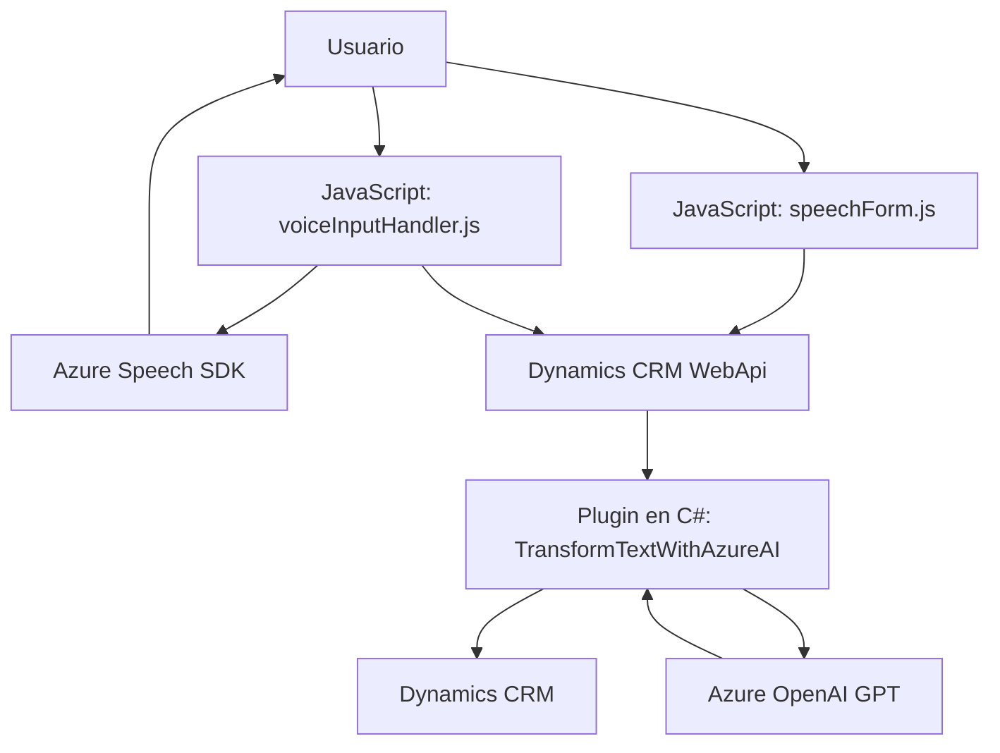

### Breve resumen técnico
Este repositorio abarca tres componentes íntimamente relacionados: un frontend basado en JavaScript para interacción de usuario mediante voz y formularios, y un backend que emplea un plugin en C# para conectar Dynamics CRM con Azure AI. Estas tecnologías permiten la síntesis de voz en tiempo real, el reconocimiento de voz para rellenar formularios dinámicos, y la transformación avanzada de texto mediante un modelo GPT integrado en Azure OpenAI.

---

### Descripción de arquitectura
La solución cuenta con una arquitectura híbrida compuesta por:
1. **Frontend basado en eventos**: Los archivos de JavaScript (`voiceInputHandler.js` y `speechForm.js`) implementan un patrón modular en el que funciones manejan eventos para entrada de voz, procesamiento, y actualización dinámica del frontend (formulario).
2. **Backend plugin extensible**: El archivo en C# (`TransformTextWithAzureAI.cs`) sigue un diseño enfocado en Dynamics CRM como referencia. Implementa un patrón de integración basado en plugins, que extiende las capacidades de Dynamics con funcionalidades de procesamiento de texto usando Azure OpenAI API.
3. **Capas externas**: La integración con servicios como Azure Speech Services (frontend) y Azure OpenAI (backend) introduce una dependencia modular ligera en la arquitectura.

La solución recuerda un diseño de **N capas** (frontend + lógica en plugins + API externa). Sin embargo, las interacciones son lo suficientemente desacopladas como para ser vistas también como componentes independientes.

---

### Tecnologías usadas
**Frontend**:
- **JavaScript**: Principal lenguaje de programación utilizado para diseñar funcionalidades del usuario como entrada/salida de voz y procesamiento de formularios.
- **Azure Speech SDK**: Para reconocimiento de voz y síntesis en tiempo real.
- `Xrm.WebApi`: Usado para integrar datos de formularios en Dynamics CRM.

**Backend**:
- **C#**: Desarrollo de plugins en Dynamics CRM.
- **Azure OpenAI API**: Manejo de modelos GPT-3/4 para transformación avanzada de texto.
- **Microsoft.Xrm.Sdk**: Interacción directa con Dynamics CRM.
- **HTTP/REST Requests**: Realización de llamadas HTTP al API de OpenAI.

### Dependencias o componentes externos presentes
- **Azure Services**:
  - Azure Speech Services (Frontend).
  - Azure OpenAI API (Backend).
- **Dynamics CRM SDK**: Base del plugin en backend y llamadas desde el frontend.
- **Librerías JSON**: `Newtonsoft.Json.Linq` y `System.Text.Json` para serialización/deserialización.

---

### Diagrama **Mermaid**

---

### Conclusión final
El repositorio implementa una solución técnica con enfoque en accesibilidad (entrada y síntesis de voz) para el frontend y transformación avanzada de datos en el backend mediante APIs de Azure y modelos GPT. Gracias a su modularidad y desacoplamiento, la arquitectura puede considerarse orientada a servicios, con elementos característicos de un diseño de **N capas**, aunque lo suficientemente flexible para funcionar en contextos de microservicios.

### Recomendaciones
1. Refactorizar la gestión de credenciales API en variables de entorno para mejorar la seguridad.
2. Optimizar las funciones del frontend mediante uso de Promesas o Async/Await para mejorar la legibilidad del código y manejo de eventos asincrónicos.