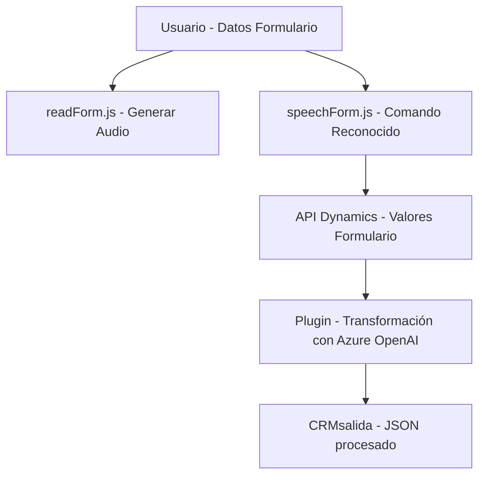

### Breve resumen técnico
El repositorio presentado contiene implementaciones que integran servicios de inteligencia artificial con Dynamics 365 CRM, específicamente utilizando el Azure Speech SDK y el servicio Azure OpenAI GPT-4. Está compuesto por tres archivos principales:
- **`readForm.js`**: Genera síntesis de voz basada en los datos de un formulario.
- **`speechForm.js`**: Procesa comandos de voz, realiza transcripciones, y aplica los resultados a un formulario.
- **`TransformTextWithAzureAI.cs`**: Plugin en C# que transforma texto en estructuras JSON utilizando Azure OpenAI.

---

### Descripción de arquitectura
La arquitectura es de tipo orientada a servicios, utilizando APIs externas y diseñada modularmente:
1. **Front-End (JavaScript)**:
   - Métodos independientes que manejan procesamiento de voz y Texto-A-Voz utilizando Azure Speech SDK.
   - Funciones para integración directa con Dynamics 365 via API (`Xrm.WebApi`).
2. **Plugin (C#)**:
   - Procesos de transformación de texto mediante integración directa con Azure OpenAI.
   - Composición basada en el patrón Plugin estándar para Dynamics 365.

Claramente, los componentes trabajan juntos en un modelo orquestador (cliente-servidor) en el contexto de Dynamics CRM:
- **Cliente:** Front-End (interacción directa en formularios).
- **Servidor:** Plugin para ejecutar lógica en Dynamics CRM.

---

### Tecnologías usadas
1. **Lenguajes**:
   - JavaScript: Gestiona interacción de front-end (formularios, reconocimiento de voz, síntesis de voz).
   - C#: Sistema de plugins en Dynamics CRM.
2. **Frameworks y SDKs**:
   - Azure Speech SDK: Convertir datos en síntesis de voz y reconocer comandos hablados.
   - Azure OpenAI GPT-4: Procesamiento y estructuración avanzada de texto.
   - Dynamics CRM SDK: Permite definir plugins que interactúan con el entorno CRM.
3. **Patrones de diseño**:
   - **Modularidad**: Funciones independientes para cada funcionalidad.
   - **Client-Server Integration**: Procesos acoplados entre Front-End y Backend (plugin).
   - **Plugin Pattern**: Framework estándar de Microsoft Dynamics CRM para extensiones.

---

### Dependencias o componentes externos
- **Azure Speech SDK API**: Recursos para herramientas de Texto-A-Voz y reconocimiento de comandos de voz. 
- **Azure OpenAI GPT-4 API**: Procesamiento avanzado de texto con modelo GPT-4.
- **Dynamics 365 Web API (`Xrm.WebApi`)**: Integración con formularios CRM.
- **HttpClient Libraries (C#)**: Comunicación HTTP con servicios en Azure.
- **JSON Handling Libraries (`System.Text.Json`, `Newtonsoft.Json.Linq`)**: Manejo avanzado de JSON.

---

### Diagrama **Mermaid**

---

### Conclusión final
Esta solución implementa una arquitectura **cliente-servidor modular** con integración de APIs de terceros. El flujo desde formularios hacia sistemas externos como Azure Speech y OpenAI está diseñado con independencia entre capas (interfaz de usuario, procesamiento en el cliente y lógica en el servidor). La arquitectura está orientada a servicios y extensibilidad mediante estándares de Dynamics 365.