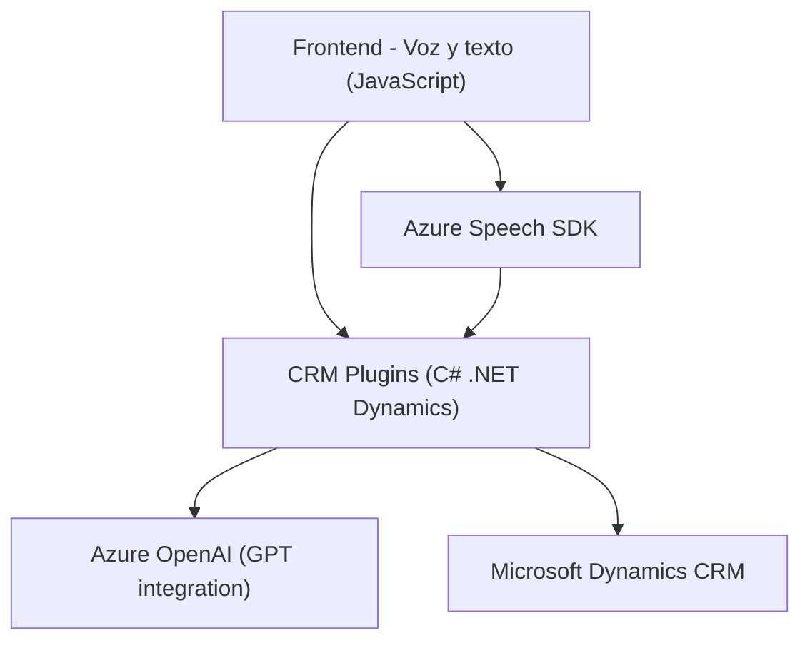

### Breve resumen técnico
El repositorio analizado implementa una solución híbrida que incluye un **frontend** en JavaScript y servicios backend en **.NET (C#)**, integrándose con servicios externos como **Azure Speech SDK**, **Azure OpenAI**, y **Microsoft Dynamics API**. La funcionalidad principal consiste en la conversión de texto a voz, reconocimiento de voz, extracción y transformación de datos en formularios de CRM Dynamics, utilizando inteligencia artificial y técnicas modernas de manipulación JSON con servicios externos.

---

### Descripción de arquitectura
La arquitectura del sistema puede clasificarse como **n-capas** con integración directa a APIs externas. 
- **Frontend (capas visible y aplicación):** Proveen la interfaz y lógica para interacción basada en texto y voz.
- **Backend (plug-ins y servicios):** Manejan procesos de negocio y comunicación con servicios externos como **Azure OpenAI** y **Dynamics CRM**.

Además, se implementa un manejo asincrónico en el frontend que coordina el uso de SDKs de habla y voz, mientras el backend utiliza estrategias de extensibilidad de Dynamics CRM y consumo de servicios externos de inteligencia artificial.

---

### Tecnologías usadas
1. **Frontend:** 
   - **JavaScript.**
   - **Azure Speech SDK** para voz (síntesis y reconocimiento).
   - **Microsoft Dynamics Form APIs** para manipulación de formularios CRM.

2. **Backend:** 
   - **C# .NET:** Desarrollo de un plugin para Dynamics CRM.
   - **Azure OpenAI:** Servicios de IA para transformar texto con modelos GPT.
   - **Newtonsoft.Json:** Manejo de respuestas JSON.

3. **Patrones aplicados:** 
   - **Encapsulación:** Separación de responsabilidades en funciones/métodos en el frontend y backend.
   - **Facade:** Interfaces reducidas para simplificar el manejo de SDKs externos y APIs.
   - **Plugin Architecture:** Modularización del backend.
   - **Service Layer:** Para comunicación entre capas.

---

### Diagrama Mermaid (100 % compatible con GitHub Markdown)

---

### Conclusión final
La solución presentada consiste en una arquitectura orientada a eventos en el frontend en combinación con una capa backend modular basada en extensibilidad de **Dynamics CRM**. Se integra de manera efectiva con servicios de terceros, como **Azure Speech SDK** y **Azure OpenAI**, demostrando un enfoque bien encapsulado que respalda funcionalidades avanzadas como síntesis de voz, reconocimiento de voz y manipulación de datos transformados.

Aunque actualmente tiene una arquitectura **n-capas**, la separación lógica sugiere que podría ser evolucionada hacia un modelo **hexagonal** o **microservicios** si se busca mayor escalabilidad, manteniendo los servicios independientes y comunicándose a través de APIs.

El diseño cumple bien su propósito en entornos empresariales relacionados con **Dynamics CRM** y puede ser adaptado a otros sistemas basados en formularios dinámicos. En general, es robusto y aprovecha tecnología moderna.